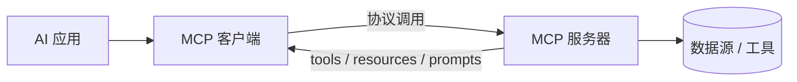

> 本文是对 Anthropic 于 2024 年 11 月发布的开放标准 Model Context Protocol（MCP，模型上下文协议）的阅读笔记与解读。原始出处为 Anthropic 官方文章《Introducing the Model Context Protocol》及协议官网 [modelcontextprotocol.io](https://modelcontextprotocol.io)，本文所述事实均以该范围为准。

## TL;DR

- **是什么**：MCP 是由 Anthropic 开源的一个通用开放标准，用于连接 AI 应用与外部数据源、工具。
- **核心思想**：用一套统一协议取代每接一个数据源/工具就要写一份定制集成的旧模式，常被比喻为「AI 应用的 USB-C 接口」。
- **关键结论**：采用客户端-服务器架构，服务器对外暴露 tools、resources、prompts 三类能力，客户端按协议统一调用。
- **意义**：为 Agent 与工具调用提供了标准化基础，催生了一批社区共建的 MCP 服务器生态。

## 一、背景与动机：集成的「M×N 问题」

随着大模型从「会聊天」走向「会做事」，让模型访问真实世界的数据与工具成为刚需：读取文件系统、查询数据库、调用 Git、对接各类 SaaS 服务等。然而在 MCP 出现之前，这类连接普遍依赖一次性的定制集成——每接入一个新的数据源或工具，开发者都要针对特定模型、特定应用、特定接口重新编写一套对接代码。

这种模式的代价随规模迅速放大：当有 M 个 AI 应用、N 个外部系统时，理论上需要维护接近 M×N 量级的对接组合。每一次接口变动、每一个新工具的加入，都意味着重复的开发与维护成本。缺乏统一约定，也让不同应用之间难以复用彼此的集成成果。

MCP 正是为了缓解这一困境而提出：与其为每对「应用—工具」单独搭桥，不如约定一套公共协议，让两端各自只面向协议编程，从而把 M×N 的组合复杂度收敛为 M+N 的标准化对接。

## 二、核心思想：AI 应用的「USB-C 接口」

官方对 MCP 最直观的比喻是「AI 应用的 USB-C 接口」。USB-C 之所以方便，在于它统一了物理接口与通信约定：无论是硬盘、显示器还是充电器，只要遵循同一标准，设备之间即可即插即用，而不必为每种外设单独设计线缆。

MCP 在 AI 与外部世界之间扮演的正是类似角色。它定义了一套与具体模型、具体厂商无关的通信规范，使得任何遵循该规范的 AI 应用，都可以连接任何遵循该规范的外部能力提供方。开发者一次性把某个工具封装为符合 MCP 的服务，便可被生态中各类客户端复用，而无需为每个应用重新适配。

## 三、架构拆解：客户端-服务器与三类能力

MCP 采用经典的客户端-服务器模式，职责清晰地分布在两侧：

- **MCP 服务器（Server）**：对外暴露能力的一方，负责把某个数据源或工具的功能按协议封装出来。
- **MCP 客户端（Client）**：集成在 AI 应用内部的一方，按照协议发现并调用服务器提供的能力。

服务器向外暴露的能力被归纳为三种基本原语：

| 原语 | 含义 | 典型用途 |
| --- | --- | --- |
| Tools（工具） | 可被模型调用以执行动作的功能 | 触发查询、写入数据、调用外部 API 等 |
| Resources（资源） | 可供模型读取的上下文数据 | 文件内容、记录、文档等只读信息 |
| Prompts（提示模板） | 预定义的提示/交互模板 | 复用规范化的指令与工作流 |

通过这三类原语，服务器既能向模型提供「可读的上下文」（resources），也能提供「可执行的动作」（tools），还能提供「可复用的交互范式」（prompts）。客户端则统一按协议进行能力发现与调用，无需关心服务器背后具体对接的是数据库、文件系统还是某个 SaaS 平台。

下图概括了这一调用关系：

## 四、生态：从单点集成到标准共建

MCP 作为开放标准发布后，社区围绕它涌现出大量 MCP 服务器，覆盖文件系统、数据库、Git 以及各类 SaaS 服务等常见场景。这些服务器一旦按协议实现，便可被不同的客户端共享，使得「为某个工具写一次集成、在多处复用」成为可能。

对 Agent 类应用而言，这种标准化的价值尤为直接。Agent 的能力边界很大程度上取决于它能调用多少工具、能读取多少上下文。当工具调用的接入方式被协议统一后，扩展一个 Agent 的能力，更多地变成「接入已有 MCP 服务器」而非「从零编写集成」，从而降低了构建门槛，也让不同项目之间的工具生态更易互通。

## 意义与局限

MCP 的意义在于，它把此前分散、重复的模型-工具集成工作收敛到一套公共协议之上，为工具调用与 Agent 的扩展提供了可复用、可互通的标准化基础。以「USB-C」为隐喻，它试图让 AI 应用与外部世界之间的连接，从一次性定制走向即插即用。

同时也应客观看待其边界。作为一项开放标准，MCP 的实际价值依赖于生态的持续建设与采纳广度：协议本身只约定「如何连接」，而能连接到什么、连接得是否稳定可靠，仍取决于具体服务器的实现质量。此外，将外部工具与数据接入模型，也意味着权限控制、数据安全与可信边界等问题需要在落地时认真对待。这些都是标准之上、留给具体实践去回答的部分。

> 延伸阅读：Anthropic《Introducing the Model Context Protocol》及协议官网 modelcontextprotocol.io。
