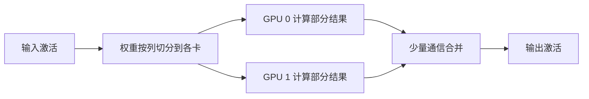

> 本文是对 Shoeybi et al. (NVIDIA), 2019, 《Megatron-LM: Training Multi-Billion Parameter Language Models Using Model Parallelism》（arXiv:1909.08053，https://arxiv.org/abs/1909.08053）的经典回顾与阅读笔记，旨在梳理其核心思想，便于理解大模型分布式训练基础设施的来龙去脉。

## TL;DR

- 当模型规模大到单张 GPU 的显存无法容纳时，需要把模型本身切分到多张 GPU 上，这就是「模型并行」。
- Megatron-LM 提出了高效的「张量（模型）并行」：把注意力层与 MLP 层中的矩阵运算沿合适的维度切分到多卡，仅配合少量通信即可完成前向与反向。
- 这一方法让训练数十亿参数级别的 Transformer 成为可能。
- 它是大模型分布式训练基础设施的代表性工作，实践中常与数据并行、流水线并行组合使用。

## 一、背景与动机

Transformer 架构出现后，研究者普遍观察到「更大的模型往往带来更强的能力」。但扩大模型规模会遇到一个非常具体的工程障碍：单张 GPU 的显存有限，当参数量增长到一定程度，模型的权重、激活值与优化器状态合在一起便无法装入一张卡。

应对这一问题的思路大致分两类。一类是「数据并行」：每张卡保存一份完整的模型副本，各自处理不同的数据切片，再同步梯度。数据并行能提升吞吐，却无法解决「单卡装不下整个模型」的根本矛盾——因为每张卡仍需保存完整模型。另一类则是「模型并行」：把模型本身拆开，分摊到多张卡上。Megatron-LM 正是在模型并行这条路线上，给出了一种工程上简洁、通信开销可控的方案。

## 二、核心思想：沿维度切分矩阵运算

Megatron-LM 的关键洞察在于：Transformer 中最占资源的计算，本质上是大型矩阵乘法。如果能把这些矩阵乘法按维度切分到多张卡，每张卡只持有权重的一部分、只算一部分结果，就能在不复制整个模型的前提下完成计算，并且只需要在必要的位置进行少量的跨卡通信来「拼接」或「求和」中间结果。

这种做法被称为张量并行（Tensor Parallelism），有时也叫层内模型并行，因为切分发生在单层内部的张量计算上，而不是把不同的层分到不同的卡上。它主要作用于 Transformer 的两个核心子模块：多头自注意力层与前馈 MLP 层。

### MLP 层的切分

MLP 通常由两次线性变换加一个非线性激活构成。Megatron 的策略是：第一层权重按列切分，让每张卡独立计算自己那一部分的激活，由于非线性是逐元素的，这一步无需通信；第二层权重则按行切分，各卡算出部分结果后通过一次跨卡求和合并。如此，整个 MLP 在前向过程中只需很少的同步点。

### 注意力层的切分

自注意力天然带有「多头」结构，不同的注意力头之间是相对独立的并行计算。Megatron 顺势把不同的头分配到不同的卡上，让每张卡负责一部分头的查询、键、值投影与注意力计算，最后再通过通信把各卡的输出整合。这种切分方式与注意力的结构高度契合，因而通信代价较低。

## 三、与其他并行方式的关系

张量并行并不是孤立使用的。在大规模训练实践中，它通常与其他并行维度组合，形成多维并行策略：

| 并行方式 | 切分对象 | 主要作用 | 与张量并行的关系 |
| --- | --- | --- | --- |
| 数据并行 | 训练数据批次 | 提升训练吞吐 | 解决「算得快」，但不解决单卡装不下 |
| 张量（模型）并行 | 层内矩阵运算 | 让单卡装下大模型 | Megatron-LM 的核心贡献 |
| 流水线并行 | 不同的层/阶段 | 进一步扩展模型深度规模 | 与张量并行互补，可叠加使用 |

下面用一张示意图说明张量并行在单层内部的基本流程：

值得注意的是，张量并行的通信发生在每一层内部，对卡间带宽较为敏感，因此它通常被限制在通信延迟低、带宽高的范围内（例如同一节点内的多张 GPU），而把跨节点的扩展交给流水线并行与数据并行来承担。这种分工正是后续大模型训练系统普遍采用的组合范式。

## 意义与局限

Megatron-LM 的意义在于，它把「让超大模型在多卡上跑起来」这件事，从概念变成了工程上可落地、通信开销可控的具体方案。通过对注意力层与 MLP 层做结构化的张量切分，它使训练数十亿参数级别的 Transformer 成为现实，并为后续更大规模模型的训练奠定了基础设施层面的范式。它所提出的张量并行思想，至今仍是主流大模型训练框架中的关键组成部分。

局限方面，张量并行高度依赖卡间的高带宽互联，跨节点使用时通信成本会显著上升，因此其可扩展范围有边界；单纯依靠它也难以无限扩大模型规模，需要与流水线并行、数据并行乃至更精细的显存优化手段配合，才能支撑起更大体量的训练。换言之，Megatron-LM 解决的是多维并行体系中的一个关键维度，而非全部。

> 延伸阅读：Shoeybi et al., 《Megatron-LM: Training Multi-Billion Parameter Language Models Using Model Parallelism》，arXiv:1909.08053（https://arxiv.org/abs/1909.08053）
