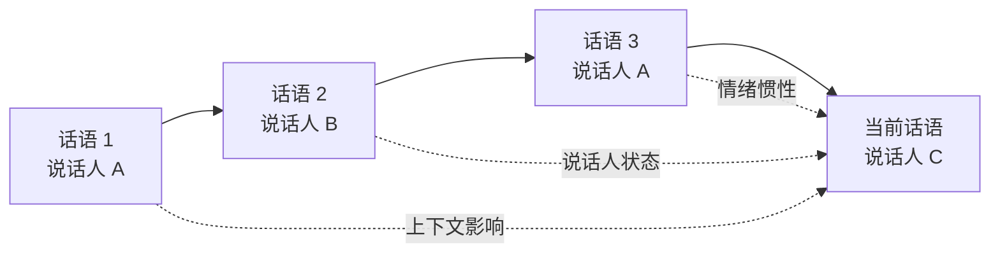

> 这是一篇阅读笔记，解读 Poria 等人于 2018 年提出、并发表于 ACL 2019 的工作《MELD: A Multimodal Multi-Party Dataset for Emotion Recognition in Conversations》（arXiv:1810.02508，[原文链接](https://arxiv.org/abs/1810.02508)）。MELD 是对话情绪识别（ERC）领域被广泛引用的基准数据集，本文梳理它的来龙去脉、构成方式与研究价值。

## TL;DR

- MELD 是对话情绪识别（ERC）任务的经典基准，由文本数据集 EmotionLines 扩展为多模态版本。
- 数据取材自美剧《老友记》，包含约 1.3 万条话语、1433 段多方对话，每条话语同时标注情绪与情感（sentiment）。
- 它同时提供文本、音频、视觉三种模态，支持多模态情绪识别研究。
- 真实的多方对话场景与多模态信号，使 MELD 既贴近实际，又难度十足：情绪随上下文与说话人动态变化。

## 一、背景与动机

情绪识别长期以单句、单人为单位展开：给定一段文本或一段语音，判断其情绪类别。但人类情绪很少孤立存在，它嵌在对话里，随着前后语境和谈话对象不断流动。同一句「真的吗？」可以是惊喜、怀疑，也可以是讽刺，区别往往不在字面，而在它出现在怎样的对话之中。

对话情绪识别（Emotion Recognition in Conversations，简称 ERC）正是为捕捉这种动态而生的任务。它要求模型在理解整段对话脉络的前提下，逐句判断说话人的情绪。早期的文本数据集 EmotionLines 已经把对话作为基本单位进行情绪标注，但它只有文本一种模态——而真实交流中，语气、停顿、表情、肢体动作同样承载着大量情绪信息。MELD 的核心动机，就是把 EmotionLines 升级为多模态、多方对话的版本，让研究者能够在更接近真实场景的数据上探索 ERC。

## 二、数据从哪里来：以《老友记》为素材

MELD 选择美剧《老友记》作为素材来源。情景喜剧的好处显而易见：它包含大量自然的多人对话，情绪表达丰富且外显，并且场景生活化，便于标注与理解。

在规模上，MELD 包含约 1.3 万条话语（utterance），分布于 1433 段多方对话（dialogue）之中。这里的「多方」是关键词：对话往往由三人及以上参与，发言在不同说话人之间轮转，这与现实中的群聊、会议、客服多轮交互高度相似，也比一对一对话更难建模。

每一条话语都带有两类标签：

- **情绪（emotion）**：更细粒度的离散情绪类别；
- **情感（sentiment）**：更粗粒度的正面、负面、中性极性。

两套标签并存，让数据集既能服务于精细的情绪分类，也能支持极性层面的情感分析。

## 三、多模态：文本、音频、视觉三路并进

MELD 真正区别于纯文本数据集的地方，在于它为每条话语对齐了三种模态的信息。

| 模态 | 承载的信息 | 在情绪识别中的作用 |
| --- | --- | --- |
| 文本 | 台词内容、措辞 | 语义与字面情绪的主要来源 |
| 音频 | 语调、音高、节奏、停顿 | 区分反讽、强调、迟疑等语气线索 |
| 视觉 | 面部表情、动作、画面 | 补充文本难以表达的非语言情绪 |

三种模态彼此互补：文本给出「说了什么」，音频和视觉给出「怎么说的」。当字面意思与语气、表情冲突时（比如用平淡语气说出激动的话），多模态信号正是消解歧义的关键。这也使 MELD 成为研究多模态融合方法的天然试验场。

## 四、为什么 ERC 难：上下文与说话人的双重依赖

ERC 的难度可以从两个维度理解。

第一重是**上下文依赖**：当前话语的情绪往往取决于前文。一句「我没事」放在安慰的语境里是难过，放在轻松的语境里则可能是平静。脱离上下文，模型很容易判错。

第二重是**说话人依赖**：在多方对话中，不同说话人有各自的情绪状态与变化轨迹，且彼此相互影响——一方的愤怒可能引发另一方的紧张。模型不仅要追踪「整段对话说了什么」，还要追踪「是谁在说、各自处于什么情绪」。正是这种上下文与说话人交织的动态，使 ERC 远比单句情绪分类复杂，也正是 MELD 想要刻画并推动研究的核心难点。

## 五、数据集定位与用法概览

下表概括 MELD 的主要特征，便于快速把握它在 ERC 研究中的位置。

| 维度 | 说明 |
| --- | --- |
| 任务 | 对话情绪识别（ERC） |
| 来源 | 美剧《老友记》 |
| 规模 | 约 1.3 万条话语，1433 段多方对话 |
| 标注 | 每条话语标注情绪 + 情感（sentiment） |
| 模态 | 文本、音频、视觉 |
| 对话形态 | 多方（多人）对话 |
| 前身 | EmotionLines（纯文本）的多模态扩展 |

凭借这样的设计，MELD 被大量 ERC 与多模态情感计算工作用作训练与评测基准，成为衡量新方法是否真正能处理上下文动态与多模态融合的参照系。

## 意义与局限

MELD 的意义在于把对话情绪识别推向了更接近真实的设定：多方参与、多模态信号、情绪随语境流动。它让研究者得以系统地评估模型对上下文建模、说话人建模与跨模态融合的能力，长期作为该领域的公共基准发挥作用。

局限同样需要客观看待。素材取自情景喜剧，其情绪表达通常较为外显、戏剧化，且场景集中于特定的社交语境，与客服、医疗、会议等领域的对话分布存在差异，因此在 MELD 上表现良好的模型未必能直接迁移到其他场景。此外，多模态标注与对齐本身存在难度，模态之间的信息冲突、噪声与缺失，都会给建模带来挑战。这些既是使用 MELD 时需要留意的边界，也是后续研究持续探索的方向。

> 延伸阅读：MELD 原文 arXiv:1810.02508（https://arxiv.org/abs/1810.02508），以及其文本前身 EmotionLines。
