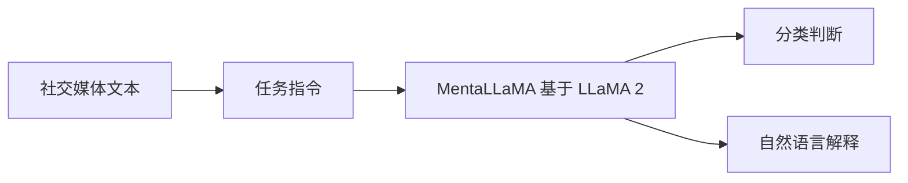

> 本文是对 Yang et al. 在 WWW 2024 发表的论文《MentaLLaMA: Interpretable Mental Health Analysis on Social Media with Large Language Models》(arXiv:2309.13567，<https://arxiv.org/abs/2309.13567>) 的阅读笔记与解读，仅作学习记录，观点与细节请以原文为准。

## TL;DR

- 是什么：MentaLLaMA 是首个面向「可解释心理健康分析」的开源大语言模型系列，基于 LLaMA 2 构建，目标是在社交媒体文本上同时给出判断与可读的解释。
- 核心思想：把传统判别式的心理健康检测，重构为「分类 + 自然语言解释」的生成式指令任务，让模型不仅说出结论，还说清依据。
- 关键结论：在多项任务上，其分类准确率接近主流判别式方法的水平，同时能生成接近人类水平的解释文本。
- 意义：在保持检测能力的前提下提升透明度与可信度，但论文也强调此类系统不能替代专业诊断与心理援助。

## 一、背景与动机

社交媒体上的公开文本，长期被视为观察大众心理状态的重要窗口。研究者据此构建了大量任务，例如抑郁检测、压力检测、自杀风险识别等。早期与近期的主流做法多为判别式模型：将一段帖子输入分类器，输出一个标签。这类方法在准确率上往往表现优秀，但存在一个结构性短板——不可解释。

不可解释意味着模型只给出「是」或「否」，却无法说明为什么。对于心理健康这一高度敏感、与人的福祉直接相关的领域，缺乏解释会带来几个现实问题：使用者难以信任结果，研究者难以排查错误，相关从业者也难以判断模型的判断是否建立在合理依据之上。换言之，一个准确但「黑箱」的系统，在真实场景中的可用性会被大打折扣。

大语言模型的兴起提供了新的可能。它们天然擅长生成连贯的自然语言，因此有机会在给出标签的同时产出解释。然而，闭源模型在该领域存在使用门槛与可控性问题，而通用开源模型未必在心理健康分析上具备足够的专门能力。MentaLLaMA 正是在这一空隙中提出的工作。

## 二、方法核心：把分析变成「带解释的指令任务」

MentaLLaMA 的核心思路，是把心理健康分析从「分类」重新表述为「指令跟随式的生成」。模型接收一段社交媒体文本与一条任务指令，输出两部分内容：一个分类判断，以及对该判断的自然语言解释。

要训练出这样的能力，关键在于数据。论文构建了 IMHI（Interpretable Mental Health Instruction）数据集，其特点可概括为多任务、多来源、带解释：

| 维度 | 说明 |
| --- | --- |
| 规模 | 约 10.5 万样本 |
| 来源 | 来自 10 个不同的数据来源 |
| 任务 | 覆盖 8 类心理健康分析任务 |
| 形式 | 指令式样本，包含分类标签与对应的解释 |

IMHI 被论文描述为首个面向可解释心理健康分析的多任务、多来源指令数据集。它把分散在不同研究中的任务统一成一致的指令格式，使单一模型可以在多种任务上学习「判断 + 解释」的范式，而不必为每个任务单独训练一个判别器。

在此数据基础上，研究者基于 LLaMA 2 进行训练，得到 MentaLLaMA 系列模型。其训练目标不只是预测正确标签，还要生成与人类判断逻辑相符的解释，从而把「可解释性」直接纳入模型的输出能力之中。

## 三、效果与对比

MentaLLaMA 试图同时回答两个问题：检测得准不准，解释得好不好。

在检测层面，论文报告其分类准确率接近主流判别式方法的水平。这一点意义在于：生成式、可解释的范式并没有以牺牲准确率为代价，而是基本守住了判别式方法多年积累的性能基线。

在解释层面，模型能够生成接近人类水平的解释文本。也就是说，输出不只是机械地复述结论，而是给出与人类标注者所写解释相近的、可读的理由。

下表对比了两类方法的主要差异：

| 对比维度 | 传统判别式方法 | MentaLLaMA |
| --- | --- | --- |
| 输出形式 | 仅分类标签 | 分类标签 + 自然语言解释 |
| 准确率 | 通常较高 | 接近主流判别式水平 |
| 可解释性 | 弱 | 强，可生成接近人类水平的解释 |
| 任务覆盖 | 多为单任务 | 多任务统一指令格式 |
| 开放性 | 视具体实现而定 | 开源模型系列 |

这种「不掉分还能解释」的特性，是 MentaLLaMA 区别于以往工作的关键，也是它作为开源可解释模型系列的价值所在。

## 意义与局限

从研究意义看，MentaLLaMA 展示了一条把可解释性内建进心理健康分析模型的可行路径：通过统一的指令数据集与生成式建模，在保持检测能力的同时提供可读的依据，并以开源形式降低后续研究与复现的门槛。统一的多任务格式也为该领域的标准化提供了参考。

局限与边界同样需要被清晰认识。最重要的一点是伦理与安全：心理健康涉及个体的真实福祉，此类系统给出的判断与解释，无论看起来多么合理，都不能替代专业人员的诊断，也不能替代正规的心理援助与危机干预。社交媒体文本本身存在噪声、语境缺失与表达多样性，模型生成的解释也可能存在偏差或过度自信的风险。因此，更稳妥的定位是辅助研究与初步筛查的工具，而非决策主体；在任何面向真实人群的应用中，都应配合专业人员与明确的安全机制使用。

> 延伸阅读：MentaLLaMA: Interpretable Mental Health Analysis on Social Media with Large Language Models (arXiv:2309.13567，<https://arxiv.org/abs/2309.13567>)
