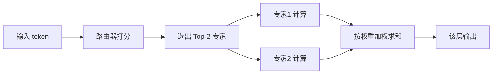

> 本文是对 Mistral AI 技术报告《Mixtral of Experts》（2024，arXiv:2401.04088，原文链接：https://arxiv.org/abs/2401.04088）的阅读笔记与解读，意在梳理稀疏混合专家模型的设计动机与核心思想，便于回顾这条开源 MoE 路线的代表性工作。

## TL;DR

- 是什么：Mixtral 8x7B 是一个稀疏混合专家（Sparse Mixture-of-Experts, SMoE）语言模型，每层包含 8 个专家，路由器为每个 token 选择 Top-2 专家参与计算。
- 核心思想：用"总参数大、单 token 激活少"的方式解耦模型容量与推理成本，让模型在保有大参数表达力的同时，只为每个 token 调用其中一小部分。
- 关键结论：总参数约在 47B 量级，但每个 token 仅激活约 13B 参数，推理成本接近一个 13B 稠密模型，而在多项基准上达到或超过 Llama 2 70B 与 GPT-3.5。
- 意义：以 Apache 2.0 协议开源，是开源 MoE 路线的重要里程碑，让"MoE 兼顾能力与成本"的优势被广泛认知。

## 一、背景与动机：容量与成本的矛盾

在稠密（dense）Transformer 中，模型的能力通常随参数规模增长，但每处理一个 token，全部参数都要参与计算。这意味着想要更强的能力，就要付出成比例上涨的推理算力与显存代价，二者被牢牢绑在一起。

混合专家（Mixture-of-Experts, MoE）提供了一条解耦的思路：把前馈层（FFN）替换为多个并列的"专家"子网络，再用一个轻量的路由器（router/gating）决定每个 token 走哪些专家。这样模型整体可以容纳很大的参数量，但任意单个 token 只激活其中一小部分。Mixtral 正是在这一框架下，把"稀疏激活"做成了一个公开、可复现、可商用的强基线。

## 二、核心思想拆解：稀疏混合专家如何工作

Mixtral 的关键设计可以逐点拆开来看：

- 专家结构：在每个 Transformer 层中，原本单一的前馈网络被替换为 8 个并列的专家网络。专家之间结构相同、参数独立。
- Top-2 路由：对每个 token，路由器计算它对 8 个专家的偏好，并只选出 Top-2 个专家来实际参与计算；其余专家对该 token 不做运算。
- 逐 token、逐层独立选择：路由发生在每一层，且对每个 token 独立进行。也就是说，同一条序列里不同位置的 token，可能被分配到完全不同的专家组合。
- 输出加权合并：被选中的两个专家各自给出输出，再按路由器给出的权重加权求和，作为该位置该层的前馈输出。

这套机制带来的直接效果，就是"激活参数远小于总参数"。下面的流程图概括了单个 token 在一层中的处理路径：

## 三、参数与成本：大模型的体量，小模型的开销

Mixtral 的价值集中体现在参数与计算的分离上。它的总参数处于 47B 量级——这是 8 组专家加上共享的注意力等模块共同贡献的规模；但由于每个 token 只激活 Top-2 专家，真正参与前向计算的参数约为 13B 量级。

需要强调的是：注意力等非专家模块对所有 token 共享，并不随路由而稀疏；真正被"稀疏化"的是前馈/专家部分。因此 Mixtral 的"激活参数"并非简单地等于两个 7B 专家相加，而是共享部分加上被选中专家部分的总和，落在约 13B 这一量级。其结果是推理时的计算量与延迟接近一个 13B 稠密模型，却拥有远超 13B 的参数容量。

| 维度 | 稠密 13B 模型 | Mixtral 8x7B（SMoE） |
| --- | --- | --- |
| 总参数规模 | 约 13B | 约 47B 量级 |
| 每 token 激活参数 | 约 13B（全部） | 约 13B（共享部分 + Top-2 专家） |
| 每层前馈结构 | 单一 FFN | 8 个专家，按 token 选 Top-2 |
| 推理计算成本 | 基准 | 接近 13B 稠密模型 |
| 模型容量上限 | 受限于 13B | 远高于激活规模 |

## 四、效果与开源：开源 MoE 的标杆

在公开报告中，Mixtral 8x7B 在多项基准任务上达到或超过 Llama 2 70B 与 GPT-3.5，同时推理成本显著更低。换句话说，它用接近 13B 稠密模型的算力，换到了对标更大规模模型的能力，这正是 MoE"以小激活换大能力"承诺的现实印证。

同样重要的是开放性。Mixtral 以 Apache 2.0 协议开源，允许自由使用与商用。一个具备竞争力、又可自由部署的稀疏 MoE 模型公开发布，对社区研究路由机制、推理优化与部署工程都有直接的推动作用。

## 意义与局限

Mixtral 的意义在于，它把稀疏 MoE 从研究概念推进为一个公开、强力、可商用的实践基线，让"总参数大、激活参数小"的范式被广泛接受，也促成了后续大量开源 MoE 工作的跟进。

局限同样值得正视。稀疏激活省的是计算，而非显存：尽管单 token 只用 Top-2 专家，全部专家的参数仍需常驻内存，部署的显存门槛并不会因此降到 13B 稠密模型的水平。同时，路由本身带来工程复杂度——专家负载是否均衡、批处理时不同 token 走向不同专家如何高效调度，都会影响实际吞吐。这些都是稀疏 MoE 在落地时需要权衡的代价，也是后续研究持续优化的方向。

> 延伸阅读：Mistral AI, 2024, 《Mixtral of Experts》, arXiv:2401.04088（https://arxiv.org/abs/2401.04088）
