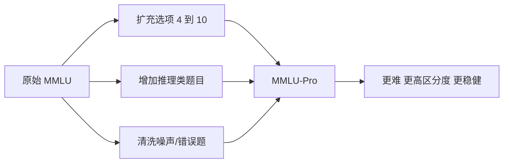

> 本文是对 Wang et al., 2024, "MMLU-Pro: A More Robust and Challenging Multi-Task Language Understanding Benchmark"（arXiv:2406.01574，https://arxiv.org/abs/2406.01574）的阅读笔记与解读，内容以原论文为准，如有出入以原文为准。

## TL;DR

- **是什么**：MMLU-Pro 是面向大语言模型综合知识与推理能力的多任务评测基准，定位为经典 MMLU 的升级版。
- **核心思想**：通过扩充选项数量、增加偏推理的题目、清洗噪声题，提高题目难度与区分度，并降低评测对提示词的敏感性。
- **关键结论**：相较 MMLU，模型在 MMLU-Pro 上的得分普遍下降、模型之间差距被拉大，且对提示词扰动更鲁棒，思维链（CoT）提示带来的收益更明显。
- **意义**：在 MMLU 趋于饱和的背景下，MMLU-Pro 成为 2024 年后常用的综合知识评测之一。

## 一、背景与动机

经典的 MMLU（Massive Multitask Language Understanding）是衡量大语言模型跨学科知识的代表性基准，覆盖人文、社科、理工等多个领域，长期被用于横向比较不同模型。然而随着模型能力快速提升，MMLU 逐渐暴露出若干问题。

第一，**接近饱和**。头部模型在 MMLU 上的得分已普遍处于较高水平，分数之间趋于密集，难以再清晰区分模型间的能力差异。第二，**含噪声**。MMLU 的部分题目存在标注错误、答案有歧义或题面不严谨的情况，这会使评测结果的可信度打折扣。第三，**对提示词敏感**。同一个模型在不同提示词、不同选项排布下的得分可能出现较明显波动，意味着分数受评测形式影响较大，稳定性不足。

这些因素共同导致 MMLU 的区分度下降，难以充分反映当代模型在知识与推理上的真实差距。MMLU-Pro 正是针对上述痛点提出的改进方案。

## 二、核心改进的逐点拆解

论文围绕"更难"与"更稳"两个目标，对题库做了系统性改造，主要包括三方面。

**其一，扩充选项数量。** 原始 MMLU 每题为 4 个选项，随机瞎猜的期望命中率约为四分之一。MMLU-Pro 将选项扩展到 10 个，显著降低了随机命中的概率，从而减少"靠运气得分"对结果的干扰，让得分更能反映真实能力。

**其二，偏向推理而非记忆。** MMLU-Pro 在题目构成上更倾向需要多步推理、计算或分析的问题，而不是单纯依赖事实记忆即可作答的题目。这一取向使基准更能区分模型的推理能力，也让思维链等推理增强手段的价值更容易显现。

**其三，清洗噪声与错误题目。** 论文对题库进行了筛查与清理，剔除或修正标注错误、答案不唯一、题面不清的条目，以提升题目质量与评测可靠性。

| 维度 | MMLU | MMLU-Pro |
| --- | --- | --- |
| 每题选项数 | 4 | 10 |
| 题目侧重 | 记忆为主 | 更偏推理 |
| 题目质量 | 含一定噪声/错误 | 经过清洗 |
| 区分度 | 趋于饱和、偏密集 | 更高、差距更明显 |
| 提示词稳定性 | 相对敏感 | 更鲁棒 |

下图概括了从 MMLU 到 MMLU-Pro 的改造思路。

## 三、观察到的效果

论文报告了改造带来的几个一致性现象。首先，**整体难度上升**：在 MMLU-Pro 上模型得分普遍低于其在 MMLU 上的表现，说明题目确实更具挑战性。其次，**区分度增强**：模型之间的分差被拉大，强弱排序更加清晰，有利于横向比较。再次，**评测更稳健**：在提示词扰动下，得分的波动相对更小，结果对评测形式的依赖降低。

此外，论文还观察到推理类提示的价值更突出：采用思维链（CoT）提示相比直接作答，往往能带来更明显的收益。这与"题目更偏推理"的设计取向是一致的——当题目需要多步推导时，显式的推理过程更容易帮助模型得到正确答案。

| 现象 | 表现 |
| --- | --- |
| 难度 | 模型得分普遍下降 |
| 区分度 | 模型间差距拉大 |
| 鲁棒性 | 对提示词扰动更稳定 |
| 推理收益 | CoT 提示收益更明显 |

## 四、意义与局限（客观陈述）

从意义上看，MMLU-Pro 缓解了 MMLU 饱和、含噪声与提示词敏感的问题，提供了一个更难、区分度更高、评测更稳定的综合知识基准。在 MMLU 难以继续有效区分头部模型的背景下，MMLU-Pro 在 2024 年之后被广泛用作综合知识与推理评测之一，常与其他维度的基准配合使用。

从局限上看，需要客观看待几点。其一，扩充选项与提高难度是有效的改进手段，但任何静态基准都可能随着模型能力增长而再次逼近饱和，长期有效性需要持续观察。其二，更偏推理的题目设计有助于区分推理能力，但综合知识评测无法覆盖模型的全部能力维度，单一基准的得分不宜被过度解读。其三，评测结论会受到具体提示策略、解析方式等实现细节影响，跨研究比较时需要保持口径一致。总体而言，MMLU-Pro 的价值在于提供了更可靠的相对比较工具，而非对模型能力的绝对刻画。

> 延伸阅读：MMLU-Pro 原论文（arXiv:2406.01574）及经典 MMLU 基准的相关工作。
