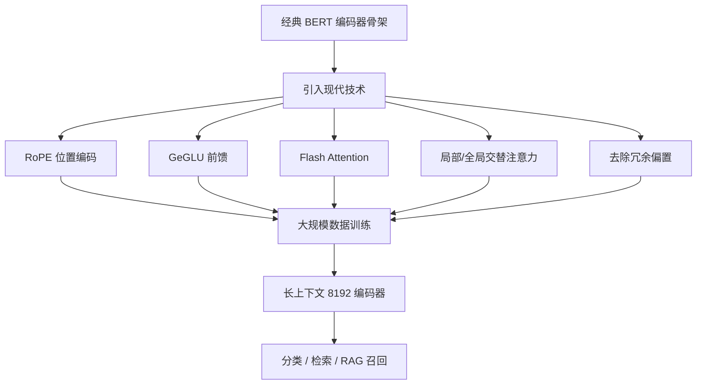

> 本文是对 Warner et al., 2024, 「Smarter, Better, Faster, Longer: A Modern Bidirectional Encoder (ModernBERT)」(arXiv:2412.13663，<https://arxiv.org/abs/2412.13663>) 的阅读笔记与解读，内容以原论文为准，如有偏差以原文为准。

## TL;DR

- **是什么**：ModernBERT 是一类「现代化」的双向编码器模型，目标是把近年大模型时代积累的架构与训练经验系统性地搬回 BERT 类编码器。
- **核心思想**：不另起炉灶，而是把 RoPE 旋转位置编码、GeGLU、Flash Attention、去除冗余偏置、交替的局部/全局注意力等成熟技术组合到编码器骨架上，并在大规模数据上训练。
- **关键结论**：支持长达 8192 的上下文，在分类与检索类任务上同时改善了效果与效率，推理速度更快。
- **意义**：在生成式解码器风头正劲的当下，提醒社区「编码器并未过时」，它在判别式与召回类任务中仍具突出的性价比。

## 一、背景与动机

最近几年，公众视野几乎被生成式的解码器(decoder-only)模型占据。但在工业界真正落地的检索、文本分类、RAG 召回、重排等场景里，BERT 这类**双向编码器**仍是主力。原因并不难理解：这些任务本质上是判别式或表示学习问题，需要对整段输入做双向理解并产出一个稠密表示或类别标签，而不是逐 token 地自回归生成。

问题在于，作为这条技术路线代表的 BERT，其架构多年来基本未做系统性更新。与此同时，解码器一侧却积累了大量被反复验证的工程与建模改进。ModernBERT 的动机正是：把这些「现代」技术有选择地引入编码器，让这条仍被广泛使用的路线重新跟上时代。

## 二、核心思想的逐点拆解

ModernBERT 的做法是「集成式现代化」，而非提出某个单一新机制。可以从几个层面理解它引入的改动：

- **位置编码：RoPE(旋转位置编码)**。用旋转位置编码替代传统的绝对位置嵌入，使模型对相对位置更敏感，也更利于扩展到更长的上下文。
- **前馈层：GeGLU**。采用门控线性单元家族中的 GeGLU 作为前馈激活结构，相比朴素的前馈层通常能带来更好的表达能力。
- **注意力实现：Flash Attention**。借助 Flash Attention 这类高效注意力实现，降低显存占用、提升训练与推理吞吐。
- **去除不必要的偏置项**。精简线性层中冗余的 bias，让参数预算更集中地用在真正有效的地方。
- **交替的局部/全局注意力**。在层间交替使用局部窗口注意力与全局注意力，使得在处理长序列时既能保持对全局信息的捕捉，又能控制注意力的计算开销。

这些改动单独看都不算新颖，但被整合进同一个编码器骨架、并配合大规模数据训练后，整体效果与效率得以同时提升。

## 三、关键特性概览

下面用表格汇总 ModernBERT 引入的主要技术点及其作用方向：

| 技术点 | 作用 |
| --- | --- |
| RoPE 旋转位置编码 | 改善相对位置建模，利于长上下文扩展 |
| GeGLU 前馈结构 | 增强前馈层表达能力 |
| Flash Attention | 提升注意力计算的效率，降低显存压力 |
| 去除冗余偏置 | 精简参数，提升训练稳定性与效率 |
| 局部/全局交替注意力 | 兼顾长序列的全局信息与计算开销 |
| 长上下文(8192) | 支持更长输入，适配文档级检索与理解 |

相对于经典 BERT 仅支持较短上下文，ModernBERT 把上下文长度提升到 8192，这对文档级检索、长文本分类以及 RAG 中较长片段的召回都更友好。

## 四、整体流程示意

下图概括 ModernBERT 的「现代化」思路：在编码器骨架上叠加多项成熟技术，并在大规模数据上训练，最终服务于检索与分类等下游任务。

## 五、为什么这件事值得做

在很多实际系统里，编码器承担的是「理解并表示」的角色：把查询和文档映射到向量空间做相似度匹配，或者把输入直接判为某个类别。这类任务对延迟和吞吐高度敏感，而编码器天然适合一次前向就得到结果，无需逐 token 解码。

因此，把编码器做得**更快、更强、能处理更长输入**，直接对应到检索召回质量、分类准确率与服务成本三方面的改善。ModernBERT 的价值在于，它没有要求使用者切换到全新的范式，而是在大家熟悉的编码器接口下，把效果与效率一并往前推了一步。

## 意义与局限

ModernBERT 最重要的信号，是在解码器主导话语权的当下，重新明确了**双向编码器并未过时**这一判断。对检索、分类、RAG 召回这些判别式与表示类任务而言，编码器仍是性价比极高的选择，而把现代技术系统性地引入编码器，能让这条路线继续发挥作用。

同时也应客观看待其边界：ModernBERT 解决的是「理解与表示」类问题，并不替代生成式模型在开放式文本生成上的能力；它本质上是把已有成熟技术组合并工程化，而非提出全新的建模范式。对于具体任务上的表现，建议以原论文给出的设置与结果为准，并结合自身场景做评估。

> 延伸阅读：Warner et al., 2024, 「Smarter, Better, Faster, Longer: A Modern Bidirectional Encoder (ModernBERT)」，arXiv:2412.13663，<https://arxiv.org/abs/2412.13663>
