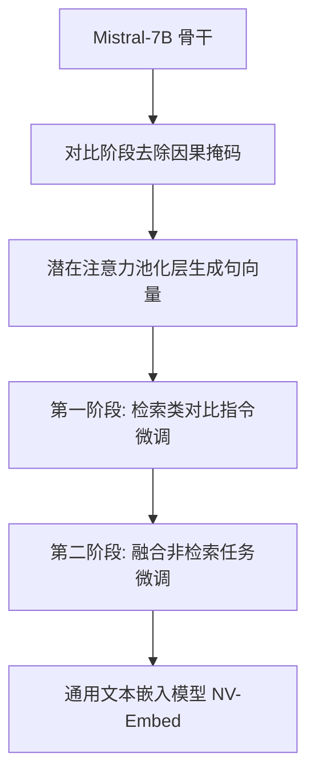

> 本文是对 Lee et al. (NVIDIA), 2024, 《NV-Embed: Improved Techniques for Training LLMs as Generalist Embedding Models》(arXiv:2405.17428，https://arxiv.org/abs/2405.17428) 的阅读笔记与解读。该工作被 ICLR 2025 接收。文中观点均以原文为准，若有出入以原论文为准。

## TL;DR

- NV-Embed 探索用 decoder-only 大模型（基于 Mistral-7B）来做通用文本嵌入，挑战长期由 BERT/T5 类编码器主导的表示学习范式。
- 提出潜在注意力池化层（latent attention pooling）来生成句向量，替代常见的均值池化或最后一个 token 表示。
- 在对比训练阶段去掉因果掩码，并采用两阶段对比指令微调，兼顾检索与非检索任务。
- 在大规模文本嵌入基准 MTEB 上取得领先成绩，展示了「大模型也能是强嵌入模型」，对检索与 RAG 有直接意义。

## 一、背景与动机

文本嵌入（text embedding）是把一段文本映射为稠密向量，使语义相近的文本在向量空间中彼此靠近。它是语义检索、聚类、去重、推荐乃至检索增强生成（RAG）的底层能力。长期以来，这一领域由 BERT、T5 等编码器（encoder）或编码-解码（encoder-decoder）架构主导：它们天然具备双向注意力，被认为更适合产出「看到全文」的句向量。

与此同时，主流生成式大模型走的是 decoder-only 路线，依赖因果掩码（causal mask）逐 token 预测。因果掩码意味着每个位置只能看到它左侧的上下文，这对生成是合理的，但对需要整体语义的嵌入任务则可能是一种限制。NV-Embed 的核心问题正是：能否把一个强大的 decoder-only 大模型，改造成通用（generalist）嵌入模型，并且在统一基准上超越传统方案？作者选择以 Mistral-7B 作为骨干展开这一探索。

## 二、核心方法逐点拆解

论文的贡献可以拆成模型结构与训练流程两条主线。

**1）潜在注意力池化层（latent attention pooling）。** 要从 token 级表示得到单一句向量，常见做法是均值池化，或直接取最后一个 token 的隐状态（在生成式模型里较常见）。NV-Embed 引入一个可学习的潜在注意力池化层：通过一组可训练的潜在向量对序列表示做注意力聚合，从而学习出更适合嵌入任务的汇聚方式，而非依赖固定的启发式。

**2）对比训练时去掉因果掩码。** 生成式模型自带的因果掩码限制了双向信息流动。作者在对比学习阶段移除该掩码，让模型能够进行双向注意力，使每个 token 的表示都能参考完整上下文，从而更贴近嵌入任务对「全局语义」的需求。这是让 decoder-only 模型胜任嵌入任务的关键改动之一。

**3）两阶段对比指令微调（two-stage contrastive instruction tuning）。** 嵌入任务种类繁多，检索类任务（给定查询找相关文档）与非检索类任务（如分类、聚类、语义相似度）对训练信号的偏好并不一致。NV-Embed 采用分阶段策略：先聚焦检索类任务用带难负例的对比学习打好基础，再引入更广泛的任务类型做进一步微调。指令（instruction）的引入让同一模型能根据任务描述调整其嵌入行为，这正是「通用嵌入模型」的题中之义。

下面用一个简化流程示意这几个环节的关系。

## 三、与传统嵌入范式的对比

为便于理解 NV-Embed 的定位，下表从几个维度对比其与传统编码器类嵌入方案的差异（为定性描述，具体实现以原论文为准）。

| 维度 | 传统 BERT/T5 类嵌入 | NV-Embed |
| --- | --- | --- |
| 骨干架构 | 编码器 / 编码-解码 | decoder-only 大模型（Mistral-7B） |
| 注意力 | 天然双向 | 对比训练阶段移除因果掩码以实现双向 |
| 句向量生成 | 多用均值池化 / [CLS] | 潜在注意力池化层 |
| 任务适配 | 常按任务单独训练 | 指令驱动的通用模型 |
| 训练流程 | 通常单阶段对比 | 两阶段对比指令微调 |

这一对比说明 NV-Embed 并非简单「换个更大的骨干」，而是围绕 decoder-only 模型的特性，对池化、掩码与训练课程做了系统性调整。

## 四、结果与影响

在大规模文本嵌入基准 MTEB（Massive Text Embedding Benchmark）上，NV-Embed 取得了领先成绩。MTEB 覆盖检索、分类、聚类、重排序、语义相似度等多类任务，是衡量嵌入模型「通用性」的常用标尺；在其上登顶意味着模型并非只在单一任务上取巧，而是在多任务综合表现上具备竞争力。该工作被 ICLR 2025 接收。

对下游而言，最直接的价值在检索与 RAG：更强的通用嵌入能提升召回质量，进而改善生成阶段所依赖的上下文。此外，它也传递出一个方法论信号——已经在生成上被大量投入优化的大模型，经过恰当改造后同样可以成为强嵌入模型，这为「一套骨干、多种用途」提供了可行路径。

## 意义与局限

NV-Embed 的意义在于，它较为系统地论证了 decoder-only 大模型担任通用嵌入模型的可行性，并给出潜在注意力池化、去因果掩码、两阶段对比指令微调等一组可复用的训练技术。这在一定程度上松动了「嵌入必须用双向编码器」的惯性认知。

需要客观看待的是其局限。首先，以 7B 规模大模型作为嵌入骨干，相比传统轻量编码器在推理与部署成本上更高，是否适配具体场景需结合延迟与算力预算权衡。其次，基准上的领先反映的是特定评测集合上的综合表现，迁移到具体业务数据时仍需实测验证。最后，指令与两阶段训练带来的收益依赖数据构造与难负例质量，复现效果与数据工程密切相关。这些细节应以原论文的完整描述为准。

> 延伸阅读：NV-Embed 论文原文 arXiv:2405.17428（https://arxiv.org/abs/2405.17428）；MTEB 基准相关资料。
