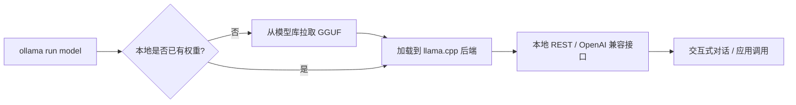

> 本文为对开源项目 Ollama 的阅读与解读笔记。项目主页：GitHub [ollama/ollama](https://github.com/ollama/ollama)，官网 [ollama.com](https://ollama.com)。文中事实以官方仓库与文档为准，定性概括之处不代表项目官方表述。

## TL;DR

- **是什么**：Ollama 是一个把"在本地运行开源大语言模型"做到极简的开源工具，跨平台支持 macOS、Linux 与 Windows。
- **核心思想**：用一条命令 `ollama run <model>` 完成模型的下载、加载与对话，把环境配置、量化、推理后端等复杂度对用户隐藏起来。
- **关键能力**：底层基于 llama.cpp，支持 GGUF 量化模型，CPU/GPU 均可运行；提供本地 REST API 与 OpenAI 兼容接口；以 Modelfile 定义模型。
- **意义**：降低了本地实验大模型的门槛，成为隐私敏感场景与离线开发的常见选择之一。

## 一、背景与动机：让本地跑模型不再"劝退"

开源大模型生态在近两年快速扩张，但要在本地把一个模型真正跑起来，往往涉及一连串繁琐步骤：选择合适的权重格式、做量化、配置推理后端、处理 GPU 驱动与依赖、再写一段加载与对话的代码。对很多希望在本机做实验、保护数据隐私或离线使用的开发者与爱好者来说，这条链路的门槛偏高。

Ollama 的出发点正是消解这种"劝退感"。它把模型获取、本地存储、量化权重加载、推理服务与对话交互整合到一个工具里，目标是让用户无需理解底层细节，也能在自己的机器上与模型对话。

## 二、核心体验：一条命令的抽象

Ollama 最具代表性的设计，是把使用流程压缩为一条命令：

```bash
ollama run llama3
```

执行后，工具会自动从模型库拉取对应的量化权重并加载，随后进入交互式对话。第一次运行会下载模型，之后则直接从本地缓存加载。这种"开箱即用"的体验，是它区别于手工搭建推理环境的关键。

围绕这条主命令，Ollama 还提供了管理模型生命周期的一组子命令，覆盖拉取、列出、删除等常见操作：

| 操作 | 命令示例 | 说明 |
| --- | --- | --- |
| 运行/对话 | `ollama run <model>` | 不存在则先下载，再进入交互 |
| 拉取模型 | `ollama pull <model>` | 仅下载，不立即对话 |
| 查看本地模型 | `ollama list` | 列出已下载的模型 |
| 删除模型 | `ollama rm <model>` | 移除本地权重以释放空间 |

## 三、底层：基于 llama.cpp 与 GGUF

Ollama 的推理能力建立在成熟的开源推理引擎 llama.cpp 之上。llama.cpp 以 C/C++ 实现，强调在消费级硬件上的高效推理，支持 GGUF 这一面向量化权重的模型格式。借助量化，原本体积庞大的模型可以被压缩到普通台式机或笔记本可承载的规模，从而在 CPU 上也能运行，具备合适的 GPU 时则可进一步加速。

这一选择带来两点直接影响：其一，Ollama 天然继承了 llama.cpp 在跨平台与量化推理上的能力，CPU/GPU 均可作为后端；其二，凡是能转换为 GGUF 的开源模型，理论上都具备被 Ollama 承载的基础。

## 四、可定制：Modelfile 与接口

除了直接使用模型库中的现成模型，Ollama 还允许用户通过 **Modelfile** 自定义模型。Modelfile 类似于描述模型构建方式的清单，可以在一个基础模型之上叠加参数设置与系统提示词（system prompt），从而得到一个行为被定制过的"派生模型"。其大致结构如下：

```
FROM llama3
PARAMETER temperature 0.7
SYSTEM "你是一个简洁的中文技术助手。"
```

在接入方式上，Ollama 启动后会提供一个本地 REST API，同时提供与 OpenAI 接口兼容的形式。这意味着许多原本面向云端 API 编写的应用，只需调整服务地址等少量配置，即可改为调用本地模型，便于做本地集成与替换实验。

下图概括了从命令到对话的整体流程：



## 五、模型库与典型场景

Ollama 维护了一个模型库（model library），收录了常见的开源模型，用户可直接按名称拉取使用，省去了自行寻找与转换权重的步骤。结合其本地化、可离线运行的特性，它在若干场景中较为常见：

| 场景 | 价值点 |
| --- | --- |
| 个人本地实验 | 快速尝试不同开源模型，无需搭建复杂环境 |
| 隐私敏感处理 | 数据留在本机，不必上传到第三方服务 |
| 离线/内网开发 | 无需持续联网即可调用模型 |
| 应用本地集成 | 借助兼容接口，便于把本地模型接入现有应用 |

## 六、意义与局限

从意义上看，Ollama 的价值主要在"体验层"：它没有重新发明推理引擎，而是通过对 llama.cpp 等成熟组件的封装与整合，显著降低了本地运行开源模型的上手门槛，让更多人能够在自己的硬件上进行实验与集成。

局限同样需要客观看待。其一，本地推理的速度与可运行的模型规模，受制于本机的内存、显存与算力，与大规模云端服务存在客观差距。其二，量化在压缩体积、降低硬件要求的同时，可能对模型输出质量产生一定影响，需要在体积与效果之间权衡。其三，作为整合型工具，它的能力边界很大程度上取决于底层引擎与所支持的模型格式。是否选用，取决于具体场景对隐私、离线、成本与性能的不同优先级。

> 延伸阅读：GitHub [ollama/ollama](https://github.com/ollama/ollama) 与官网 [ollama.com](https://ollama.com) 上的文档与模型库。
