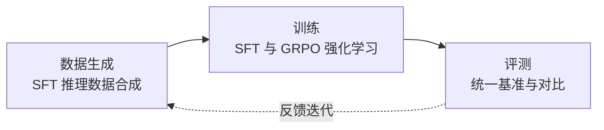

> 本文是对 Hugging Face 主导的开源项目 Open-R1 的阅读与解读。项目目标是用完全开放的代码与数据复现 DeepSeek-R1 的训练流程。出处：Hugging Face, 2025, Open-R1 项目（GitHub: huggingface/open-r1）。文中观点以项目公开的目标与方法为准，不涉及未经核实的指标。

## TL;DR

- **是什么**：Open-R1 是 Hugging Face 发起的社区项目，目标是用完全开放的代码与数据，复现 DeepSeek-R1 这类推理模型的训练流程。
- **核心思想**：DeepSeek-R1 开源了权重，但完整的训练数据与训练代码细节并未全部公开；Open-R1 试图把缺失的环节补齐成可复现、可复用的开源模块。
- **关键结论**：把"复现一个推理模型"拆解为数据生成、训练、评测几个相对独立的部分，降低参与门槛，让社区可以协作推进。
- **意义**：体现了开源社区对"可复现的推理训练"的追求，让更多研究者能够在 R1 的方法之上做研究与改进。

## 一、背景与动机

DeepSeek-R1 的发布是近期推理模型方向上的一个重要节点。它在公开权重的同时，展示了通过强化学习等手段提升模型推理能力的路径，受到广泛关注。然而，"开源权重"并不等同于"开源全流程"：模型参数可以下载并使用，但真正决定模型如何被训练出来的若干环节——例如用于监督微调（SFT）的推理数据是如何合成的、强化学习阶段采用了怎样的具体配置、数据如何筛选与组织——并未被完整地公开。

对社区而言，这种"结果可见、过程不全"的状态带来一个直接的问题：研究者很难在同一基础上验证、对比和改进。如果无法复现训练流程，就难以判断某个改动究竟来自方法本身还是来自未公开的工程细节。Open-R1 正是针对这一缺口而生：它由 Hugging Face 发起，定位是一个面向社区的开放复现项目，希望以完全开放的代码与数据，把 R1 的训练流程重新搭建起来。

## 二、核心思路：把复现拆成可复用的模块

Open-R1 的关键做法，是不把"复现 R1"当成一个不可分割的黑箱，而是将其拆解为几个相对独立、可单独迭代的部分。这样做的好处是：每个部分都可以由不同的贡献者并行推进，也便于他人复用其中某一环而不必接受全部假设。

大致可以把流程理解为下面几个阶段：

- **数据生成**：合成用于监督微调的推理数据，使模型先具备基础的推理与"思考"格式能力。
- **训练**：在 SFT 的基础上，引入以 GRPO（Group Relative Policy Optimization）为代表的强化学习方法，进一步提升推理表现。
- **评测**：用统一的基准对训练结果进行评估与对比，使不同改动之间具有可比性。

## 三、各模块要点

下表概括了 Open-R1 几个组成部分各自要解决的问题：

| 模块 | 要解决的问题 | 对社区的价值 |
| --- | --- | --- |
| 数据生成 | 补齐 R1 未完整公开的 SFT 数据合成环节 | 提供可审视、可复用的开放数据流程 |
| 训练 | 重建 SFT 与 GRPO 等强化学习流程 | 让方法本身可被独立验证与调整 |
| 评测 | 在统一基准上衡量结果 | 使不同实验之间具备可比性 |

这种模块化设计的意义在于：复现工作不必"全有或全无"。即便某个团队只关心数据合成，或只想替换强化学习算法，也能在 Open-R1 的框架下找到对应的切入点，而不必从零搭建整条管线。

## 四、为什么"开放复现"重要

在推理模型的研究中，方法的有效性往往与训练数据、训练配置高度耦合。仅有权重时，外界能做的多是推理使用与微调，难以触及"为什么这样训练有效"的核心问题。开放复现项目把这一过程透明化，带来几方面的影响：

- **可验证性**：公开的代码与数据让结论可以被独立检验，而不是只能依赖原始发布方的描述。
- **可复用性**：模块化的组件可以被嫁接到其他模型或任务上，形成更广泛的研究基础设施。
- **协作性**：社区贡献者可以分别认领数据、训练、评测等环节，以增量的方式共同推进。

## 意义与局限

Open-R1 的价值，主要体现在它把"可复现的推理训练"作为明确目标，并以开放协作的方式去逼近 DeepSeek-R1 所展示的方法。对希望深入理解推理模型训练机制的研究者来说，一套开放的代码与数据流程，意味着更低的进入门槛和更高的研究透明度。

同时也应客观看待其边界。复现一个推理模型本身是一项工程与方法都颇具挑战的工作：原始项目未公开的细节需要由社区通过实验逐步摸索，数据合成与强化学习的配置存在大量可调空间，复现结果与原模型之间可能存在差异。这些都属于开放复现工作天然要面对的不确定性。Open-R1 的意义，更多在于提供一个公开、可参与、可迭代的基础，而非一次性地给出与原模型完全等价的产物。在这个意义上，它是开源社区推动推理训练走向透明与可协作的一次具体实践。

> 延伸阅读：Hugging Face, Open-R1 项目（GitHub: huggingface/open-r1）。
