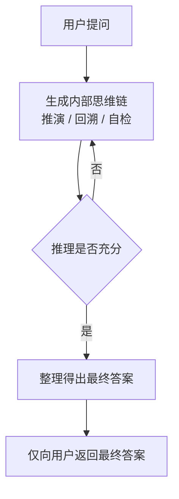

> 本文是对 OpenAI 2024 年公开材料《Learning to Reason with LLMs》（官方博客与配套系统卡，非完整技术论文）的阅读与解读。需特别说明：o1 至今没有公开完整的技术报告，下文仅围绕官方公开披露过的、业界广为人知的信息展开，训练细节与具体内部机制官方并未公开。原文：<https://openai.com/index/learning-to-reason-with-llms/>

## TL;DR

- **是什么**：o1 是 OpenAI 于 2024 年发布的一类推理模型，特点是在给出答案前先生成一段很长的内部“思维链”（chain of thought）。
- **核心思想**：通过强化学习训练模型“先思考再回答”，把更多算力投入到推理阶段，即“测试时计算”（test-time compute）。
- **关键结论**：在数学、竞赛编程、研究生级科学题等高难推理任务上，相比通用模型有明显提升。
- **意义**：标志着“扩展测试时计算”可能成为继预训练规模扩展之后的又一条能力增长路径。

## 一、背景与动机

过去几年大语言模型能力的提升，主要依赖预训练阶段的规模扩展——更多数据、更多参数、更多算力。这条路径成效显著，但在需要多步严谨推理的任务上，通用聊天模型仍常常“想得太快”：在尚未充分推演的情况下就直接给出答案，导致数学推导、复杂编程、严密科学论证等场景出错率偏高。

o1 提出的思路是把“思考”本身当作一个可以投入算力的环节。直观地说，让模型在回答前先在内部进行较长的推演、尝试、回溯与自我检查，再给出最终结论。这与人类面对难题时“多想一会儿再下笔”的方式类似。OpenAI 将这种在推理阶段投入更多计算的做法称为测试时计算（test-time compute）。

## 二、核心思想拆解

根据官方公开说明，o1 的做法可以概括为以下几个要点（更细的训练流程官方未公开）：

- **强化学习训练推理**：o1 通过强化学习来训练，使模型学会生成更有效的思维链，而非仅靠监督模仿。模型在“如何思考”上得到优化，例如识别并纠正自身错误、把难题拆解为更易处理的步骤、在一种方法走不通时尝试另一种。
- **长内部思维链**：在产生最终答案前，模型会生成一段可能相当长的内部推理过程，用于推演与自我校验。
- **隐藏推理**：这段内部推理过程对用户隐藏（hidden reasoning tokens），界面上通常只呈现最终答案（以及可能的推理摘要），完整的原始思维链不直接展示给用户。
- **算力换正确率**：思考得越久、推理链越充分，在困难任务上的表现往往越好。这意味着除了训练阶段的扩展，推理阶段的算力投入也成为一个可调节的变量。

下面用一张简化流程图表示其“先思考后作答”的结构：

## 三、与通用模型的定位差异

为便于理解，将“推理模型”与“通用聊天模型”的侧重点做一个定性对比（非性能数字，仅为定位说明）：

| 维度 | 通用聊天模型 | o1 这类推理模型 |
| --- | --- | --- |
| 响应方式 | 倾向快速直接作答 | 先进行较长内部推演再作答 |
| 主要算力投入 | 集中在预训练阶段 | 额外投入推理阶段（测试时计算） |
| 擅长场景 | 通用对话、写作、常识问答 | 数学、竞赛编程、严谨科学推理等高难任务 |
| 推理过程 | 通常较短或直接外显 | 长链条且对用户隐藏 |
| 响应延迟与成本 | 相对较低 | 因“思考”更久通常更高 |

## 四、表现领域

OpenAI 公开材料指出，o1 在多类高难推理基准上相比此前的通用模型有明显提升，被反复提及的代表性领域包括：

- **数学**：如美国数学邀请赛（AIME）类竞赛题。
- **竞赛编程**：如 Codeforces 风格的算法竞赛题。
- **研究生级科学题**：如 GPQA 这类需要专业知识与多步推理的科学问答。

需要强调的是，这些是官方披露的“相较通用模型有明显进步”的方向；本文不引用具体分数，因为这类数字依赖特定评测设定，且完整、可复核的细节并未以技术报告形式公开。

## 五、意义与局限

从范式角度看，o1 的公开传递了一个信号：模型能力的增长不只依赖预训练规模，推理阶段投入更多计算（扩展测试时计算）同样可能带来可观提升。这为后续研究与产品提供了一条新的扩展维度。

局限与不确定性同样需要明确：

- **信息公开程度有限**：o1 没有公开完整技术报告，其强化学习的具体目标、数据构成、思维链的训练与对齐细节均未公开，外部难以完整复核。
- **成本与延迟**：更长的内部推理意味着更高的计算开销与响应时间，在对实时性敏感的场景需要权衡。
- **适用边界**：测试时计算在高难推理任务上收益显著，但并非所有任务都需要长链思考；对简单任务可能并不划算。
- **隐藏推理带来的可观测性问题**：内部思维链对用户隐藏，便于产品体验与安全控制，但也使外部对其推理过程的审视更受限。

总体而言，o1 把“让模型多想一会儿”工程化、规模化，使“扩展测试时计算”成为一个被认真讨论的方向。在更完整的公开材料出现之前，对其内部机制的判断都应保持谨慎。

> 延伸阅读：OpenAI《Learning to Reason with LLMs》官方博客与 o1 系统卡。
