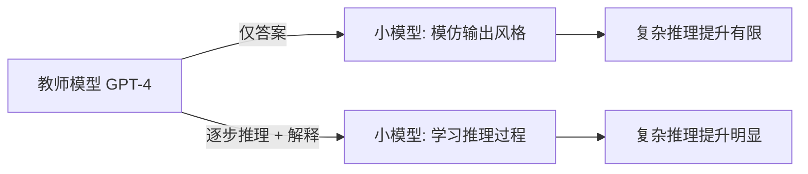

> 经典回顾 / 阅读笔记：本文回顾 Mukherjee et al.（Microsoft）于 2023 年发布的论文《Orca: Progressive Learning from Complex Explanation Traces of GPT-4》，arXiv:2306.02707（https://arxiv.org/abs/2306.02707）。文中事实以原论文为准，仅在已核实的范围内展开。

## TL;DR

- 传统蒸馏多让小模型模仿大模型的「答案」，Orca 主张让小模型学习大模型的「解释过程」。
- 通过收集 GPT-4 的逐步推理、思路说明等丰富信号进行训练，称为「解释微调（explanation tuning）」。
- 这种学过程而非只学结果的方式，使小模型在复杂推理任务上获得明显提升。
- Orca 的核心贡献是把「模仿过程」确立为数据蒸馏中一条值得重视的路线。

## 一、背景与动机

借助强大模型来「教」较小模型，是近年扩散很快的一类做法：用大模型生成大量问答数据，再用这些数据对小模型做指令微调，从而以较低成本获得一个表现尚可的小模型。这条路线直观、廉价，也确实推动了一批轻量模型的出现。

但这类做法存在一个被反复观察到的局限：小模型往往学会了「像」大模型那样说话，却没有真正学会大模型背后的推理能力。原因之一在于训练信号本身——当蒸馏数据只包含「问题 + 最终答案」时，小模型能模仿的只是输出的表层风格与格式，而生成答案所依赖的中间推理、判断依据和思考结构，并没有进入训练数据，自然也无从学起。

Orca 正是针对这一缺口提出的。它的出发点是：如果希望小模型具备更强的推理能力，那么训练数据就不应只停留在结果层面，而要把大模型「怎么想到这个答案」的过程也一并暴露出来。

## 二、核心思想：从模仿答案到模仿过程

Orca 的关键转变可以概括为一句话：**让小模型学习 GPT-4 的解释过程，而不仅仅是最终答案。**

在以往的蒸馏范式中，教师模型只提供结论；而 Orca 让教师模型输出更丰富的信号，包括逐步推理、对解题思路的说明、对中间步骤的解释等。这些「解释痕迹（explanation traces）」承载了大模型组织问题、拆解步骤、逐步逼近答案的方式，相当于把原本隐藏在一次性回答背后的思维链路显式地写了出来。

小模型在这种数据上训练时，目标不再只是「给出对的答案」，而是「按照与教师相似的过程抵达答案」。Orca 把这种以解释信号为核心的训练方式称为**解释微调（explanation tuning）**。其直觉在于：当训练目标从结果对齐扩展到过程对齐，小模型有机会内化一部分推理结构，而不只是复制输出表象。

下面的对比有助于看清两类蒸馏的差异：

| 维度 | 仅学答案的蒸馏 | Orca 的解释微调 |
| --- | --- | --- |
| 训练信号 | 问题 + 最终答案 | 问题 + 逐步推理 / 思路说明 + 答案 |
| 模仿对象 | 输出的表层风格与格式 | 教师模型的推理过程 |
| 期望习得 | 像大模型那样作答 | 学到一部分推理方式 |
| 复杂推理表现 | 提升有限 | 提升相对明显 |

## 三、为什么解释信号会带来差异

把过程纳入训练，之所以可能改善复杂推理，与任务的性质有关。对于事实问答或简单格式化任务，最终答案本身已包含大部分可学信息；但对于需要多步推断的复杂任务，答案只是一个端点，真正决定能否答对的是中间的推理路径。如果训练数据缺失这条路径，小模型就只能从结果反推，往往学到的是脆弱的捷径而非可迁移的推理能力。

解释信号的作用，便是把这条路径补回训练数据中，让小模型在拟合答案的同时，也拟合通往答案的步骤。Orca 强调，这种对「过程」的模仿，是数据蒸馏中一条重要且此前被相对忽视的思路。

下图概括了两种范式在训练信号上的区别：

## 四、定位与方法要点

从方法层面看，Orca 的贡献并不在于某个全新的网络结构，而在于对蒸馏数据形态的重新设计：把教师模型的解释痕迹作为核心监督信号引入小模型训练。论文标题中的「progressive learning」与「complex explanation traces」也点明了这一取向——围绕复杂的解释痕迹来组织学习，使小模型逐步获得更强的推理表现。

需要说明的是，本文仅在已核实的定性结论范围内讨论，不涉及具体的基准分数、模型规模等需逐一核对的数值细节；这些请以原论文为准。总体而言，Orca 提供的是一种关于「蒸馏什么」的视角转变：从蒸馏答案，转向蒸馏推理过程。

## 意义与局限

Orca 的意义在于明确并系统化了「模仿过程而非仅模仿结果」这一思路，为后续以推理过程为核心的蒸馏与小模型训练提供了一个清晰的参照。它提示研究者，小模型与大模型之间的差距，部分可以通过让训练数据携带更丰富的推理信号来缩小，而不必单纯依赖扩大模型规模。

局限同样存在。其一，解释信号来自教师模型，质量与覆盖范围受教师能力约束，教师在某些推理上的偏差或风格也可能被一并继承。其二，模仿过程不等于真正理解，小模型在解释微调后能在多大程度上泛化到训练分布之外的复杂任务，仍取决于数据构造与评估方式。其三，依赖强教师模型生成大量解释数据，本身也带来成本与可获得性方面的现实约束。这些都构成了在解释微调路线上需要继续审视的问题。

> 延伸阅读：Mukherjee et al., "Orca: Progressive Learning from Complex Explanation Traces of GPT-4", arXiv:2306.02707（https://arxiv.org/abs/2306.02707）
