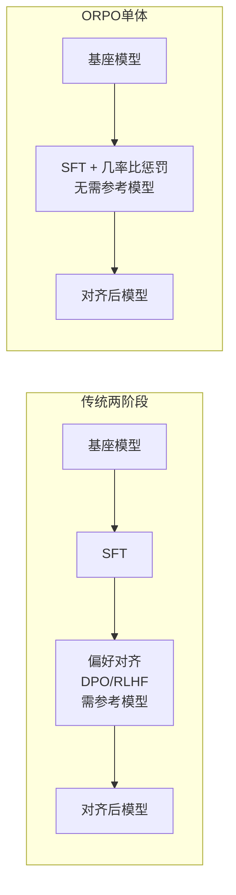

> 本文是对 Hong et al., 2024（EMNLP 2024）《ORPO: Monolithic Preference Optimization without Reference Model》的经典回顾与解读，原文见 arXiv:2403.07691（https://arxiv.org/abs/2403.07691）。下文力求贴合论文原意，对其动机、核心思想与定位做定性梳理。

## TL;DR

- 传统对齐通常分两步走：先做监督微调（SFT），再单独进行一个偏好对齐阶段（RLHF 或 DPO），链路偏长。
- ORPO 提出一种「单体（monolithic）」、无需参考模型的方法，在 SFT 损失里加入一个基于「几率比（odds ratio）」的惩罚项。
- 它把两阶段合成一阶段、去掉了参考模型，从工程与流程上做了显著简化。
- ORPO 与 DPO、SimPO、KTO 同属「直接偏好优化」家族，体现了该方向不断「做减法」的演进趋势。

## 一、背景：对齐流程为什么越来越想「做减法」

让一个大语言模型既会回答问题、又能对齐人类偏好，业界长期采用的是分阶段的范式。第一阶段是监督微调（SFT），用高质量的「指令—回答」样本教模型学会任务格式与基本能力；第二阶段才是偏好对齐，让模型在「更受偏好的回答」和「不受偏好的回答」之间学会取舍。

偏好对齐这一阶段又有不同实现。早期以 RLHF 为代表，需要先训练奖励模型，再用强化学习去优化策略，环节多、调参敏感。后来 DPO 等方法把偏好优化改写成一个可以直接用偏好数据训练的目标，省去了显式的奖励模型与在线采样，大幅简化了流程。

但即便是 DPO，链路依然不算短：它需要保留一个「参考模型」，在训练中约束当前模型不要偏离参考模型太远。这意味着除了正在训练的模型之外，还要额外加载、维护一份参考权重。整体上仍然是「SFT 在前、偏好对齐在后」的两段式结构。

正是在这样的背景下，研究者开始追问：偏好信号能不能不必等到 SFT 之后才用？参考模型这一份额外开销能否省掉？ORPO 给出的回答，正是把这两个问题一起解决。

## 二、核心思想：在 SFT 里加一个「几率比」惩罚项

ORPO 的全称是 Odds Ratio Preference Optimization。它的关键观察在于：单纯的 SFT 只会提升「被偏好回答」的似然，却并不会主动压低「不被偏好回答」的似然——模型对一段糟糕回答的生成倾向，未必会因为只学好样本而下降。

ORPO 的做法是，在标准的监督微调目标之外，引入一个基于「几率比（odds ratio）」的项。直观上，它衡量的是模型生成「被偏好回答」相对于生成「不被偏好回答」的相对倾向：训练时不仅鼓励模型提高好回答的概率，同时通过这个几率比惩罚项，主动拉开好回答与坏回答之间的差距，压低坏回答的相对生成几率。

这样一来，偏好信息不再需要一个独立的后续阶段来注入，而是和 SFT 的语言建模目标融合在同一个损失函数里，在同一次训练中一并完成。论文用「monolithic（单体）」一词来强调这种「一体化」的特征：不再是先后衔接的两个阶段，而是一个统一的训练目标。

更重要的是，几率比是直接基于当前模型自身的输出概率来计算的，并不依赖另一份参考权重。因此 ORPO 不需要参考模型——这正是它区别于 DPO 的一个关键点。

## 三、它在「直接偏好优化」家族中的位置

要理解 ORPO 的意义，把它放到同一谱系里对比会更清楚。RLHF、DPO、KTO、SimPO、ORPO 大体可以按「是否需要奖励模型 / 参考模型」「阶段数」等维度来区分。下表做一个定性梳理（侧重结构差异，不涉及具体指标）。

| 方法 | 偏好对齐方式 | 是否需要奖励模型 | 是否需要参考模型 | 与 SFT 的关系 |
| --- | --- | --- | --- | --- |
| RLHF | 强化学习优化策略 | 需要 | 通常需要 | SFT 之后单独阶段 |
| DPO | 直接用偏好数据优化 | 不需要 | 需要 | SFT 之后单独阶段 |
| KTO | 基于单条样本的偏好/厌恶信号 | 不需要 | 需要 | SFT 之后单独阶段 |
| SimPO | 简化的偏好目标 | 不需要 | 不需要 | SFT 之后单独阶段 |
| ORPO | 几率比惩罚融入 SFT | 不需要 | 不需要 | 与 SFT 合并为一阶段 |

可以看到，这条技术线的演进方向相当一致：从依赖奖励模型与在线采样的 RLHF，到去掉奖励模型的 DPO，再到进一步去掉参考模型、甚至把阶段也合并掉的方案。ORPO 在「去参考模型」与「合并阶段」两个维度上同时往前迈了一步，是这个「不断做减法」趋势中颇具代表性的一环。

下面用一张简图概括 ORPO 与传统两阶段流程在结构上的差异。

## 四、个人随笔

把流程「做减法」总是有吸引力的：少一个阶段、少一份参考权重，意味着更少的工程复杂度与维护成本。ORPO 的思路平和而务实——它没有发明全新的范式，而是顺着「直接偏好优化」既有的方向，把偏好信号更早地、更省地嵌入训练。对于资源有限、希望简化管线的场景，这种一体化思路提供了一个值得了解的选项；至于在具体任务上的取舍，仍要结合自身数据与需求来判断。

## 意义与局限

ORPO 的意义首先在于流程上的简化：它把「SFT + 偏好对齐」两个阶段合并为一个统一的训练目标，并且通过几率比的构造去掉了参考模型，降低了对齐流程的复杂度与额外的显存开销。这对工程落地和方法理解都有清晰的价值，也进一步印证了直接偏好优化方向「做减法」的可行性。

局限方面同样需要客观看待。把偏好对齐与 SFT 合并，意味着两者的训练动态被耦合在同一个目标里，权衡的灵活度可能不如分阶段方案；几率比惩罚项的设计与权重，对不同任务、不同数据分布的适配也需要谨慎调节。此外，作为偏好优化家族中的一员，ORPO 与 DPO、SimPO、KTO 等方法各有侧重，孰优孰劣并无定论，应结合具体场景与数据条件来选择。

> 延伸阅读：ORPO 原文 arXiv:2403.07691（https://arxiv.org/abs/2403.07691），以及 DPO、SimPO、KTO 等同属「直接偏好优化」家族的相关工作。
