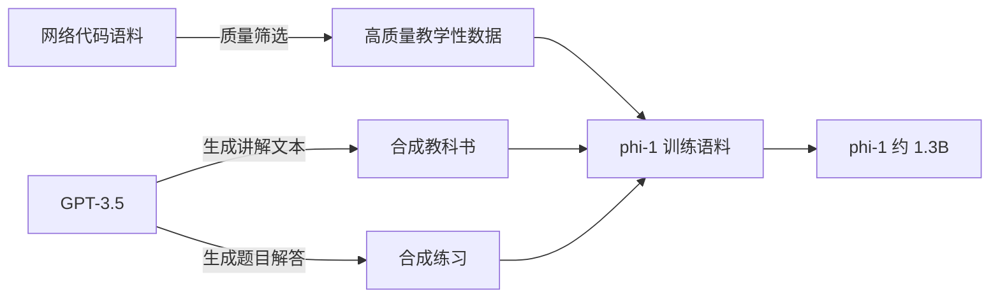

> 本文是对经典工作的阅读笔记。原文为 Gunasekar et al.（Microsoft）于 2023 年发表的 *Textbooks Are All You Need*，arXiv:2306.11644（https://arxiv.org/abs/2306.11644）。文中观点与事实均以原文为准，本文仅作梳理与回顾。

## TL;DR

- 论文提出 phi-1，一个参数量约 1.3B 的代码生成小模型，远小于同期主流代码大模型。
- 核心在于训练数据：以「教科书级质量」为目标，混合从网络筛选的高质量代码数据与用 GPT-3.5 合成的教科书式材料及练习题。
- 中心论点是高质量、结构化的数据能让小模型获得超出其规模预期的能力，对「唯规模论」构成挑战。
- 它是微软 Phi 系列的开篇之作，开启了后续以「数据为王」为主线的小模型研究路线。

## 一、背景与动机

自语言模型进入大模型时代以来，主流叙事长期围绕「规模」展开：更多参数、更多数据、更多算力，往往意味着更强的能力。这一经验被广泛总结为缩放规律（scaling laws），并在很大程度上指导了模型的训练投入方向。

然而，这条路径也带来了显而易见的代价：训练与推理成本高昂、部署门槛高、迭代周期长。在代码生成这一相对结构化、可自动评测的任务上，研究者开始追问一个问题——能力的上限究竟更多取决于「数据有多大」，还是「数据有多好」。

*Textbooks Are All You Need* 正是从这一角度切入。它没有继续在参数规模上做加法，而是把注意力转向训练语料的质量，试图论证：当数据足够「干净」「有教学性」时，一个规模不大的模型同样可以在特定任务上表现出色。

## 二、核心思想：把训练语料当作「教科书」

论文的命名本身就点明了方法论。作者认为，人类学习编程时依赖的是结构清晰、循序渐进、带有讲解与练习的教科书，而非杂乱无章的网络文本。模型的训练或许也应遵循类似逻辑。

围绕这一思路，phi-1 的数据构成可以拆解为几个层次：

- 高质量筛选数据：从网络代码语料中筛出具有「教学价值」的部分，即逻辑清晰、自包含、可读性强、能体现良好编程范式的内容，而非简单堆量。
- 合成教科书材料：借助 GPT-3.5 生成教科书风格的讲解性文本，使语料在内容组织上更接近系统化教学。
- 合成练习题：进一步生成带有练习性质的题目与解答，强化模型在具体任务上的对齐能力。

这种「筛选 + 合成」的组合，目标是让模型在有限的 token 预算内接触到信息密度更高、噪声更低的语料。

## 三、为什么数据质量可能比规模更关键

从直觉上看，高质量数据带来的收益体现在几个方面。其一是信息密度：教学性强的样本在单位 token 内承载了更明确的模式与意图，模型更容易从中归纳出可迁移的规律。其二是噪声控制：网络语料中存在大量风格混乱、逻辑断裂甚至错误的代码，过滤这些内容相当于减少了模型需要「纠错」的负担。其三是分布对齐：练习题式的数据让训练分布更贴近评测与实际使用场景。

下表对「规模优先」与「质量优先」两条思路做一个定性的对照：

| 维度 | 规模优先思路 | 质量优先思路（phi-1） |
| --- | --- | --- |
| 主要杠杆 | 参数量、数据量 | 数据的教学性与纯净度 |
| 数据来源 | 大规模网络抓取 | 筛选数据 + 合成教科书与练习 |
| 模型体量 | 偏大 | 较小（约 1.3B） |
| 成本特征 | 训练与推理成本高 | 相对更轻量 |
| 风险点 | 噪声与冗余 | 合成数据偏差、评测泄漏需谨慎 |

需要说明的是，这一对照是方向性的，并非否定规模的价值；论文要表达的是质量这一被相对忽视的杠杆同样重要。

## 四、对小模型路线的影响

phi-1 被视为微软 Phi 系列的开篇。它所主张的「数据为王」理念，在此后的一系列小模型工作中得到延续与扩展，逐渐形成一条与单纯堆规模不同的研究路线：通过精心设计的数据配方，让小模型在有限算力下覆盖更多实用场景。

这一路线的吸引力在于现实约束。对许多应用而言，模型需要在边缘设备或受限成本下运行，参数规模并非越大越好。如果数据工程能够弥补部分规模差距，那么小模型的可用边界就会被显著拓宽。

## 意义与局限

从意义上看，*Textbooks Are All You Need* 把「数据质量」从一个工程细节提升为可以与规模并列讨论的核心变量，为后续小模型研究提供了清晰的方法论参照，也促使社区更认真地对待数据筛选与合成。

从局限上看，合成数据本身依赖更强模型（如 GPT-3.5）的生成能力，其质量与偏差会被继承到下游；同时，当评测与训练数据都涉及合成内容时，如何严格避免数据泄漏、保证评测结论的可靠性，是这一范式必须持续审视的问题。此外，phi-1 聚焦于代码这一结构化任务，相关结论能在多大程度上推广到更开放的自然语言任务，仍需结合后续工作具体看待。

> 延伸阅读：Gunasekar et al., *Textbooks Are All You Need*, arXiv:2306.11644（https://arxiv.org/abs/2306.11644）
