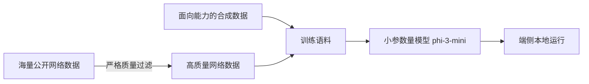

> 本文是对微软 Phi-3 技术报告的阅读笔记与解读。原文：Microsoft, 2024, *Phi-3 Technical Report: A Highly Capable Language Model Locally on Your Phone*, arXiv:2404.14219（https://arxiv.org/abs/2404.14219）。文中数据与结论均以该报告为准，本文只做梳理与理解，不引入报告之外的量化细节。

## TL;DR

- Phi-3 延续了 Phi 系列「数据质量优先」的核心信念：与其一味堆参数，不如把训练数据打磨到极致。
- 旗舰版 phi-3-mini 参数量约 3.8B，规模足够小，可以在手机等端侧设备上本地运行。
- 尽管体量小，phi-3-mini 在多项能力评测上对标了明显更大的模型，再次印证「小模型也能以小博大」。
- 系列还提供 small、medium 等更大规模版本，覆盖从端侧到云端的不同部署需求。

## 一、背景与动机：为什么再做一个「小模型」

近年来大语言模型的能力提升，很大程度上依赖参数规模与训练数据体量的同步扩张，也就是通常所说的「规模定律」。这条路线有效，但代价是模型越来越大，对算力、显存和部署环境的要求越来越高，很难直接落到手机、笔记本这类资源受限的端侧设备上。

微软的 Phi 系列走的是另一条思路。从早期的 Phi 到 Phi-2，它们持续在验证一个假设：模型能力不完全由参数量决定，训练数据的质量同样是关键变量。如果能用「教科书级别」的高质量数据来训练，一个体量小得多的模型也可能学到扎实的推理与语言能力。Phi-3 正是这条路线的延续，并把目标推进到了一个更具象的场景——让一个足够强的模型直接跑在手机上。

## 二、核心思想：数据质量优先

Phi-3 报告中最核心的方法论，并不是某种全新的网络结构，而是对训练数据的极致筛选与构造。其数据策略大致可以拆成两个方向：

- **高质量网络数据的筛选**：并非把海量网页原样喂进模型，而是对公开网络语料做严格的质量过滤，优先保留知识密度高、表达清晰、对推理有帮助的内容。
- **合成数据的构造**：在筛选之外，主动生成用于强化特定能力（如逻辑推理、常识、语言理解）的合成语料，让训练集在「能教会模型什么」这一维度上更有针对性。

这套做法的直觉可以类比人的学习：读一百本精挑细选、循序渐进的教材，往往比漫无目的地翻阅海量杂乱资料更高效。Phi-3 想让模型在有限的参数容量里，尽可能多地装进「有价值的知识与能力」，而不是被低质量数据稀释。

## 三、模型家族与端侧定位

Phi-3 不是单一模型，而是一个覆盖不同规模的家族。旗舰的 phi-3-mini 参数量约 3.8B，是整个系列「手机可跑」定位的代表；在它之上，报告还提供了 small、medium 等更大规模的版本，用于在可接受更多算力时换取更强的整体能力。

不同规模版本的存在，意味着同一套数据方法论可以按需伸缩：端侧场景选用 mini，追求本地、低延迟、离线可用；对能力要求更高、部署环境更宽裕的场景，则可选择更大的版本。下表梳理了这种定位差异（具体量化指标以技术报告为准，此处只作定性对照）：

| 版本 | 相对规模 | 典型定位 |
| --- | --- | --- |
| phi-3-mini（约 3.8B） | 最小 | 手机等端侧本地运行，强调轻量与可用性 |
| phi-3-small | 中等 | 在端侧与云端之间取平衡 |
| phi-3-medium | 较大 | 追求更强综合能力的部署场景 |

phi-3-mini 之所以受到关注，关键在于它把「能装进手机」和「性能对标更大模型」这两件事放在了一起。报告展示了它在多项能力评测上的表现能够对标明显更大的模型——这正是数据质量优先路线想要证明的结论：在同等甚至更少的参数下，好的数据可以换来更高的能力密度。

## 四、意义与局限

Phi-3 的意义，首先在于它进一步夯实了「精心构造的数据能让小模型以小博大」这一判断。它不是孤例，而是 Phi 系列多代工作的连续验证，让「小而强」从一个偶然现象变成一条可复现、可推进的技术路线。其次，端侧本地运行的定位有现实价值：本地推理天然更利于隐私保护、离线可用与低延迟响应，也降低了对云端算力的持续依赖。

但这条路线同样有边界。小模型的参数容量有限，所能承载的世界知识与长尾事实终究不及大模型，在需要广博知识或超长上下文的任务上会更容易触及天花板。此外，「数据质量优先」高度依赖数据筛选与合成流程本身的质量，而这套流程的构建成本、可复现性与潜在偏差，都是需要持续关注的问题。评测表现的「对标」也应结合具体任务与场景理解，而非简单等同于全面超越。

总体而言，Phi-3 更像是对一个方向的有力注脚：在通往更强模型的道路上，除了把规模做大，把数据做精同样是一条值得坚持走下去的路。

> 延伸阅读：Phi-3 Technical Report（arXiv:2404.14219，https://arxiv.org/abs/2404.14219）。
