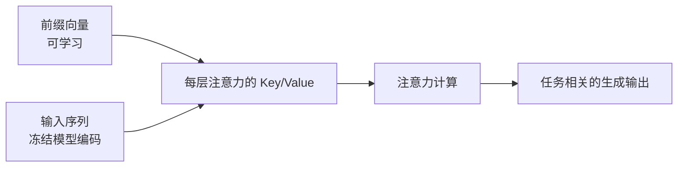

> 本文是对 Li & Liang, 2021, "Prefix-Tuning: Optimizing Continuous Prompts for Generation"（arXiv:2101.00190，https://arxiv.org/abs/2101.00190）的经典回顾与阅读笔记。文中只梳理论文已公开、业界普遍认可的核心思想，不展开任何无法核实的具体数据。

## TL;DR

- Prefix-Tuning 冻结整个预训练语言模型，只学习一小段连续的、任务相关的「前缀」虚拟向量。
- 这些前缀被拼接到每一层注意力的 key/value 之前，从而影响模型在每一层的计算。
- 由此只需训练极少量参数，就能把一个大模型适配到具体的生成任务上。
- 它是参数高效微调（PEFT）的早期代表，与后来的 LoRA、P-Tuning 等同属一脉。

## 一、背景动机：全量微调的代价

随着预训练语言模型规模不断增大，最直接的下游适配方式——对所有参数进行全量微调（fine-tuning）——开始暴露出明显的成本问题。每一个新任务都意味着保存一份完整的模型副本，存储与部署的开销随任务数量线性增长；在多任务、多用户的场景下，这种代价会迅速放大。

一种朴素的替代思路是「提示」（prompting）：在输入前面拼接一段人工设计的文字描述，引导模型完成任务，模型参数完全不动。这种做法几乎不需要训练，但人工离散提示的表达能力有限，且难以稳定地逼近全量微调的效果。Prefix-Tuning 的出发点，正是在「全量微调」与「离散提示」之间，寻找一个既高效、又有足够表达力的中间地带。

## 二、核心思想：把「提示」变成可学习的连续向量

Prefix-Tuning 的关键转变，是把提示从「人写的离散词」改为「可学习的连续向量」。它的做法可以拆解为几个要点：

- **冻结主体模型。** 预训练语言模型的全部参数保持不变，训练过程中不更新。
- **引入前缀。** 在序列前面附加一小段「前缀」向量，这些向量是任务相关的、连续的、可被梯度优化的参数。
- **作用于每一层注意力。** 前缀并非只拼在输入嵌入层，而是作为额外的 key/value，被拼接到模型每一层注意力的 key/value 之前。这样前缀能够在每一层都参与注意力计算，而非仅在最底层施加一次影响。
- **只优化前缀。** 训练时梯度只更新这一小段前缀参数，模型其余部分始终冻结。

直观地说，模型把这段前缀当作一段「虚拟的上文」来看待：后续每个位置在做注意力时，都会「回头看」这段前缀，从而被引导到适合当前任务的生成行为上。与人工提示不同，前缀向量不必对应任何真实词表中的词，因此具备更大的优化自由度。

下面用一张示意图说明前缀在注意力中的位置：

## 三、与相关方法的关系

Prefix-Tuning 通常被视为参数高效微调（Parameter-Efficient Fine-Tuning, PEFT）的早期代表之一。它和后续若干方法共享同一条主线：冻结大模型主体，只引入并训练少量新增参数来完成任务适配。它们在「往哪里加参数、加什么形式的参数」上各有侧重。

| 方法 | 主体模型 | 新增/训练的部分 | 思路特点 |
| --- | --- | --- | --- |
| 全量微调 | 全部更新 | 无新增，更新所有参数 | 表达力强，但每任务一份完整副本 |
| 离散提示 | 冻结 | 人工设计的文字提示 | 几乎零训练，表达力受限 |
| Prefix-Tuning | 冻结 | 每层注意力前的连续前缀向量 | 连续可学习，作用于每一层 |
| LoRA | 冻结 | 注入权重矩阵的低秩增量 | 以低秩分解逼近权重更新 |
| P-Tuning 系列 | 冻结 | 可学习的连续提示向量 | 同属连续提示一脉 |

需要强调的是，上表只刻画思路层面的差异，各方法在不同任务、不同模型规模下的实际表现需结合具体实验来看，本文不展开数值比较。Prefix-Tuning 与 P-Tuning 等同属「连续提示」一脉，而 LoRA 则从「低秩权重更新」的角度切入，二者常被并列讨论，作为 PEFT 家族中不同的代表性路线。

## 四、为何「只调前缀」也能奏效

从机制上理解，预训练语言模型在海量语料上已经习得了丰富的语言能力与世界知识，下游任务往往更像是「如何调用这些已有能力」，而非「重新学习语言」。前缀向量提供了一组可优化的「控制信号」，通过影响每一层的注意力，引导模型在既有能力之上聚焦到目标任务的输出分布。

这也解释了 PEFT 路线的共同动机：当主体模型足够强大时，适配所需的「增量信息」可以被压缩进很小的参数空间里。Prefix-Tuning 把这个增量信息具体化为「每层注意力前的一小段前缀」，从而在存储与训练成本上获得显著收益——每个任务只需保存对应的前缀，而非整份模型。

## 意义与局限

Prefix-Tuning 的意义在于，它较早地系统化了「冻结大模型、只学少量连续参数」这一范式，并把连续提示的作用从输入层扩展到每一层注意力，提升了这类方法的表达能力。它为后续 PEFT 研究提供了重要的思路参照，也让「一个底座模型 + 多套轻量任务参数」的部署形态变得现实可行。

其局限同样值得注意。前缀本身缺乏可解释性，难以像离散提示那样被人直接阅读或编辑；前缀长度、初始化方式等设计需要针对任务进行调试；在不同任务与模型规模上的适配效果也存在差异，需结合具体场景评估。总体而言，它是一条重要而非唯一的技术路线，应放在整个 PEFT 家族的演进脉络中来理解。

> 延伸阅读：Li & Liang, "Prefix-Tuning: Optimizing Continuous Prompts for Generation"，arXiv:2101.00190（https://arxiv.org/abs/2101.00190）
