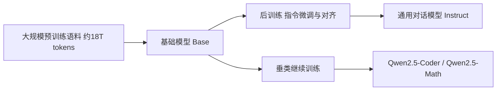

> 本文是对 Qwen 团队技术报告的阅读笔记与解读。原文出处：Qwen Team, 2024, *"Qwen2.5 Technical Report"*, arXiv:2412.15115（<https://arxiv.org/abs/2412.15115>）。文中涉及的具体数值与细节以原报告为准，本文仅作概括性梳理与背景补充。

## TL;DR

- **是什么**：Qwen2.5 是阿里通义千问团队推出的新一代大语言模型家族，覆盖从轻量级到大参数规模（约 0.5B 到 72B 量级）的多种型号，采取开源系列与闭源旗舰并行的策略。
- **核心思想**：通过大幅扩充预训练数据规模（报告提到约 18T tokens 量级）、优化后训练流程，并以专用垂类模型分担代码、数学等高难度领域，实现通用能力与专项能力的协同提升。
- **关键结论**：相比前代，Qwen2.5 在知识、代码、数学、指令遵循以及长上下文等维度上有全面进步，并强化了多语言与结构化输出能力。
- **意义**：作为 2024 年开源模型生态中的重要力量，Qwen2.5 以"全尺寸 + 垂类协同"的产品矩阵，降低了不同算力条件下使用高质量模型的门槛。

## 一、背景与动机

近年来，大语言模型的竞争逐渐从"单一旗舰模型"转向"模型家族"的体系化建设。不同的应用场景对模型有着差异化的需求：端侧与边缘部署偏好小参数、低延迟的型号；企业级复杂任务则需要更大的模型来承载推理与知识密度。Qwen 系列从早期版本起就在持续扩展尺寸谱系，Qwen2.5 延续并强化了这一思路。

报告所反映的动机大致可以归纳为三点：其一，通过更大规模、更高质量的预训练语料，提升模型在知识与推理上的上限；其二，通过覆盖多个参数规模，让用户能够在精度与成本之间灵活取舍；其三，通过专用垂类模型，针对代码、数学等对正确性要求高的领域做深度优化，而非依赖单一通用模型"包打天下"。

## 二、模型家族与产品矩阵

Qwen2.5 最直观的特点是其完整的尺寸谱系。报告中模型规模跨度较大，从适合端侧的小参数型号一直延伸到 72B 量级的大模型，并以开源系列搭配闭源旗舰的方式覆盖不同的使用层级。

| 维度 | Qwen2.5 的做法 |
| --- | --- |
| 参数规模 | 覆盖约 0.5B 到 72B 量级的多档型号 |
| 开放策略 | 开源系列与闭源旗舰并行 |
| 垂类模型 | Qwen2.5-Coder（代码）、Qwen2.5-Math（数学） |
| 能力侧重 | 知识、代码、数学、指令遵循、长上下文、多语言、结构化输出 |

这种"全尺寸 + 垂类"的布局，使得开发者既可以选择轻量模型用于资源受限的环境，也可以在需要更强能力时切换到大模型或专用模型，形成了较为完整的可选项。

## 三、预训练：数据规模与质量

预训练数据的扩充是 Qwen2.5 相比前代的重要变化之一。报告提到其预训练语料达到约 18T tokens 量级，相比上一代有明显增长。需要强调的是，数据规模的扩大并不只是数量上的堆叠，更关键的是对数据配比与质量的优化——在知识性文本、代码、数学等领域增加高质量来源，有助于模型在这些方向上获得更扎实的基础能力。

数据层面的改进通常会在多个下游能力上同时体现：更丰富的知识语料提升事实性问答表现，更多的代码与数学数据增强推理与生成的严谨性，而长文档语料则为长上下文能力打下基础。报告中对各项能力的提升做了定性与定量的描述，具体分数以原文为准。

## 四、后训练与能力强化

在预训练得到基础模型之后，后训练阶段（指令微调与对齐）决定了模型在实际交互中的表现。Qwen2.5 在这一环节强化了指令遵循、长文本处理与结构化输出等方面的能力。结构化输出（例如稳定地生成 JSON 等格式）对于将模型接入实际系统、构建工具调用与智能体应用尤为重要，因为下游程序往往依赖可预测的输出格式来解析结果。

下面用一张简化的流程图来表示从基础模型到可用模型的大致路径：

## 五、垂类模型：Coder 与 Math

通用模型在面对代码生成、数学推理这类对正确性要求极高的任务时，往往受限于通用语料的覆盖密度。Qwen2.5 通过专门的 **Qwen2.5-Coder** 与 **Qwen2.5-Math** 来分担这部分压力。

- **Qwen2.5-Coder**：面向代码理解与生成，强化在多种编程语言上的能力，适用于代码补全、生成与辅助开发等场景。
- **Qwen2.5-Math**：面向数学推理，针对数学问题求解链路做专门优化。

这种"通用 + 垂类"的协作模式，使得通用模型可以专注于广泛场景的对话与知识任务，而把对专业性要求高的领域交给经过针对性训练的模型来处理。

## 六、长上下文与多语言

长上下文能力是近年来大模型的重要演进方向，它直接影响模型处理长文档、长对话与检索增强等任务的可用性。Qwen2.5 在长上下文方面有所加强，使其更适合需要一次性处理大量文本的应用。

多语言能力同样是 Qwen 系列的传统优势之一。覆盖多种语言不仅扩大了模型的适用范围，也对全球化的应用场景更为友好。报告对多语言覆盖与表现做了相应说明，具体语种范围与评测结果以原文为准。

## 七、意义与局限（客观陈述）

从生态角度看，Qwen2.5 作为 2024 年开源模型领域的重要力量，其完整的尺寸谱系与垂类模型矩阵，为不同算力条件、不同任务需求的使用者提供了较为丰富的选择，降低了获取高质量模型的门槛。开源部分也为研究与二次开发提供了基础。

需要客观看待的是：其一，技术报告通常会在自身设定的评测集合上展示优势，跨模型的横向比较应结合统一、独立的基准来综合判断；其二，更大的数据规模与更强的能力提升，往往伴随训练与推理成本的增加，实际落地时仍需在精度与成本之间权衡；其三，长上下文、多语言与结构化输出等能力的真实表现，会因具体任务与数据分布而有所差异，建议结合自身场景进行验证。具体的实验数字、评测分数与配置细节，请以 arXiv:2412.15115 原报告为准。

> 延伸阅读：Qwen Team, "Qwen2.5 Technical Report", arXiv:2412.15115（<https://arxiv.org/abs/2412.15115>）。
