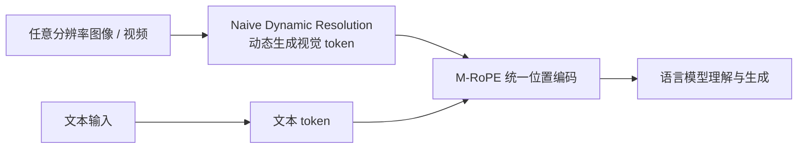

> 本文是对阿里团队 Qwen2-VL 技术报告的阅读笔记。原文：Wang et al. (Alibaba), 2024, "Qwen2-VL: Enhancing Vision-Language Model’s Perception of the World at Any Resolution", arXiv:2409.12191（https://arxiv.org/abs/2409.12191）。以下内容基于报告公开描述整理，力求还原其核心设计思路，不涉及未公开的细节。

## TL;DR

- Qwen2-VL 是阿里推出的视觉语言模型（VLM），核心目标是提升模型对「任意分辨率」图像与视频的感知能力。
- Naive Dynamic Resolution 让模型能直接处理不同分辨率的图像，并动态映射为数量可变的视觉 token，更接近人眼的观察方式。
- 多模态旋转位置编码（M-RoPE）统一编码文本、图像与视频的位置信息，为长视频理解提供支撑。
- 模型提供多种参数规模，是当前开源多模态模型生态中的重要一员。

## 一、背景与动机

视觉语言模型要做的事，是把图像、视频这类视觉信号与文本对齐到同一套表示空间中，从而完成看图问答、文档理解、视频描述等任务。然而在很长一段时间里，主流做法存在一个隐含的约束：把输入图像统一缩放（resize）到固定的分辨率，再切分为固定数量的图块（patch）送入视觉编码器。

这种「固定分辨率」范式带来两个问题。其一，面对高分辨率的文档、图表或密集文字场景，强行降采样会损失细节，模型看不清小字；其二，面对极端长宽比或超大画幅的图像，统一缩放会引入形变或大量无效填充。人类观察世界时并不会先把画面压缩到某个固定尺寸，而是按内容的疏密自然分配注意力。Qwen2-VL 的出发点，正是让模型的感知方式更贴近这种「按需分配」的直觉，同时把这一思路延伸到视频这一时间维度更长的模态上。

## 二、Naive Dynamic Resolution：动态分辨率感知

Qwen2-VL 的第一项核心设计是 Naive Dynamic Resolution（朴素动态分辨率）。它的基本思想是：不再把所有图像强制缩放到同一尺寸，而是允许模型接收任意分辨率的输入，并根据图像本身的大小，动态地生成数量不等的视觉 token。

直观地说，一张信息密集、分辨率高的图会被映射为更多的视觉 token，从而保留更多细节；一张简单的小图则只需要较少的 token。这样做的好处是显而易见的：模型在处理文档、表格、界面截图等场景时，能够更充分地利用原始像素信息，而不必在预处理阶段就丢失关键内容。

这一机制让「视觉 token 的数量」从一个固定的超参数，变成了随输入内容自适应变化的量。它与人眼的工作方式形成呼应——面对细节丰富的画面投入更多「观察带宽」，面对简单画面则相对省力。

## 三、M-RoPE：面向多模态的旋转位置编码

第二项核心设计是多模态旋转位置编码（Multimodal Rotary Position Embedding, M-RoPE）。位置编码解决的是「模型如何知道每个 token 处在序列什么位置」的问题。旋转位置编码（RoPE）在纯文本大模型中已被广泛采用，但文本是一维序列，而图像是二维平面、视频还额外带有时间维度。

M-RoPE 的思路是把位置信息拆解到多个维度上，统一编码文本、图像与视频三类模态的位置关系。这样，模型既能理解一段文字中词与词的先后顺序，也能理解一张图中区域之间的空间关系，还能理解一段视频里帧与帧之间的时间先后。正是这种对时间维度的显式建模，为长视频理解提供了基础：模型可以把跨越较长时间跨度的画面组织为连贯的序列来处理，而不是把视频简单当作一堆孤立的图片。

下表概括了两项核心设计各自解决的问题：

| 核心设计 | 面向的问题 | 带来的能力 |
| --- | --- | --- |
| Naive Dynamic Resolution | 固定分辨率丢失细节、引入形变 | 处理任意分辨率图像，token 数量自适应 |
| M-RoPE | 文本、图像、视频位置编码不统一 | 统一多模态位置表示，支持长视频理解 |

## 四、整体处理流程

从输入到输出，Qwen2-VL 大致遵循「视觉编码 — 多模态对齐 — 语言模型生成」的路径。视觉端负责把任意分辨率的图像或视频帧转化为视觉 token，位置信息由 M-RoPE 统一标注，随后与文本 token 一同进入语言模型进行理解与生成。

需要说明的是，上图仅为对报告所述思路的示意性梳理，用以帮助理解各模块之间的关系，并非严格的工程实现细节。

## 五、模型规模与定位

Qwen2-VL 以多种参数规模对外提供，覆盖了从相对轻量到较大规模的不同需求，便于在不同算力条件下部署与研究。作为开源多模态模型生态的一部分，它的价值不仅在于单一模型的能力，也在于为社区提供了可复现、可二次开发的基础，推动「任意分辨率」与视频理解这两个方向的探索。关于各规模模型在具体基准上的表现，建议以官方报告与公开发布信息为准。

## 意义与局限

Qwen2-VL 的意义在于，它把「让模型按内容自适应地感知视觉信息」这一直觉，落实为 Naive Dynamic Resolution 与 M-RoPE 两项具体设计，并将其从静态图像扩展到长视频这一更具挑战的模态。这为文档理解、图表识别、视频问答等对分辨率与时间连续性敏感的任务提供了更合适的基础架构。

从局限来看，动态分辨率意味着视觉 token 数量随输入变化，对于超高分辨率或超长视频，序列长度与计算开销的控制仍是需要权衡的现实问题；长视频理解的实际效果也受限于训练数据的覆盖范围与评测方式。此外，多模态模型在细粒度感知、复杂推理与可靠性方面仍有共性挑战。具体能力边界，宜结合原始报告与后续社区实践综合判断。

> 延伸阅读：Qwen2-VL 技术报告 arXiv:2409.12191（https://arxiv.org/abs/2409.12191）。
