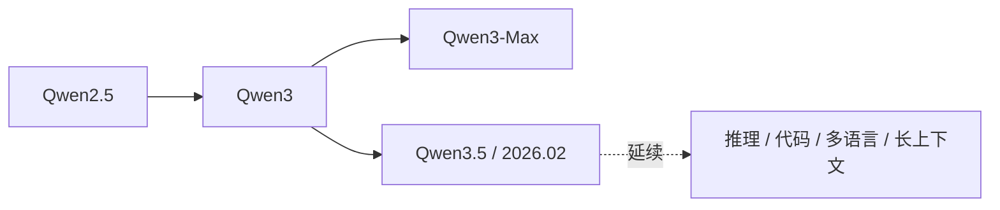

> 本文是对 **Qwen3.5 系列**（Alibaba Qwen Team, 2026 年 2 月发布）的一篇前沿观察笔记。需要说明的是，截至本文写作，Qwen3.5 的公开技术细节仍较为有限，因此下文只就可确认的信息做概括性梳理，并结合 Qwen 历代版本的脉络做背景解读，不对未公开的参数、架构与评测分数做任何揣测。原始信息以 Qwen 官方博客为准：[qwen.ai](https://qwen.ai)。

## TL;DR

- 阿里 Qwen 团队于 **2026 年 2 月** 发布 Qwen3.5 系列，是继 Qwen3 之后的一次重要迭代。
- 它延续了 Qwen 一贯的产品哲学：覆盖多种参数规模，强调推理、代码、多语言与长上下文能力。
- 目前公开的技术细节有限，本文不展开具体参数与跑分，只陈述可确认的方向性信息。
- 把 Qwen3.5 放进 Qwen2.5 → Qwen3 → Qwen3-Max 的演进脉络里，更能理解这次更新的定位。

## 一、背景：Qwen 家族走到了哪一步

要理解 Qwen3.5，先要把它放回 Qwen 系列近两年的演进节奏中。Qwen（通义千问）是阿里巴巴推出的大语言模型家族，最鲜明的特点之一是**坚持开源与多规模覆盖**：从适合端侧、轻量部署的小参数版本，到面向高复杂度任务的大参数版本，形成了一条完整的"模型货架"。

在 Qwen3.5 之前，几个关键节点值得回顾：

- **Qwen2.5**：进一步夯实了多语言、代码与数学能力，并在不同尺寸上保持了较一致的体验，成为开源社区中被广泛采用的基座之一。
- **Qwen3**：在推理能力上做了重点强化，延续多规模策略，覆盖从小到大的多档位模型。
- **Qwen3-Max**：定位于家族中的旗舰能力档位，面向更复杂、更需要深度推理的场景。

这条脉络透露出 Qwen 团队稳定的迭代逻辑：**以"主版本"奠定架构与训练范式，再用小版本号（如 .5）做能力打磨与扩展**。Qwen3.5 正是这种"中间迭代"的产物——它不必是架构的彻底重写，而更像是在 Qwen3 既定方向上的一次集中升级。

## 二、Qwen3.5 这次更新的可确认信息

需要再次强调：Qwen3.5 的公开细节有限。在不编造数字与编号的前提下，可以确认的要点集中在两个层面。

**其一，发布时间与代际定位。** Qwen3.5 系列由阿里 Qwen 团队在 2026 年 2 月发布，是 Qwen3 之后的一次重要迭代。从命名约定看，".5" 通常意味着在主版本框架内的能力增强与覆盖扩展，而非推倒重来。

**其二，能力方向。** Qwen3.5 延续了 Qwen 一贯强调的几条主线：覆盖多种规模、强调推理、强调代码、强调多语言、强调长上下文处理能力。这几条主线在 Qwen2.5、Qwen3 上都有清晰体现，Qwen3.5 大概率是在这些维度上继续向前。

除此之外的具体参数量、模型架构选择以及在各类基准上的评测分数，目前公开资料不足以支撑确切结论，本文不作展开。读者若需要权威数据，应以 Qwen 官方博客的正式发布说明为准。

## 三、从"主版本—小版本"看 Qwen 的迭代节奏

把历代信息整理成表格，更能看清 Qwen3.5 在家族中的位置（注意：以下仅为方向性归纳，不含未公开的具体指标）：

| 版本 | 大致定位 | 公认的能力强调点 |
| --- | --- | --- |
| Qwen2.5 | 广泛采用的开源基座 | 多语言、代码、数学 |
| Qwen3 | 主版本迭代 | 推理能力强化、多规模覆盖 |
| Qwen3-Max | 旗舰能力档位 | 面向复杂任务的深度推理 |
| Qwen3.5 | Qwen3 之后的重要迭代（2026.02） | 延续推理 / 代码 / 多语言 / 长上下文方向 |

这种"主版本打地基、小版本做精修"的节奏，对使用方有现实意义：基座与生态（部署工具链、社区适配、下游微调经验）在小版本之间通常更容易平滑迁移，升级成本相对可控。

下图概括了这一演进脉络：

## 四、对使用者与社区的观察视角

对开发者和研究者而言，关注 Qwen3.5 时有几条务实的视角：

- **多规模意味着选择空间。** Qwen 家族一贯提供从小到大的多档位模型，使用方可以按算力预算与延迟要求在"能力—成本"之间权衡，这一点在小版本迭代中通常会被延续。
- **开源生态的连续性很重要。** 开源基座的价值不仅在于模型本身，还在于围绕它沉淀的推理框架、量化方案与微调经验。代际之间的连续性越好，迁移成本越低。
- **以官方发布为准。** 在细节尚未充分公开时，对参数、架构、分数的任何具体描述都应回到官方说明，避免被二手信息误导。

## 意义与局限

从意义上看，Qwen3.5 延续了 Qwen 家族稳定而高频的迭代节奏，在 Qwen3 奠定的方向上继续推进推理、代码、多语言与长上下文能力，并保持多规模覆盖与开源策略——这对依赖开源基座的研究与工程社区是积极信号。

从局限上看，本文最大的克制之处正在于：**Qwen3.5 当前可公开核实的信息有限**。在缺乏官方完整技术报告与基准数据的情况下，任何对其参数量、架构创新点与具体性能排名的断言都不够严谨。因此本文只做了方向性、定性的梳理，把确切结论留给官方资料与后续社区复现验证。前沿观察的价值，恰恰在于既保持关注，又对未经证实的细节保持审慎。

> 延伸阅读：Qwen 官方博客 [qwen.ai](https://qwen.ai)，以及 Qwen2.5、Qwen3 的历代发布说明。
