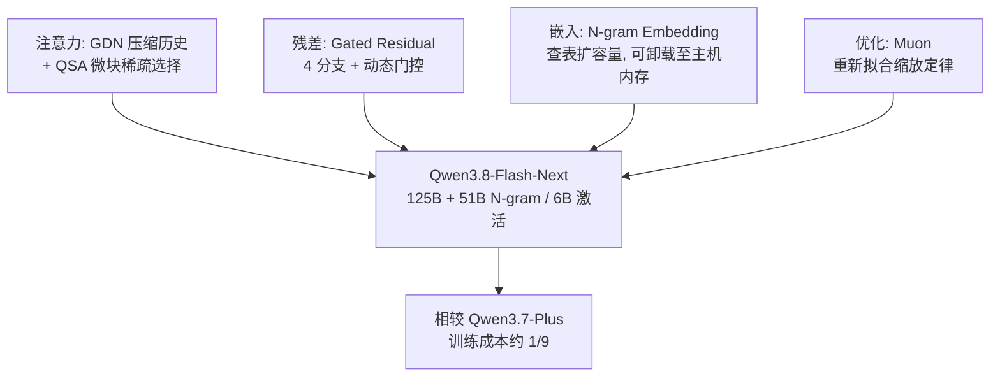

> 本文是对 Qwen 团队 2026 年 8 月 26 日发布的 Qwen3.8-Flash-Next 的解读笔记，材料来源为官方 GitHub 仓库、模型卡与技术博客（https://qwen.ai/blog?id=qwen3.8-flash-next ），配套技术报告为《On the Design of Qwen3.8-Next Architecture: Evaluation, Efficiency, and Training Stability》（Qwen Team, Alibaba Group, 2026 年 8 月）。以下为个人整理与解读，具体结论请以官方材料为准。

## TL;DR

- Qwen3.8-Flash-Next 是一个多模态 MoE 模型，同时被官方定位为 Qwen4 所用架构的早期预览——角色与当年 Qwen3-Next 对 Qwen3.5 的关系相同。
- 规格上是 125B 主模型 + 51B 额外的 N-gram 嵌入，每 token 激活 6B 参数。
- 四项系统性升级分别落在注意力、残差、嵌入与优化器：GDN + QSA 混合注意力、Gated Residual、N-gram Embedding、Muon 优化器。
- 官方称相较 Qwen3.7-Plus，训练成本约为其 1/9，同时在编码与办公类任务上能力更强。

## 一、定位：为什么先放一个「Next」

Qwen 家族有一个已经形成惯例的做法：在新一代模型家族全面铺开之前，先单独放出一个采用新架构的中等规模模型，让社区提前检验。上一次是 Qwen3-Next——它引入的 Gated DeltaNet + Gated Attention 混合设计，此后被 Qwen3.5、3.6、3.7、3.8 各系列沿用。这一次的 Qwen3.8-Flash-Next 扮演同样的角色，只不过对标的是 Qwen4。

这个做法的好处对双方都成立：官方能在真实使用中提前暴露架构问题，社区则获得一个可自部署、可研究的新架构样本。需要区分的是两个相近的名字——按官方模型卡，**Qwen3.8-Flash-Next** 是开放权重与架构预览版本，面向研究与自部署；**Qwen3.8-Flash** 是基于它的生产 API 版本，默认提供 1M 上下文与官方内置工具。

## 二、四项升级

官方把改动组织为四个方面：注意力、残差、嵌入、优化。这个分类本身就说明了当下架构探索的重点已经从「加深加宽」转向「在同等算力下提高容量效率」。

**1）注意力：GDN + QSA 混合架构。** 两个组件分工明确。Gated DeltaNet（GDN）承担历史信息的高效压缩，属于线性注意力一路；Qwen Sparse Attention（QSA）则使用一个压缩过的轻量索引器（indexer），以微块（micro-block）粒度挑选出重要的上下文，从而大幅降低长序列上的注意力开销。

值得注意的是这两条技术路线的合流。本站此前写过 DeepSeek-V3.2 的稀疏注意力 DSA，也在上个月的 Kimi K3 笔记里记录过混合线性注意力 KDA。到这里可以看出一个清晰的趋势：**头部团队普遍不再指望单一机制解决长上下文，而是让「线性压缩」与「稀疏选择」各管一段**——前者以低成本维持一个可用的历史摘要，后者负责在需要时精确取回关键片段。

**2）残差：Gated Residual（GR）。** 这一项把残差流从单条拓宽为 4 个分支，并用一个动态门控来控制读写。目标是加强跨层的信息流动与训练稳定性。这与 Kimi K3 的 Attention Residuals 在动机上是同一类问题——深层网络里信息沿深度衰减——只是解法不同：一个加宽残差流并门控，一个让每层可回看所有前层。

**3）嵌入：N-gram Embedding。** 这是四项里最有意思的一项。它用局部上下文去查一张嵌入表，从而以极小的额外计算换取模型容量的扩张。这里的取舍很清楚：125B 的主模型之外，额外的 51B 参数全部是嵌入表——参数量增加了 40%，但因为查表几乎不产生计算，每 token 激活的参数仍只有 6B。

官方还提到这张表可以卸载到主机内存，并通过异步预取与模型计算重叠。这个细节说明该设计从一开始就把部署考虑进来了：巨大的嵌入表不必常驻显存。

**4）优化：Muon 优化器。** 官方说明围绕三处做了打磨：正交化的精度、Muon 与 AdamW 之间的分工、以及融合参数的拆分处理；同时针对新架构重新拟合了缩放定律。最后一点尤其值得留意——架构变了，原有的缩放定律外推就不再可靠，重新拟合是必要而非可选的工作。

## 三、规格与成本

| 项目 | 内容 |
| --- | --- |
| 主模型参数 | 125B |
| 额外 N-gram 嵌入 | 51B |
| 每 token 激活参数 | 6B |
| 模态 | 多模态（文本 + 视觉） |
| 定位 | Qwen4 架构早期预览 / 开放权重 |
| 训练成本 | 官方称约为 Qwen3.7-Plus 的 1/9 |

「1/9 训练成本且能力更强」是官方给出的核心卖点，但这个对比的口径需要留意：Qwen3.7-Plus 与 Flash-Next 定位并不相同（一个 Plus 档、一个 Flash 档），因此它更像是「用新架构以更低成本达到甚至超过上一代更高档位」的表述，而非同档位的严格对照。具体基准数字官方放在博客中，本文不逐项转述。

生态支持方面，官方文档列出了 transformers、llama.cpp、MLX、Unsloth 的本地运行路径，以及 SGLang、vLLM、TokenSpeed 的服务方案。对一个 6B 激活的模型来说，这一层的完备度直接决定它能否被广泛使用，也是 Flash 档位相对旗舰档位的真正优势。

## 四、放回 Qwen 的技术脉络

把这次发布放进演进线里看会更清楚。Qwen3-Next 确立了「混合注意力」这个基本盘并被后续多代沿用，Qwen3.8-Flash-Next 在此之上做了两件事：把混合的另一半从 Gated Attention 换成 QSA 这种带索引器的稀疏注意力，以及在注意力之外向残差、嵌入、优化器三个方向同时扩展。

换个说法，前一轮的主题是「注意力该怎么算」，这一轮的主题是「算力预算固定时，还能从哪里挖出容量」。N-gram Embedding 是这个主题最直白的体现：它几乎不增加计算，只增加内存占用——而内存比算力便宜，且可以卸载。

## 意义与局限

意义层面，Qwen3.8-Flash-Next 的价值一部分在架构本身，一部分在「提前开放」这个动作。就架构而言，它把长上下文的解法明确推向「线性压缩 + 稀疏选择」的组合，并在注意力之外找到了残差与嵌入两个可挖掘的维度；N-gram Embedding 用可卸载的内存换容量，是一个思路清晰、对部署也友好的设计。就动作而言，在 Qwen4 全面铺开之前把新架构以开放权重形式交给社区检验，客观上加速了生态对这批技术的吸收——过去一年多个团队沿用 Qwen3-Next 的混合设计，已经证明这条路径有效。

局限层面需要几点克制。本文所依据的主要是官方材料，而官方材料在选择对比对象与呈现口径上必然有其倾向，「1/9 训练成本」与「能力更强」都需要第三方评测确认，尤其是跨档位对比的合理性。四项改动是打包发布的，各自贡献无法从公开信息中剥离，若要判断哪一项最值得借鉴，还得等消融或复现工作。N-gram 嵌入表卸载到主机内存虽然缓解了显存压力，却引入了对内存带宽与预取调度的依赖，不同硬件配置下的实际收益可能差异很大。最后，「架构预览」这个定位本身就意味着设计仍可能在 Qwen4 中被调整，现在下的任何结论都应留有余地。

> 延伸阅读：Qwen3.8-Flash-Next 官方博客（https://qwen.ai/blog?id=qwen3.8-flash-next ）与 GitHub 仓库（https://github.com/QwenLM/Qwen3.8-Flash-Next ）。长上下文的相邻思路可参考本站 DeepSeek-V3.2 与 Kimi K3 两篇笔记。
