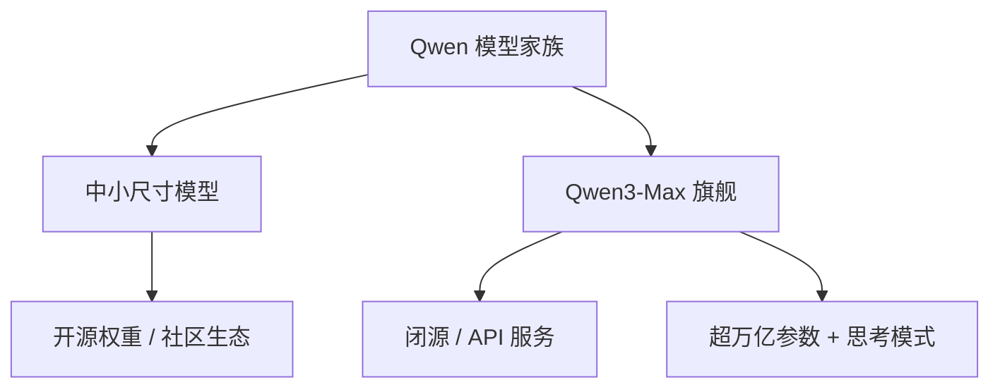

> 本文是对阿里巴巴 Qwen 团队 2025 年发布的 Qwen3-Max 的一篇技术解读与前沿观察。Qwen3-Max 于 2025 年 9 月先以预览版亮相、10 月转为正式版，相关介绍可见 Alibaba Cloud 博客文章「Just Scale it」（Alibaba Qwen Team, 2025, Qwen3-Max）。

## TL;DR

- **是什么**：Qwen3-Max 是阿里巴巴在 2025 年下半年推出的旗舰大语言模型，参数规模超过 1 万亿，是 Qwen 家族迄今最大、能力最强的成员。
- **核心思想**：延续「Just Scale it」（持续扩大规模）的路线，在更大的参数与训练规模上追求综合能力的全面提升，并支持「思考模式」。
- **关键结论**：在编码（coding）与智能体（agentic）类任务上表现突出，强调复杂推理与工具调用场景下的实用能力。
- **意义**：Qwen3-Max 不再开源权重，转为闭源 / API 形态，标志着阿里在旗舰超大模型上的策略调整——开源中小模型、闭源旗舰。

## 一、背景：从开源生态到旗舰闭源

Qwen（通义千问）系列是阿里巴巴在大模型领域持续投入的产物。过去几代 Qwen 模型以「开源 + 多尺寸」著称：从小参数量到较大参数量覆盖广泛，权重公开可下载，配合宽松的许可，吸引了大量开发者在其上做微调、蒸馏与二次开发，逐渐形成一个活跃的开源社区生态。

在这样的背景下，Qwen3-Max 的出现具有标志性意义。它把规模推到了万亿参数级别，是 Qwen 家族迄今最大、最强的模型。与以往不同的是，这一旗舰模型不再公开权重，而是以闭源、API 服务的形态对外提供。换言之，阿里在产品结构上出现了清晰的分层：中小尺寸模型继续走开源路线服务社区，而最顶端的旗舰则收归闭源，通过云服务交付。

## 二、核心思想：「Just Scale it」

Qwen3-Max 的对外叙事关键词是「Just Scale it」——把规模做大。这条路线的底层假设是业界已经反复观察到的现象：在数据、参数与算力同步扩展的条件下，模型在多类任务上的综合能力会随之持续提升。Qwen3-Max 把参数规模推到超过 1 万亿，正是这种扩展信念的直接体现。

需要强调的是，「规模」并非单指参数数量，它通常还伴随着训练数据规模、训练算力投入以及工程系统能力的同步放大。对于万亿参数级别的模型而言，训练与推理都对底层基础设施提出了很高的要求，这也是其更适合以云端服务形态交付的客观原因之一。

此外，Qwen3-Max 支持「思考模式」（thinking mode）。这类模式允许模型在给出最终答案前进行更充分的中间推理，从而在需要多步逻辑、规划与校验的复杂问题上获得更稳健的表现。

## 三、能力侧重：编码与智能体

从公开信息看，Qwen3-Max 的能力亮点集中在两个方向：

- **编码（coding）**：在代码生成、理解与修改等任务上表现强，面向开发者的实际使用场景。
- **智能体（agentic）**：在需要规划、工具调用、与外部环境多轮交互的任务上具备较强能力，契合当前 agent 应用的趋势。

这两个方向并非孤立，而是高度相关：现代智能体系统往往把「写代码、调用工具、执行并根据反馈迭代」串联成闭环，对模型的推理深度与稳定性都提出了更高要求。Qwen3-Max 对「思考模式」的支持，与这两类任务的需求在方向上是一致的。

## 四、策略分层：开源与闭源的并行

Qwen3-Max 最值得关注的，不只是规模本身，而是它所代表的产品策略转向。下表概括了这种分层的对照关系：

| 维度 | 中小尺寸 Qwen 模型 | Qwen3-Max（旗舰） |
| --- | --- | --- |
| 权重 | 开源、可下载 | 闭源、不公开 |
| 交付形态 | 本地部署 / 自托管 / API | API 服务为主 |
| 规模 | 相对较小，覆盖多档 | 超 1 万亿参数 |
| 目标人群 | 社区、二次开发者 | 追求最强能力的应用方 |
| 战略角色 | 生态扩散与心智占领 | 能力上限与商业变现 |

这种「开源中小模型 + 闭源旗舰」的组合，让阿里既能借助开源生态维持影响力与开发者粘性，又能把最强能力收拢为可商业化的服务。它与业界部分厂商「全面闭源」或「全面开源」的路线都不相同，体现出一种折中的平台化思路。

下图勾勒了这一分层的大致结构：

## 意义与局限

从意义上看，Qwen3-Max 一方面验证了「持续扩大规模」在工程与能力上的可行性，把 Qwen 家族的能力上限显著抬高；另一方面，它通过开源与闭源并行的产品结构，给出了一种兼顾生态与商业的平衡范式。对于关注编码与智能体应用的开发者而言，它提供了一个能力更强的可选项。

局限与值得留意之处同样存在。其一，旗舰模型转为闭源意味着权重不可获取，研究者无法像对待开源模型那样自由地审查、微调或本地部署，复现与可控性受限。其二，万亿参数级模型对算力与成本要求高，以 API 形态使用时需要权衡延迟、成本与数据合规等因素。其三，由于官方未公开全部精确的参数与评测细节，外界对其能力边界的判断仍需以公开披露为准，避免过度外推。总体而言，Qwen3-Max 既是一次规模与能力的推进，也是一次产品策略的明确表态。

> 延伸阅读：Alibaba Cloud 博客「Just Scale it」（Alibaba Qwen Team, 2025, Qwen3-Max）。
