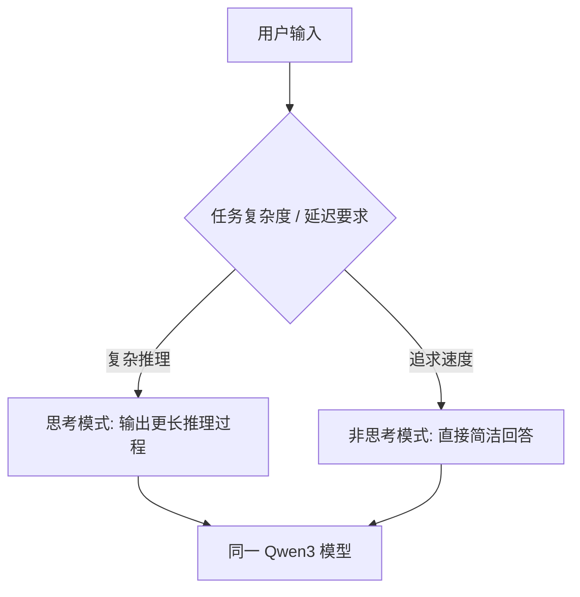

> 本文是对 Qwen3 技术报告的阅读笔记与解读。原文出处：Qwen Team, 2025, "Qwen3 Technical Report", arXiv:2505.09388（https://arxiv.org/abs/2505.09388）。文中事实以技术报告为准，解读部分为笔者整理，未公开的精确数据不在讨论范围之内。

## TL;DR

- **是什么**：Qwen3 是 Qwen 系列的新一代开源大语言模型，同时提供稠密（dense）与混合专家（MoE）两类架构，参数规模覆盖从 0.6B 到 235B 的广阔区间。
- **核心思想**：在同一个模型内部统一「思考模式」与「非思考模式」，让用户按需在「深入推理」与「快速响应」之间切换，而无需更换模型。
- **关键结论**：旗舰 Qwen3-235B-A22B 采用 MoE 架构，总参数约 235B，每个 token 仅激活约 22B，以较低的推理开销支撑大模型容量。
- **意义**：以一个统一的模型族覆盖多种规模与场景，强调多语言、长上下文与代码/数学能力，进一步降低高质量开源模型的使用门槛。

## 一、背景与动机

开源大模型的演进，长期面临两组张力。其一是**规模与成本**：稠密模型参数越大效果越强，但推理时全部参数都要参与计算，部署成本随规模线性上升；混合专家（MoE）则通过「总参数大、激活参数小」的方式，在保持容量的同时压低单次推理开销。其二是**推理深度与响应速度**：复杂的数学、代码与多步推理任务需要模型「想得更久」，而日常对话、检索式问答又追求低延迟，二者的需求并不一致。

Qwen 系列此前已在开源社区形成较广的使用基础。Qwen3 的目标，是在一个统一的模型族里同时回应上述两组张力：用稠密与 MoE 两类架构覆盖不同的规模与成本档位，并在模型层面引入可切换的推理模式，让「深思」与「快答」共存于同一权重之中。Qwen3 系列模型在 2025 年 4 月底陆续发布，对应的技术报告于 5 月公开。

## 二、稠密与 MoE 并举的模型族

Qwen3 最直观的特征，是它不是单一模型，而是一整个**模型族**。参数规模从 0.6B 一直延伸到 235B，既包含适合端侧与轻量部署的小模型，也包含面向高复杂度任务的大模型；在架构上同时提供稠密与 MoE 两条路线。

旗舰的 **Qwen3-235B-A22B** 是其中的代表：它是 MoE 模型，总参数约 235B，但每处理一个 token 只激活约 22B 参数。这种「总量大、激活少」的设计，使模型能够拥有大容量带来的表达能力，同时把单次前向计算控制在远小于同等总参数稠密模型的水平，从而在效果与推理成本之间取得平衡。

| 维度 | 稠密模型 | MoE 模型 |
| --- | --- | --- |
| 推理时参与计算的参数 | 全部参数 | 仅激活的部分专家 |
| 容量与成本关系 | 成本随规模线性上升 | 总容量大、单次激活小 |
| 在 Qwen3 中的角色 | 覆盖中小规模与轻量部署 | 支撑旗舰级大容量场景 |
| 代表 | 系列中的 dense 各档 | Qwen3-235B-A22B（约 235B 总参 / 约 22B 激活） |

模型族的好处在于「同源」：不同规模的模型共享设计思路与能力取向，使用者可以根据延迟、显存与任务难度选择合适的档位，而不必在能力风格迥异的模型之间反复迁移。

## 三、统一的「思考模式」与「非思考模式」

Qwen3 最具特色的设计，是把两种推理风格统一进同一个模型：

- **思考模式（thinking）**：面对数学证明、代码生成、多步逻辑等复杂任务时，模型进入深入推理状态，输出更长的中间推理过程，再给出结论。
- **非思考模式（non-thinking）**：面对简单问答、闲聊或对延迟敏感的场景时，模型直接给出简洁回答，追求速度与效率。

二者的关键差异在于：它们由**同一个模型**承载，而不是两个独立模型。使用者可以根据任务需要在两种模式间切换，从而在「答案质量」与「响应速度／成本」之间做权衡。这种设计把过去「换模型」才能完成的取舍，收敛成了「换模式」这一更轻量的选择。

## 四、能力取向：多语言、长上下文与代码数学

除了架构与模式上的设计，Qwen3 在能力建设上强调三个方向：

- **多语言**：面向多语言场景进行能力构建，扩展模型在不同语言上的理解与生成覆盖。
- **长上下文**：强化对长文本的处理能力，以适配长文档理解、长对话与代码库级别的输入需求。
- **代码与数学**：将代码生成与数学推理作为重点能力之一，这类任务也正是「思考模式」更长推理过程能够发挥作用的典型场景。

这三者并非孤立的指标，而是相互支撑：长上下文为多语言与代码任务提供了更大的信息窗口，思考模式则为数学与代码这类需要多步推导的任务提供了更充分的推理空间。

## 五、意义与局限

从意义上看，Qwen3 以「稠密 + MoE」的模型族形态，配合统一的思考／非思考模式，为开源社区提供了一种覆盖面更广的选择：使用者既能在小规模模型上获得轻量部署能力，也能借助 MoE 旗舰在可控成本下使用大容量模型，还能在同一权重内按需调节推理深度。这降低了在不同模型之间反复迁移与调优的成本，也让「深度推理」这一能力以更易获取的方式进入开源生态。

从局限上看，统一推理模式带来的灵活性，也要求使用者对何时启用思考模式做出判断——模式选择本身成为新的工程变量；MoE 架构在容量与激活成本上的优势，同时伴随专家路由、部署与显存管理上的复杂性。此外，本文仅依据公开技术报告进行概括性解读，具体的评测分数、训练细节与对比结论应以原始报告及官方发布为准，本文不对未公开的精确数据作出断言。

> 延伸阅读：Qwen Team, 2025, "Qwen3 Technical Report", arXiv:2505.09388（https://arxiv.org/abs/2505.09388）。
