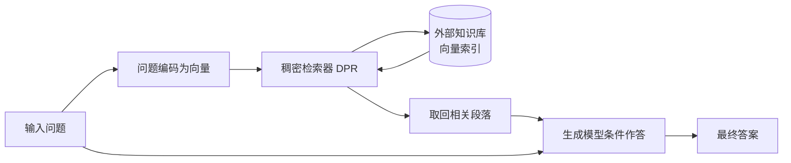

> 本文是对经典论文的解读与回顾。原文：Lewis et al. (FAIR), 2020 (NeurIPS 2020)，《Retrieval-Augmented Generation for Knowledge-Intensive NLP Tasks》，arXiv:2005.11401（<https://arxiv.org/abs/2005.11401>）。RAG 一词由此而来，也奠定了如今「大模型 + 知识库 / 向量数据库」应用范式的基础。

## TL;DR

- **是什么**：RAG 是一种把可检索的外部知识引入生成模型的框架，核心是「参数化记忆」与「非参数化记忆」的结合。
- **核心思想**：先用检索器从外部知识库取回相关段落，再让生成模型在这些段落的条件下作答，而非只依赖模型权重里学到的知识。
- **关键结论**：在开放域问答等知识密集型任务上更准确、更不容易出现幻觉，且知识可以通过更换索引来更新，无需重新训练模型。
- **意义**：作为该范式的开山工作，RAG 至今仍是检索增强落地的主流思路。

## 一、背景与动机

大型 seq2seq 预训练模型在训练过程中把大量世界知识压缩进了模型权重，可以视作一种「参数化记忆」。这种记忆很强大，但也有结构性的短板：模型很难精确地回忆并引用某个具体事实，知识一旦固化在权重里就难以更新，而当模型「记不清」时往往会编造出看似合理却错误的内容，也就是幻觉。

对于知识密集型任务（典型如开放域问答），答案高度依赖具体、准确、可更新的事实。仅靠把知识塞进参数里，既不透明也不可控。RAG 提出的思路是：让模型在回答时能够「查资料」，把一部分知识从权重里搬到一个可检索的外部存储中。

## 二、核心思想：两种记忆的结合

RAG 的设计可以拆成两层记忆：

- **参数化记忆（parametric memory）**：预训练 seq2seq 模型的权重，负责语言理解、组织语言和综合表达。
- **非参数化记忆（non-parametric memory）**：对维基百科等大规模语料构建的稠密向量索引，可以按需检索，负责提供具体、可更新的事实依据。

两者各司其职：检索部分负责「找到对的资料」，生成部分负责「把资料读懂并组织成答案」。这种解耦带来一个重要性质——知识与模型在一定程度上分离，更新知识不必动模型本身。

## 三、方法流程拆解

RAG 的工作流程可以概括为「先检索、后生成」：

1. **编码问题**：把输入（如一个问题）编码成向量表示。
2. **稠密检索**：基于 DPR（Dense Passage Retrieval）这类稠密检索方法，从外部知识库的向量索引中取回若干相关段落。
3. **条件生成**：把检索到的段落作为上下文，与原始输入一起送入生成模型，模型在这些证据的条件下生成答案。

下面用一张流程图概括这条主链路：

这一架构的关键在于：生成不再是「凭空回忆」，而是「带着证据作答」。

## 四、收益与特性对比

把 RAG 与「仅靠参数化记忆」的纯生成模型放在一起对比，差异主要体现在以下几个方面：

| 维度 | 纯参数化生成模型 | RAG（检索增强生成） |
| --- | --- | --- |
| 知识来源 | 全部固化在模型权重中 | 权重 + 可检索的外部知识库 |
| 知识更新 | 通常需要重新训练 | 更换 / 更新索引即可，无需重训 |
| 事实准确性 | 依赖记忆，易模糊 | 以检索到的段落为依据，更准确 |
| 幻觉风险 | 相对更高 | 因有证据条件而降低 |
| 可追溯性 | 难以指出依据来源 | 可关联到检索到的段落 |

由此可以看出，RAG 在知识密集型任务上的优势不仅是「答得更准」，还包括知识可维护、来源相对可追溯这些工程上很重要的性质。

## 五、对后续工作的影响

RAG 提出的「检索 + 生成」组合，为后来大量应用范式提供了模板。如今常见的「大模型 + 知识库」「大模型 + 向量数据库」方案，本质上都沿用了这条主链路：先从外部存储中召回相关内容，再让模型基于召回结果作答。无论是企业内部知识问答、文档助手，还是各类需要引用外部资料的智能体，检索增强都已成为落地的主流选择之一。

## 意义与局限

RAG 的意义在于，它把「知识」与「语言能力」做了一定程度的解耦：模型负责理解与表达，外部索引负责提供可更新、可检索的事实，从而在知识密集型任务上同时改善了准确性与可维护性，并降低了幻觉风险。

与此同时，这一框架的效果在相当程度上受限于检索环节：如果检索器召回的段落不相关或不完整，生成质量也会随之下降；外部知识库的覆盖范围、构建与维护质量，以及检索与生成之间如何更好地协同，都是需要持续打磨的方向。这些也正是后续大量检索增强研究所围绕展开的核心问题。

> 延伸阅读：Lewis et al., 《Retrieval-Augmented Generation for Knowledge-Intensive NLP Tasks》，arXiv:2005.11401（<https://arxiv.org/abs/2005.11401>）。
