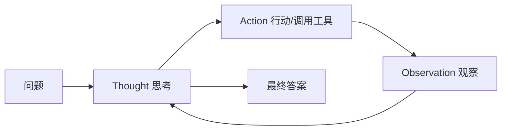

> 本文是对 Yao et al., 2022（ICLR 2023）论文《ReAct: Synergizing Reasoning and Acting in Language Models》的经典回顾与解读。原文见 arXiv:2210.03629（https://arxiv.org/abs/2210.03629）。文中观点与事实均以原论文为准。

## TL;DR

- **是什么**：ReAct 是一种让大语言模型在解题时交替进行「推理」与「行动」的提示范式，名字正是 Reasoning + Acting 的合写。
- **核心思想**：模型循环产生「思考（Thought）→ 行动（Action，如调用搜索或工具）→ 观察（Observation）」，反复迭代直到给出最终答案。
- **关键结论**：相比只在「脑内」推理的思维链（CoT），ReAct 能从外部世界获取信息、减少凭空捏造；相比只会调工具的纯行动方式，它又补上了规划与推理。
- **意义**：ReAct 成为后来大量 Agent 框架「工具调用循环」的思想原型。

## 一、背景与动机：推理与行动为何要分开又合并

在 ReAct 出现之前，大模型的能力大致沿两条线发展。一条是「推理」：以思维链（Chain-of-Thought, CoT）为代表，让模型把中间推理步骤显式写出来，从而在数学、常识推理等任务上取得提升。另一条是「行动」：让模型生成可执行的动作，去操作外部环境，例如调用 API、检索文档、在交互式环境中移动。

这两条线各有短板。纯推理的 CoT 全程在模型内部完成，不与外部世界交互，因此它的中间结论无从校验，容易出现事实性错误，也就是常说的「幻觉」——推理链条看似流畅，事实却可能是凭空编造的。纯行动的方式虽然能接触真实信息，却缺乏对「下一步该做什么、为什么这样做」的显式规划，行动之间难以形成连贯的策略。

ReAct 的动机正是把这两者拧成一股绳：让模型既能像 CoT 那样进行显式推理来规划和反思，又能像行动型方法那样调用外部工具来获取真实信息，二者在同一条轨迹里彼此支撑。

## 二、核心机制：Thought–Action–Observation 循环

ReAct 的运行方式可以概括为一个循环。模型在每一步可以选择生成一段「思考」，用自然语言表达当前的推理、计划或对已有信息的反思；也可以生成一个「行动」，去调用外部工具（例如检索某个实体、查找页面内某段内容等）；行动执行后，环境返回一段「观察」，作为新的上下文输入下一轮。三者交替推进，直到模型认为信息足够，输出最终答案。

逐点拆解这套机制的关键点：

- **思考服务于行动**：思考不是摆设，它用来分解任务、决定下一步检索什么、判断已有观察是否足够，从而引导行动更有目的性。
- **行动获取外部事实**：通过检索等行动，模型把真实信息引入推理过程，弥补内部知识的缺口与时效性问题。
- **观察反哺推理**：每一次观察都会修正或补充模型的认识，使后续思考建立在外部证据之上，而非一路自说自话。
- **可追溯性**：整条「思考—行动—观察」轨迹是显式的，便于人理解模型为何这样作答，也便于发现错误发生在哪一步。

## 三、与 CoT、纯行动的对比

下表从几个维度对比三种范式的取向，帮助理解 ReAct 的定位。

| 维度 | 思维链 CoT | 纯行动 | ReAct |
| --- | --- | --- | --- |
| 是否显式推理 | 是 | 否 | 是 |
| 是否与外部交互 | 否 | 是 | 是 |
| 事实获取来源 | 模型内部知识 | 外部工具/环境 | 内部推理 + 外部信息 |
| 幻觉风险 | 较高，难校验 | 取决于信息使用 | 借助检索可降低 |
| 规划能力 | 有，但无法核验 | 较弱 | 推理引导行动 |
| 过程可追溯性 | 推理链可读 | 动作序列可读 | 推理与证据交织可读 |

从对比可以看出，ReAct 并非提出全新的能力，而是把已有的两类能力做了结构化的协同：推理负责规划与判断，行动负责把真实世界拉进来，观察负责让推理保持「脚踏实地」。

## 四、收益与典型场景

论文展示的收益主要体现在两类任务上。一类是知识密集型问答，例如结合维基百科检索来回答问题：ReAct 让模型边推理边检索，用查到的内容支撑结论，从而减少幻觉，并让作答过程可追溯、可解释。另一类是交互式决策任务，需要模型在环境中按步骤行动并根据反馈调整策略：在这类任务上，显式的推理步骤帮助模型形成更连贯的计划，表现优于缺乏推理的行动方式。

这两类场景共同说明了 ReAct 的价值取向：当任务既需要思考、又需要与外部世界打交道时，把二者交替编排，往往比单独使用任何一方更稳健。

## 五、对后续 Agent 生态的影响

ReAct 提出的「思考—行动—观察」循环，后来成为许多 Agent 框架的思想原型。如今常见的「工具调用循环」——模型先思考、再决定调用哪个工具、拿到结果后继续思考、直到完成任务——在结构上与 ReAct 一脉相承。可以说，ReAct 把「让语言模型在推理中调用工具」这一做法变成了一种清晰、可复用的范式，为后续围绕工具使用、检索增强与多步任务的 Agent 设计奠定了基础。

## 意义与局限

ReAct 的意义在于，它用一种简洁的提示结构，把推理与行动的协同关系讲清楚，并验证了二者结合在知识问答与交互决策上的好处，进而启发了大量 Agent 系统的工程实践。

局限同样需要客观看待。ReAct 的效果依赖外部工具与信息源的质量：如果检索返回的内容本身有误或不相关，错误同样会传导进最终答案。多轮的「思考—行动—观察」会带来更长的交互轨迹，意味着更多的调用与上下文开销。此外，行动的选择与推理的质量仍受底层模型能力约束，并不能自动消除所有幻觉。理解这些边界，有助于在实际系统中合理设计工具集、检索质量控制与终止条件。

> 延伸阅读：ReAct: Synergizing Reasoning and Acting in Language Models, arXiv:2210.03629（https://arxiv.org/abs/2210.03629）
