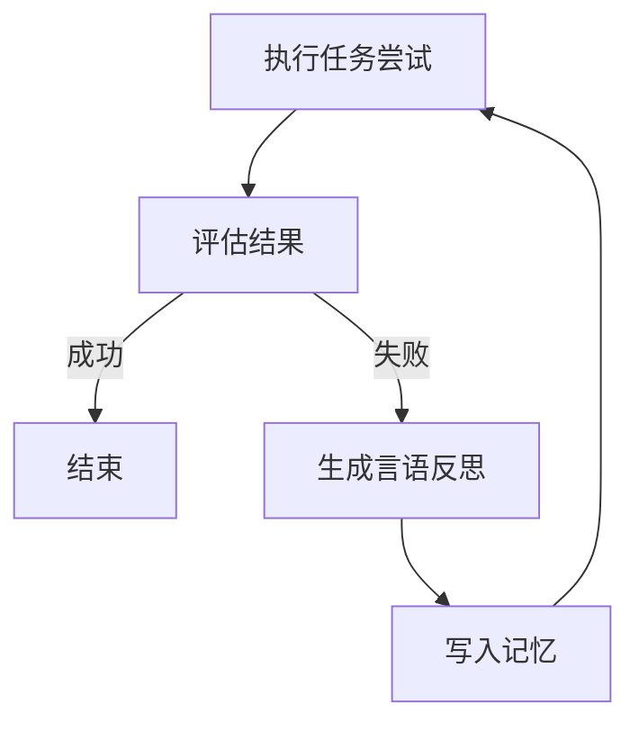

> 本文回顾的是 Shinn 等人于 2023 年发表、并被 NeurIPS 2023 收录的经典工作《Reflexion: Language Agents with Verbal Reinforcement Learning》（arXiv:2303.11366，链接：<https://arxiv.org/abs/2303.11366>）。它是「自我反思 / 自我改进」型语言智能体范式的代表作之一，至今仍被广泛引用与复现。

## TL;DR

- Reflexion 让智能体在某次尝试失败后，不更新模型权重，而是用自然语言对失败原因做「言语反思」。
- 反思内容被写入记忆，下一次尝试时作为提示参考，从而在多轮试错中逐步改进。
- 这相当于一种「言语强化学习」：用语言反馈代替梯度信号来驱动行为修正。
- 它常与 ReAct 式「推理 + 行动」智能体结合，在决策、编程、问答等任务上随尝试次数提升表现。

## 一、背景与动机

大语言模型驱动的智能体在处理多步任务时，往往需要在环境中反复尝试：规划、执行动作、观察反馈、再调整。传统强化学习的改进方式是通过奖励信号更新模型参数，但对于体量庞大的语言模型而言，这种基于梯度的微调成本高昂，且在很多在线交互场景下并不现实——既缺乏大量可训练样本，也难以频繁更新权重。

与此同时，语言模型本身具备一项独特能力：它能用自然语言对自己的行为进行描述、解释与批评。一个直观的想法随之产生——既然模型能「读懂」失败，能否让它把失败经验用语言写下来，作为下一次尝试的指导，而完全不触碰参数？Reflexion 正是沿着这一思路展开的。它把「改进」从权重空间搬到了语言空间。

## 二、核心思想：用语言代替梯度

Reflexion 的核心可以概括为「言语强化学习（verbal reinforcement learning）」。当智能体完成一次尝试（trial）后，系统会判断这次尝试是否成功；若失败，便引导模型对失败过程进行反思，生成一段自然语言形式的总结，指出问题所在与改进方向。这段反思不会用于更新模型，而是被存入一块记忆中。在后续尝试里，这些反思作为上下文提示重新喂回模型，使其在新一轮决策中规避此前的错误。

这一机制把强化学习中「试错—反馈—改进」的循环保留了下来，但替换了其中的关键环节：反馈不再是标量奖励，而是富含语义的语言描述；改进不再依赖参数更新，而是依赖提示中累积的经验。语言反馈相比标量信号往往更具体、更可解释，能直接告诉模型「上次为什么错、这次该怎么做」。

为便于理解，可将其与传统做法做一个定性对比：

| 维度 | 基于梯度的强化学习 | Reflexion（言语强化学习） |
| --- | --- | --- |
| 反馈形式 | 标量奖励信号 | 自然语言反思文本 |
| 改进载体 | 更新模型权重 | 写入记忆、作为提示 |
| 是否改动模型 | 是 | 否 |
| 反馈可解释性 | 较低 | 较高 |
| 适用场景 | 可大量训练、可更新权重 | 在线试错、权重冻结 |

## 三、工作流程拆解

Reflexion 通常将智能体的能力拆分为几个协作的角色：负责与环境交互、产生推理与动作的主体；负责判断尝试结果好坏的评估环节；以及负责把失败经验转化为语言反思的自我反思环节。三者配合，构成一个跨多次尝试的外层循环。

一次完整的运行大致是这样推进的：智能体在当前尝试中执行任务，得到结果；评估环节给出成败或质量信号；若结果不理想，自我反思环节据此生成一段语言反思并存入记忆；进入下一次尝试时，记忆中的反思作为提示注入，引导智能体调整策略。随着尝试次数增加，记忆中沉淀的经验越来越多，智能体的表现往往随之提升。

值得强调的是，这里的「记忆」是连接多次尝试的关键纽带。单次尝试内部，智能体可以采用 ReAct 式的推理与行动交替模式；而跨尝试之间，正是语言反思的累积让智能体不必从零开始，而是带着教训重新出发。

## 四、与 ReAct 等范式的关系

Reflexion 并不取代「推理 + 行动」式的智能体框架，而更像是在其之上叠加的一层外循环。ReAct 关注的是单次任务推进过程中如何交错思考与动作，解决的是「这一步怎么做」；Reflexion 关注的是多次尝试之间如何积累经验，解决的是「这一整轮失败后下一轮怎么改」。两者结合时，智能体在每一轮内用推理引导行动，在每一轮后用反思总结教训，从而在决策、编程、问答等需要反复试探的任务上，随尝试次数的增加而逐步改善表现。

这种「内层推理 + 外层反思」的分层结构，也使 Reflexion 的思想较易迁移到不同任务形态：只要能够判断一次尝试的好坏，并能将反馈表述为语言，就有可能套用这一自我改进的循环。

## 意义与局限

Reflexion 的意义在于，它清晰地展示了一条不依赖参数更新、仅凭语言反馈即可让智能体自我改进的路径。它把「反思」这一人类常见的学习方式形式化为可操作的智能体机制，并成为后续众多自我反思、自我批评、自我改进类工作的重要参考起点，推动了「语言智能体能否从经验中学习」这一问题的讨论。

其局限同样需要客观看待。该方法的效果依赖于对尝试结果是否能够获得可靠的成败或质量判断；当任务缺乏明确的评估信号时，反思的质量与方向难以保证。反思本身由语言模型生成，可能不准确甚至产生误导，进而影响后续尝试。此外，把经验保存在提示中的做法受上下文长度约束，随着尝试与记忆增多，如何取舍与组织这些经验也成为现实挑战。这些都是该范式在实际应用中需要权衡的方面。

> 延伸阅读：Shinn et al., 2023, 《Reflexion: Language Agents with Verbal Reinforcement Learning》，arXiv:2303.11366（<https://arxiv.org/abs/2303.11366>）。
