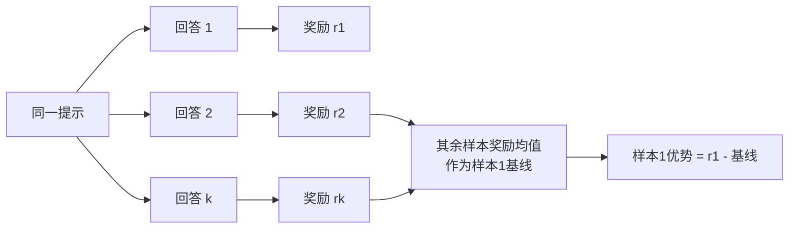

> 本文是对 Ahmadian et al., 2024（ACL 2024）《Back to Basics: Revisiting REINFORCE Style Optimization for Learning from Human Feedback in LLMs》的阅读笔记，原文见 arXiv:2402.14740（https://arxiv.org/abs/2402.14740）。以下内容为个人梳理，具体结论以原文为准。

## TL;DR

- PPO 在 RLHF 场景中被作为默认选择，但其价值网络、GAE、复杂裁剪等组件多是为通用深度强化学习设计，在语言模型对齐中未必必要。
- 本文主张「回到基础」，用更简单的 REINFORCE 及其多样本扩展 RLOO（REINFORCE Leave-One-Out）来做对齐优化。
- RLOO 的核心是对同一提示采样多个回答，用「留一法」把其余样本奖励的均值作为基线来估计优势，从而去掉独立的价值网络。
- 论文报告 RLOO 相比 PPO 更简单、更省，并在效果上优于 DPO、RAFT 等方法，是 2024 年 RLHF 简化路线的代表工作。

## 一、背景：RLHF 为何默认用 PPO

RLHF（基于人类反馈的强化学习）通常分三步：监督微调、训练奖励模型、再用强化学习优化策略。在优化环节，PPO（近端策略优化）几乎成了事实标准。

但 PPO 的设计初衷是应对通用强化学习中的高方差、长时序、部分可观测等难题。它引入了独立的价值网络来估计状态价值、用 GAE 平衡偏差与方差、用比率裁剪限制更新幅度。这些组件都要额外的显存、算力与调参成本。

作者提出的问题是：RLHF 的任务结构和典型 RL 环境差别很大，PPO 的这些复杂性是否真的被需要？

## 二、RLHF 场景的特殊性

论文指出，RLHF 的优化问题相对「温和」。一方面，策略并非从零开始，而是从已经过监督微调的强初始化出发，探索空间受到约束；另一方面，奖励往往是在整段回答结束后给出的、偏向单步的信号，而非需要长时序信用分配的密集奖励。

在这样的设定下，为通用 RL 准备的方差削减机制未必划算。这为「用更简单的方法替代 PPO」提供了动机。

## 三、方法：从 REINFORCE 到 RLOO

REINFORCE 是最基础的策略梯度方法：直接用回答获得的奖励去加权对数似然的梯度，不需要价值网络。它的主要问题是梯度方差较大，通常需要一个基线来缓解。

RLOO（REINFORCE Leave-One-Out）给出的解法是：对同一个提示采样多个回答，在估计某个样本的优势时，用「留一法」——把同一提示下其余样本奖励的均值当作该样本的基线。这样得到的基线是无偏的，且完全来自采样本身，不再需要单独训练一个价值网络。

直觉上，RLOO 把「这个回答比同一提示下的其他回答好多少」作为学习信号，天然贴合成对/多样本偏好的比较语境。

## 四、与其它方法的定位对比

下表按论文的定性讨论，概括几类常见对齐方法的差异：

| 方法 | 是否需要价值网络 | 是否显式在线采样 | 特点 |
| --- | --- | --- | --- |
| PPO | 需要 | 是 | 组件多、开销与调参成本较高 |
| RLOO | 不需要 | 是 | 用留一法基线，简化流程、降低开销 |
| DPO | 不需要 | 否 | 直接在偏好数据上优化，无需在线采样 |
| RAFT | 不需要 | 是 | 通过筛选高奖励样本再做微调 |

论文报告，在其评测设定下，RLOO 在保持简单与高效的同时，效果优于 DPO、RAFT 等方法，也不逊于 PPO。

## 意义与局限

RLOO 的价值在于「做减法」：它说明在 RLHF 这一相对温和的优化问题上，去掉价值网络等 PPO 组件不仅可行，还可能带来更好的效率与效果平衡。这一思路降低了对齐训练的工程门槛，已被 TRL 等库采用，成为 2024 年 RLHF 简化路线的代表工作之一。

局限方面，RLOO 依赖对同一提示采样多个回答，采样数量会影响基线质量与计算成本；其效果也高度依赖奖励模型的可靠性——当奖励信号存在偏差或被策略「钻空子」时，简化后的方法同样会受影响。此外，论文结论建立在特定模型规模与评测设定之上，迁移到更大规模或不同任务时仍需具体验证。

> 延伸阅读：Ahmadian et al., 2024, arXiv:2402.14740（https://arxiv.org/abs/2402.14740）。
