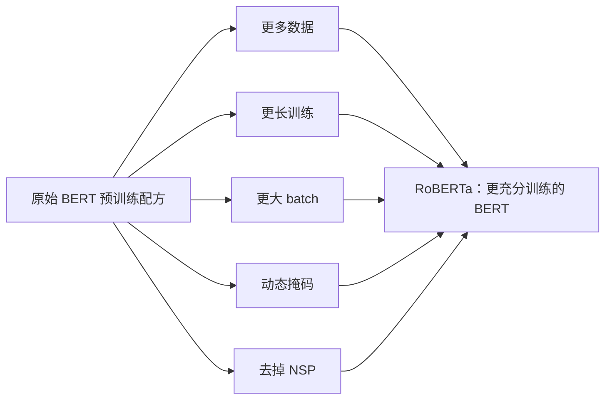

> 本文是对经典论文的阅读笔记。出处：Liu et al. (FAIR), 2019, *RoBERTa: A Robustly Optimized BERT Pretraining Approach*，arXiv:1907.11692（https://arxiv.org/abs/1907.11692）。

## TL;DR

- RoBERTa 并未改动 BERT 的模型结构，而是系统性地重新审视了它的预训练设置。
- 研究发现：原始 BERT 其实「训练不足」，潜力远未被释放。
- 关键改动包括更多数据、更长训练、更大 batch、动态掩码，并去掉下一句预测（NSP）任务。
- 仅靠更充分的训练与更合理的调参，RoBERTa 就在多项基准上显著超过原始 BERT，说明「训练配方」本身对预训练模型至关重要。

## 一、背景与动机

BERT 自提出以来迅速成为自然语言理解任务的主流骨干，但它的成功也带来了一个长期悬而未决的问题：在 BERT 的诸多设计选择中，究竟哪些是真正起作用的，哪些只是当时的经验性默认？由于预训练成本高昂，不同工作往往使用不同的数据规模、训练时长与超参数，使得各类改进之间难以公平比较，模型之间的差异也常常被归因于结构创新，而非训练细节。

RoBERTa 的出发点正是要把这些被忽视的变量重新拿到台面上。作者并不打算设计一个全新的网络结构，而是把原始 BERT 当作一个可复现、可调参的对象，逐一检验它的预训练超参数与训练数据规模对最终效果的影响。这种「控制变量、复现并审视」的研究方式，本身就构成了论文的核心贡献。

## 二、核心发现：BERT 训练不足

论文最重要的结论可以概括为一句话：原始 BERT 是「训练不足」（undertrained）的。也就是说，在保持模型结构基本不变的前提下，只要给予更充分的训练，它的表现还能进一步提升。这一发现颠覆了「想要更强就必须改结构」的惯性思路，把注意力引向了训练过程本身。

围绕这一发现，RoBERTa 提出并验证了若干关键改动：

- **更多数据**：使用规模更大的文本语料进行预训练，扩大模型见过的语言分布。
- **更长训练**：延长训练步数，让模型有机会被「喂饱」，而不是过早停止。
- **更大 batch**：采用更大的训练批量，并相应调整优化设置，使训练更稳定、更高效。
- **动态掩码**：相比原始 BERT 在数据预处理阶段一次性确定掩码位置（静态掩码），动态掩码在每次将序列输入模型时重新生成掩码，从而让同一段文本在不同训练步看到不同的掩码模式。
- **去掉 NSP 任务**：移除下一句预测（Next Sentence Prediction）目标，研究表明这一目标并非必要，去掉它甚至有助于下游表现。

## 三、训练配方的对比

为了直观地理解 RoBERTa 与原始 BERT 在训练层面的差异，可以从几个维度做定性对比。需要强调的是，下表只描述方向性的变化，不涉及具体数值。

| 维度 | 原始 BERT | RoBERTa |
| --- | --- | --- |
| 模型结构 | Transformer 编码器 | 基本不变 |
| 训练数据规模 | 相对较小 | 更大 |
| 训练时长 | 相对较短 | 更长 |
| 批量大小 | 相对较小 | 更大 |
| 掩码方式 | 静态掩码 | 动态掩码 |
| NSP 任务 | 保留 | 去掉 |

从这张表可以看出，RoBERTa 的改动几乎全部集中在「怎么训练」而非「训练什么样的模型」，这正是论文想要传达的重点。

## 四、为什么这件事重要

RoBERTa 的实验结果显示，仅靠上述训练层面的调整，模型就能在多项自然语言理解基准上显著超过原始 BERT。换句话说，性能的提升并不依赖新的网络结构，而来自对既有结构更充分、更合理的训练。

这一结论的意义超出了单个模型本身。它提醒研究者：在评估一个预训练模型的优劣时，必须把训练数据规模、训练时长、批量大小、训练目标等因素纳入考量，否则很容易把「训练得更充分」误读成「结构更先进」。RoBERTa 因此成为后续大量预训练工作中常被引用的强基线，也推动了社区对「训练配方」这一变量的系统性关注。

## 意义与局限

RoBERTa 的价值首先在于方法论：它用一套严谨的复现与对照实验，说明了预训练模型的潜力可能被训练设置所掩盖，而非被结构所限制。这种「先把基线训练充分，再讨论创新」的研究态度，对后续工作有持续的参考意义。

与此同时，它的局限也较为明显。更多数据、更长训练与更大批量意味着更高的计算成本，这一路径对资源有限的研究者并不友好；论文的核心贡献集中在训练策略的探索上，对模型结构本身并未提出新的设计。此外，结论建立在当时的基准与设置之上，随着任务、数据与模型规模的演进，最优训练配方仍需要在具体场景中重新校准。总体而言，RoBERTa 留下的最重要遗产，是把「如何训练」明确地确立为与「训练什么」同等重要的研究维度。

> 延伸阅读：RoBERTa: A Robustly Optimized BERT Pretraining Approach，arXiv:1907.11692（https://arxiv.org/abs/1907.11692）。
