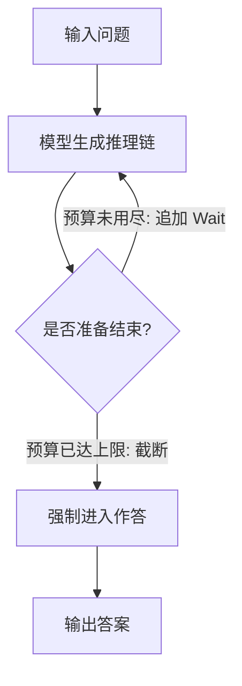

> 本文是对 Muennighoff et al.（Stanford / UW / AI2 等），2025，《s1: Simple test-time scaling》的阅读笔记与解读，论文见 arXiv:2501.19393（https://arxiv.org/abs/2501.19393）。代码开源在 simplescaling/s1。文中观点以原文为准，本文只做梳理与背景补充。

## TL;DR

- **是什么**：s1 是一套追求极简的测试时扩展（test-time scaling）方案，目标是用最简单的方式获得强推理能力。
- **核心思想**：精选约 1000 道带完整推理过程的题目组成数据集 s1K 做监督微调，再配合一个名为 budget forcing（预算强制）的解码技巧，在推理时直接调节模型的「思考预算」。
- **关键结论**：仅用约 1000 条训练样本加上 budget forcing，模型在数学等推理任务上即可达到接近 o1-preview 的水平区间。
- **意义**：强推理或许更依赖少量高质量数据加测试时计算，而非单纯堆叠训练规模。

## 一、背景与动机

近一年来，以 o1 为代表的推理模型展示出一种新的能力增长曲线：不再只靠把训练做大，而是在推理（test time）阶段花更多算力「多想一会儿」，从而在数学、代码等需要长链条推理的任务上明显提升表现。这条路线通常被称为测试时扩展。

但这类强推理模型的训练细节往往不公开，外界对「究竟需要多少数据、多复杂的训练流程」缺乏清晰认识。一种容易形成的印象是：要复现强推理，必须有海量的推理轨迹数据和复杂的强化学习管线。s1 想回答的正是相反方向的问题——能不能用尽可能简单、可复现的方式，把强推理与测试时扩展同时做出来。

## 二、数据：小而精的 s1K

s1 的第一个支点是数据。作者没有走「大规模采集推理轨迹」的路线，而是精心筛选出约 1000 道题目，构成数据集 s1K。每道题都带有推理过程，用于对基础模型做监督微调（SFT）。

这里的关键词是「筛选」。约 1000 条这个量级，相对于常见的指令微调或推理训练数据集而言极小。s1 的主张是：在数据高效（data-efficient）的前提下，样本的质量与覆盖度比数量更重要——挑选具有难度、多样性、且推理过程清晰的题目，远比无差别地堆量更能教会模型如何「展开思考」。

## 三、核心技巧：budget forcing 预算强制

s1 的第二个、也是更具特色的支点，是一个在解码阶段生效的技巧：budget forcing。它的作用是在生成时直接控制模型的「思考预算」，即让模型把推理链拉长或截短。

具体做法可以概括为两个方向：

- **想让模型多想**：当模型准备结束推理（要给出答案）时，强制阻止它收尾，并追加诸如「Wait」之类的提示词，促使它继续往下推理、自我检查或重新审视。
- **想让模型少想**：在推理链达到一定长度时提前截断，强制其进入作答阶段。

通过这两个动作，就能在推理时平滑地调节投入的算力：花更多 token 思考通常对应更高的准确率，反之则更省算力。这正是「测试时扩展」在 s1 中的具体落地方式——不改权重，只改解码策略，就能把算力换成性能。

## 四、要点对比

下表把 s1 的两个支点与常见印象中的「强推理配方」做一个定性对比，帮助理解它「简单」在何处。

| 维度 | 常见印象中的强推理 | s1 的做法 |
| --- | --- | --- |
| 训练数据规模 | 大规模推理轨迹 | 约 1000 条精选样本（s1K） |
| 训练方式 | 复杂流程，常含强化学习 | 监督微调（SFT） |
| 推理时算力调节 | 依赖采样/搜索等额外机制 | budget forcing，直接控制思考预算 |
| 可复现性 | 细节多不公开 | 数据与代码开源（simplescaling/s1） |

可以看到，s1 在数据和训练两侧都做了减法，把「调节算力」的复杂度集中收敛到解码阶段一个直观的开关上。

## 五、结论与启示

s1 给出的核心结论是：仅用约 1000 条训练样本加上 budget forcing，模型即可在数学等推理任务上达到接近 o1-preview 的水平区间。这一结果的含义并不在于刷新某个绝对分数，而在于它揭示的一种可能性——强推理也许更依赖少量高质量数据与充分的测试时计算，而非一味扩大训练规模。

换句话说，基础模型可能已经具备相当的推理潜力，所欠缺的更多是「如何被引导着把思考过程完整展开」。少量高质量样本负责教会展开的方式，budget forcing 负责在推理时按需投入算力，二者相加便逼近了原本被认为需要复杂流程才能企及的能力区间。

## 意义与局限

s1 的意义在于提供了一个简单、开放、可复现的测试时扩展样本：它把「数据高效」与「测试时计算」两条线索清晰地连接起来，并以开源数据与代码降低了研究者复现与延展的门槛。对于关注推理能力来源的研究而言，这是一个有价值的对照点。

局限方面也需保持克制的判断。约 1000 条样本的筛选本身依赖于精心设计，其有效性与所选基础模型、题目分布密切相关；budget forcing 通过追加提示与截断来调节预算，随着思考链不断拉长，收益是否持续递增、在不同任务上的稳健性如何，都需要在更广的设置下进一步检验。「接近 o1-preview 水平区间」是面向特定推理任务的定性表述，不宜外推为全面对等。总体而言，s1 更像是对「强推理的最小必要条件」的一次有力探索，而非给出最终配方。

> 延伸阅读：s1: Simple test-time scaling（arXiv:2501.19393），https://arxiv.org/abs/2501.19393
