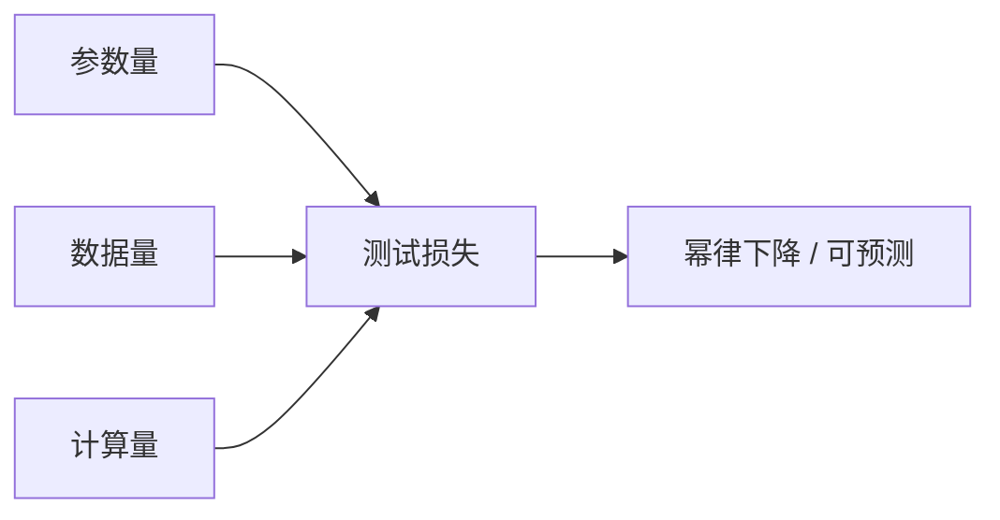

> 本文是对经典论文的阅读笔记。出处：Kaplan et al. (OpenAI), 2020, *Scaling Laws for Neural Language Models*, arXiv:2001.08361（https://arxiv.org/abs/2001.08361 ）。文中所述均以原文公开结论为准，定性概括为主，不展开未经核实的具体数值。

## TL;DR

- 语言模型的测试损失随参数量、数据量、计算量按幂律平滑下降，且这种关系是可预测的。
- 这意味着"更大的模型 + 更多的数据 + 更多的算力"能够稳定地换来更低的损失，为"做大模型"提供了量化依据。
- 论文还讨论了在固定算力预算下，如何在模型规模与训练数据之间分配资源（这一分配结论后被 Chinchilla 工作进一步修正）。
- 它是理解大模型为何要"做大"的奠基性工作之一。

## 一、背景与动机

在这篇工作出现之前，模型规模、数据量与训练效果之间的关系更多停留在经验直觉层面：人们大体知道"更大往往更好"，却缺少一套能够把"投入"与"回报"对应起来的定量框架。对于需要规划算力预算、决定模型该做多大、数据该收集多少的研究者和工程团队而言，这种不确定性是真实的成本。

Kaplan 等人的核心问题正是：当我们持续增加参数量、训练数据和计算资源时，语言模型的表现究竟如何变化？这种变化是杂乱无章的，还是存在可被刻画、甚至可被外推的规律？论文给出的答案是后者——并且这种规律的形式相当简洁。

## 二、核心发现：幂律与可预测性

论文最为人熟知的结论是：神经语言模型的测试损失，随参数量、数据量和计算量分别呈现幂律（power law）形式的平滑下降。换句话说，当把损失与这些规模因素放在对数坐标上观察时，它们近似落在一条直线上，而非充满噪声的散点。

这种平滑性带来了两个重要含义：

- **可预测性**：在一定范围内，可以根据较小规模实验的趋势，去外推更大规模下的表现。这让"先小规模验证、再放大投入"的研发路径有了理论支撑。
- **无明显饱和的趋势**：在论文考察的范围内，增大规模带来的收益没有迅速触顶，而是以可描述的速率持续累积。

下面用一张概览图示意三类规模因素与损失之间的关系。

## 三、规模因素的拆解

论文把影响损失的规模因素拆开来分别考察，使得每个维度的作用都更加清晰。可以用下表概括三类主要因素的角色：

| 规模因素 | 含义 | 与损失的关系（定性） |
| --- | --- | --- |
| 参数量 | 模型自身的容量 | 随其增大，损失按幂律下降 |
| 数据量 | 训练所用的文本规模 | 随其增大，损失按幂律下降 |
| 计算量 | 训练所投入的总算力 | 随其增大，损失按幂律下降 |

这种"分维度"的视角带来一个工程上极具价值的推论：当我们手握一份固定的算力预算时，应该把它更多地花在更大的模型上，还是更多地花在更多的数据上？论文对这一资源分配问题进行了讨论，并给出了在其设定下的倾向性结论。

需要强调的是，这一具体的分配建议在后续研究中得到了修正。DeepMind 的 Chinchilla 工作重新审视了模型规模与数据量在固定算力下的最优配比，提出在相同算力预算下，许多模型其实"训练数据偏少、模型偏大"，应当在更多数据上训练相对更小的模型。这一点常被视作对 Kaplan 等人原始分配结论的重要更新，但它并不否定幂律本身的存在，而是细化了分配策略。

## 四、为什么它是奠基性工作

这篇论文的影响力，不在于某个单点的数值，而在于它提供了一种**看待规模的方式**。在它之后，"扩大规模"不再只是一个经验口号，而成为一个可以量化讨论、可以纳入预算规划的工程命题。

- 对研究方向而言，它为"持续做大模型"这条技术路线提供了量化依据，使得投入巨大算力训练超大模型成为一个有据可循的选择。
- 对工程实践而言，幂律的可外推性意味着团队可以用相对低成本的小规模实验，去估计大规模训练的预期收益，从而更理性地配置资源。
- 对后续研究而言，它开启了一系列围绕"缩放"展开的工作，Chinchilla 等研究正是在它搭建的框架内继续推进的。

## 意义与局限

从意义上看，这项工作把"规模"从模糊的直觉提升为可度量、可预测的对象，深刻影响了此后大模型的研发范式。它让"更大、更多、更强算力"之间的权衡有了共同的语言，也为产业界投入大规模预训练提供了底层逻辑。

从局限上看，幂律是在特定的模型族、数据分布和考察范围内总结出来的经验规律，外推到极端规模或不同设定时需要谨慎；测试损失的持续下降也并不直接等同于所有下游任务能力的同步提升。此外，正如 Chinchilla 所揭示的，关于固定算力下"模型与数据如何分配"的具体结论会随研究的深入而被修正。理解这些边界，有助于把缩放定律用在它真正成立的地方，而不是当作放之四海皆准的公式。

> 延伸阅读：DeepMind, *Training Compute-Optimal Large Language Models*（Chinchilla），对固定算力下的规模与数据分配给出了进一步修正。
