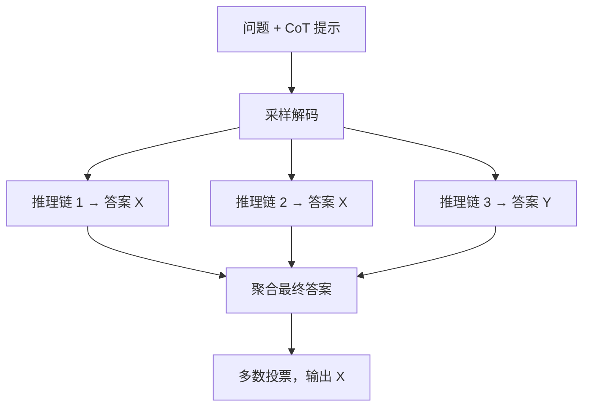

> 本文是对 Wang et al., 2022（ICLR 2023）《Self-Consistency Improves Chain of Thought Reasoning in Language Models》的阅读笔记与解读。原文见 arXiv:2203.11171（<https://arxiv.org/abs/2203.11171>）。文中事实以原论文为准，解读部分为笔记整理。

## TL;DR

- **是什么**：一种用于思维链（Chain-of-Thought, CoT）推理的解码策略，名为自洽性（Self-Consistency）。
- **核心思想**：不再用贪心解码只取一条推理路径，而是采样多条不同的推理链，再对它们得到的最终答案做「多数投票」，取最一致的那个答案。
- **关键结论**：在算术与常识推理等任务上，自洽性显著优于单条 CoT，且无需额外训练，仅在推理阶段多采样几次即可。
- **意义**：它是 CoT 的重要增强，也是「用测试时计算换取正确率」这一思想的早期体现。

## 一、背景与动机

思维链提示通过让模型「把推理过程写出来」，显著提升了大语言模型在多步推理任务上的表现。但标准 CoT 通常配合贪心解码使用：模型一步步生成，每步都选概率最高的词，最终落到唯一一条推理路径上。

这种做法存在一个直觉上的隐患。一条贪心路径只代表模型「最顺手」的那次推理，一旦中途某一步走偏，错误会沿着这条链一路传导到最终答案，而解码过程本身没有任何纠偏机制。对于需要多步演算的复杂问题，单条路径的脆弱性尤其明显。

自洽性正是针对这一点提出的：与其押注一条路径，不如让模型多想几遍，再看这些独立尝试在结果上是否「自我一致」。

## 二、核心思想逐点拆解

自洽性的做法可以拆成三步，整体替换掉原本的贪心解码环节：

1. **采样多条推理路径**：在同样的 CoT 提示下，用带随机性的采样解码（而非贪心），生成多条彼此不同的推理链。每条链都有自己的中间步骤与最终答案。
2. **聚合最终答案**：忽略中间推理过程的具体措辞，只抽取每条链给出的最终答案。
3. **多数投票**：在这些最终答案中选出出现次数最多的一个，作为模型的输出。

支撑这套流程的直觉是：**一个复杂问题往往存在多种正确的推理路径，但它们大概率会指向同一个正确答案；而错误的推理则各错各的，彼此之间难以达成一致。** 因此，当多条独立采样的路径在最终答案上「不约而同」时，这个答案更可能是对的；偶发的错误路径则因为分散，难以在投票中胜出。

值得强调的是，自洽性是一种**无监督、无需额外训练**的推理时方法。它不改动模型权重，也不需要额外的标注或验证器，只是把「解码一次」换成「解码多次再投票」。

## 三、与标准 CoT 解码的对比

下表从几个维度对比贪心 CoT 与自洽性，便于把握差异：

| 维度 | 贪心 CoT 解码 | 自洽性 |
| --- | --- | --- |
| 推理路径数 | 单条 | 多条采样 |
| 解码方式 | 取每步最高概率 | 带随机性的采样 |
| 答案选取 | 直接输出该路径结果 | 对多条结果多数投票 |
| 容错性 | 中途出错即传导到结果 | 错误分散，难在投票中胜出 |
| 是否需要训练 | 否 | 否 |
| 推理成本 | 一次前向生成 | 多次采样，成本更高 |

可以看到，自洽性几乎只在「解码与聚合」环节做文章，对提示模板和模型本身都不做改动，这使它很容易叠加到既有的 CoT 流程上。

## 四、为什么有效

从效果上看，自洽性在算术推理、常识推理等多类任务上相比单条 CoT 带来了一致的提升。其有效性可以从两个角度理解。

一方面，它把单点判断变成了**群体判断**。单条贪心路径相当于只听一个人的一次回答，而采样多条路径并投票，相当于让模型对同一问题独立作答多次，再用一致性来筛选可信结论。当正确答案具有「条条大路通罗马」的结构时，这种聚合天然有利于正确答案浮现。

另一方面，它体现了一种**用计算换准确率**的取舍：通过在推理时多花费若干次采样，换取最终答案正确率的提升，而不必触碰模型训练。这一思路后来在更广泛的推理增强方法中被反复采用。

## 意义与局限

自洽性是思维链方向上一项简洁而通用的增强：它不依赖额外训练、不修改模型，仅靠「多采样、再投票」就能在推理任务上取得可观提升，因此很容易与现有 CoT 提示组合使用。更重要的是，它较早地展示了「测试时多花算力以换取正确率」这一思想的可行性，为后续一系列推理时增强方法提供了思路参照。

局限同样需要正视。其一，自洽性以**多次采样**为代价，推理成本随采样数增加而上升，在对延迟或算力敏感的场景中需要权衡。其二，它依赖于「最终答案可被抽取并比较」的任务结构，更适合答案形式相对明确、便于投票的问题；对于开放式生成等难以做答案聚合的任务，直接套用并不自然。其三，多数投票的前提是正确路径在采样中占据相对多数，若模型对某类问题存在系统性偏差，投票也可能稳定地投向错误答案。

> 延伸阅读：Wang et al., 2022, 《Self-Consistency Improves Chain of Thought Reasoning in Language Models》，arXiv:2203.11171（<https://arxiv.org/abs/2203.11171>）。
