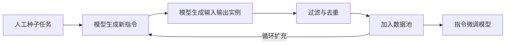

> 本文是对 Wang et al., 2022 经典论文「Self-Instruct: Aligning Language Models with Self-Generated Instructions」的解读与回顾。原文见 arXiv:2212.10560（<https://arxiv.org/abs/2212.10560>）。文中所述事实以原论文为准，旨在梳理其核心思想与对后续对齐工作的影响。

## TL;DR

- 指令微调依赖大量人工编写的「指令-回答」数据，标注成本高、覆盖面有限，是对齐阶段的主要瓶颈之一。
- Self-Instruct 提出用模型自举（bootstrap）的方式造数据：从少量人工种子任务出发，让模型自己生成新指令、再补全输入输出实例。
- 自生成的数据经过过滤与去重后回流到数据池，循环扩充，最后用这批数据微调模型本身。
- 这一思路大幅降低了人工标注负担，并直接启发了 Alpaca 等以自生成/蒸馏数据做指令微调的工作，成为「数据合成」在对齐中的奠基性研究之一。

## 一、背景：指令数据为何这么贵

让基座语言模型听懂并执行各种自然语言指令，需要在「指令微调」阶段喂给它大量形如「指令-（输入）-回答」的样本。早期高质量的指令数据集普遍依赖人工编写或人工标注：标注者要先想出一个任务，写清楚指令，再给出可接受的答案。

这种方式有两个固有难题。其一是成本，人工撰写既慢又贵，规模一旦上去就难以为继。其二是多样性与覆盖面，人类标注者往往会落入熟悉的任务模式，难以系统性地覆盖长尾、冷门或组合型任务，导致数据分布偏窄。指令微调的效果在很大程度上取决于指令的多样性，而多样性恰恰是人工流程最难保证的部分。

Self-Instruct 的出发点正是绕开这一瓶颈：既然要对齐的是语言模型，能不能让模型本身参与到指令数据的生产中来？

## 二、核心思想：用模型自举指令数据

Self-Instruct 的核心是一个自举循环。它不依赖大规模的人工标注，而是从一小批人工编写的「种子任务」起步，借助模型自身的生成能力，不断扩充出新的指令数据，再用这些数据回过头来微调模型。

整个过程可以拆成几个环节：

- **种子起步**：准备少量人工编写的种子任务，每个任务包含指令以及对应的实例，作为引导模型的范例。
- **生成新指令**：以种子任务为示例提示模型，让它仿照着产出新的、此前没有的指令，扩展任务空间。
- **生成实例**：对每条新指令，让模型进一步补全对应的输入与输出，形成完整的训练样本；论文区分了「需要输入」与「不需要输入」的两类任务，分别处理。
- **过滤与去重**：对自生成的指令和实例做筛选，去掉与已有任务过于相似的、格式不合规的或质量明显偏低的内容，再把保留下来的样本加入数据池。
- **循环扩充与微调**：把扩充后的数据池作为下一轮生成的素材来源，反复迭代；最终用累积得到的自生成数据对模型做指令微调。

这里的关键在于「自举」二字：模型既是数据的生产者，也是数据的消费者。过滤与去重环节尤其重要——它把生成过程中不可避免的重复和噪声压下去，从而在控制质量的同时尽量保留任务的多样性。

## 三、与人工标注流程的对照

把 Self-Instruct 与传统人工标注放在一起，可以更清楚地看出它的取舍：

| 维度 | 传统人工标注 | Self-Instruct |
| --- | --- | --- |
| 数据来源 | 人工撰写指令与答案 | 模型从少量种子自生成 |
| 人力投入 | 高，随规模线性增长 | 仅需少量种子任务 |
| 任务多样性 | 受标注者经验限制 | 可借生成不断扩展 |
| 主要风险 | 成本与覆盖面 | 生成噪声、重复，需过滤 |
| 扩展方式 | 继续雇人标注 | 自举循环迭代扩充 |

可以看到，Self-Instruct 用「过滤生成噪声」的工程代价，换来了「摆脱大规模人工标注」的收益。这是一种典型的以计算与算法换人力的思路。

## 四、影响：数据合成成为对齐的常规手段

Self-Instruct 的意义不止于它本身省了多少标注。它把一个理念清晰地确立下来：对齐所需的指令数据可以由模型来合成，而不必全部依赖人工。这一理念随后被广泛沿用与变体。

最直接的例子是 Alpaca 等工作——它们采用了自生成/蒸馏数据来做指令微调，让规模相对有限的模型也能以很低的数据成本获得不错的指令跟随能力。自此，「先合成指令数据、再做微调」成为对齐研究中一条被反复使用的常规路径，后续大量关于数据合成、蒸馏与自我改进的工作，都能在 Self-Instruct 中找到思想源头。

换句话说，Self-Instruct 把「数据从哪来」这个问题，从纯粹的标注问题，转化成了一个可以用模型能力去解的生成问题。

## 意义与局限

意义方面，Self-Instruct 以一种简洁而通用的自举框架，证明了模型自生成数据用于指令微调的可行性，显著降低了对人工标注的依赖，并为后续以合成数据驱动对齐的研究奠定了方法论基础。它让「数据合成」从边缘技巧变成对齐流程中的一等公民。

局限同样值得正视。自生成数据的质量受限于生成模型自身的能力，模型不会的、答错的内容也可能被当作训练样本回流，存在错误自我放大的隐患；过滤与去重能缓解但难以根除这类噪声。此外，生成出的任务分布仍可能带有模型固有的偏好与盲区，多样性的提升有其边界。这些问题也正是后续在数据筛选、质量评估与混合人工监督等方向上持续改进的动因。

> 延伸阅读：Self-Instruct 原论文 arXiv:2212.10560（<https://arxiv.org/abs/2212.10560>），以及受其启发的 Alpaca 等指令微调工作。
