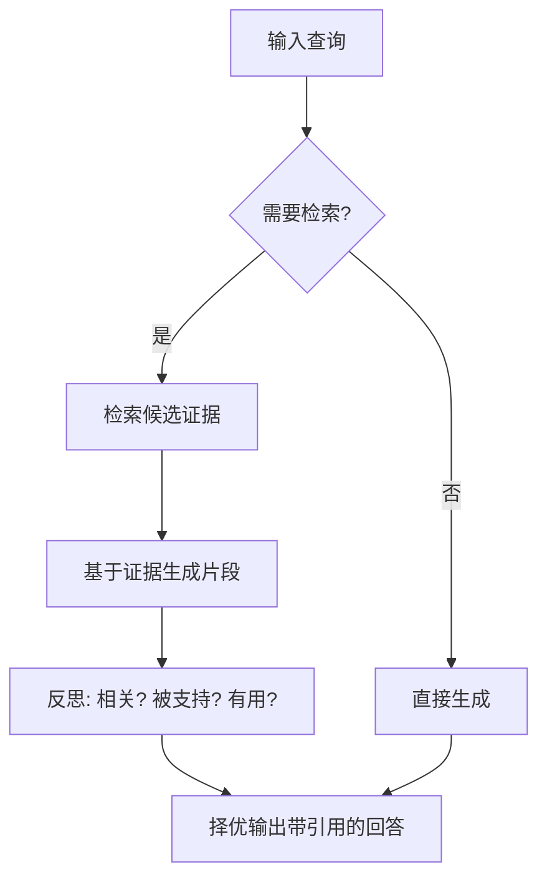

> 这是一篇论文解读。原文为 Asai et al., 2023（ICLR 2024），《Self-RAG: Learning to Retrieve, Generate, and Critique through Self-Reflection》，arXiv:2310.11511（https://arxiv.org/abs/2310.11511）。本文围绕其核心思想与设计动机做一次梳理，便于回顾。

## TL;DR

- 传统 RAG 通常固定检索若干段落再生成，既可能引入无关内容，也无法判断生成是否真的有据可依。
- Self-RAG 让模型按需决定是否检索，并在生成过程中预测特殊的"反思 token"，对检索证据与自身输出做细粒度自我批评。
- 在开放域问答、事实核查、长文事实性与引用等任务上，Self-RAG 优于多种基线。
- 它是把"自我反思"机制系统地引入检索增强生成的代表性工作。

## 一、背景与动机

检索增强生成（Retrieval-Augmented Generation, RAG）的初衷，是借助外部知识缓解大语言模型的幻觉与知识陈旧问题。然而早期的 RAG 范式存在一个结构性约束：它往往在每次回答前都固定地检索一批段落，再不加区分地拼接进上下文。

这种"先检索、再生成"的固定流水线带来了两类问题。其一是**该不该检索由不得模型**：对于模型本就掌握、或本质上不依赖外部事实的查询，强行检索反而引入噪声段落，干扰生成质量。其二是**生成是否有据无人核查**：即便检索到了相关材料，模型也未必真正使用，输出与证据之间是否一致、引用是否站得住脚，传统流程缺乏内生的判别环节。

Self-RAG 正是针对这两点提出的：把"是否检索"和"生成是否被证据支持"都交给模型自身去判断，让检索与生成的每一步都伴随一次自我审视。

## 二、核心思想：按需检索 + 反思 token

Self-RAG 的关键创新，是引入一组特殊的**反思 token（reflection tokens）**，让模型在常规文本生成之外，还能输出对自身行为的元判断。这些反思 token 大致承担两类职责：

- **检索决策**：在生成的某个节点，模型先判断"此处是否需要检索外部证据"。若不需要，便直接续写；若需要，则触发检索。这使检索从"无条件前置"变为"按需触发"。
- **批评判断**：当检索发生后，模型对候选证据与自己的生成结果做细粒度评估——证据是否与查询相关、生成内容是否被证据支持、整体回答是否真正有用。

通过把这些判断显式化为可预测的 token，模型得以在同一个解码过程中既生成答案，又对答案的"可信度"打分。下面用一张简化流程图勾勒这一控制流。

## 三、与传统 RAG 的对比

为了更直观地理解差异，下面从几个维度对比传统 RAG 与 Self-RAG 的处理方式。

| 维度 | 传统 RAG | Self-RAG |
| --- | --- | --- |
| 检索时机 | 通常固定前置，每次都检索 | 由模型按需决定是否检索 |
| 证据使用 | 拼接进上下文，缺乏显式核验 | 通过反思 token 评估相关性与支持度 |
| 自我评估 | 一般无内生判别 | 对输出做细粒度自我批评 |
| 引用与事实性 | 难以保证可溯源 | 强调输出被证据支持、可附引用 |

可以看到，Self-RAG 的差异并不在于换了更强的检索器或更大的模型，而在于把"判断"这一动作纳入生成本身，使检索增强从外部拼接转向内生可控。

## 四、训练与推理的配合

要让模型学会输出这些反思 token，需要在训练阶段把检索决策与批评信号一并纳入学习目标，使模型在生成普通文本的同时也能预测元判断。推理阶段则可以利用这些反思信号进行可控解码：例如在多个候选续写之间，依据"是否被证据支持""是否有用"等判断进行加权或筛选，从而在生成质量与事实性之间取得平衡。

这种设计的一个直接好处是**灵活性**：使用者可以根据任务对事实性或流畅性的不同侧重，调整对反思信号的依赖程度，而无需重新训练模型。对于强调可溯源的场景（如事实核查、需要引用的长文写作），可以更倚重证据支持判断；对于偏开放、对外部事实依赖较弱的场景，则可减少不必要的检索。

## 五、效果概览

论文在多类任务上对 Self-RAG 进行了评估，涵盖开放域问答、事实核查，以及更具挑战性的长文生成中的事实性与引用质量。结果显示，Self-RAG 相对多种基线方法取得了更好的表现，尤其体现在事实性与引用可靠性这类对"有据生成"要求较高的维度上。

需要强调的是，这里的优势更多源于机制层面的改变——把检索与自我批评内生化，而非单纯堆叠规模或更换检索组件。这使得它的思路具有较好的可迁移性。

## 意义与局限

Self-RAG 的意义在于，它把"自我反思"从一种抽象理念落实为生成过程中可学习、可预测的具体机制，为检索增强提供了一条"模型自己决定何时检索、并对结果负责"的路径，对后续大量结合反思与检索的工作产生了启发。

其局限也值得客观看待。引入反思 token 需要相应的训练数据与训练流程，构建成本不可忽视；模型的自我批评本身仍可能出错，反思判断的可靠性最终受限于模型能力与训练信号质量；此外，按需检索与可控解码在带来灵活性的同时，也增加了系统设计与调优的复杂度。总体而言，Self-RAG 提供的是一种值得借鉴的框架性思路，而非一劳永逸的终点。

> 延伸阅读：Self-RAG 原文 arXiv:2310.11511（https://arxiv.org/abs/2310.11511）。
