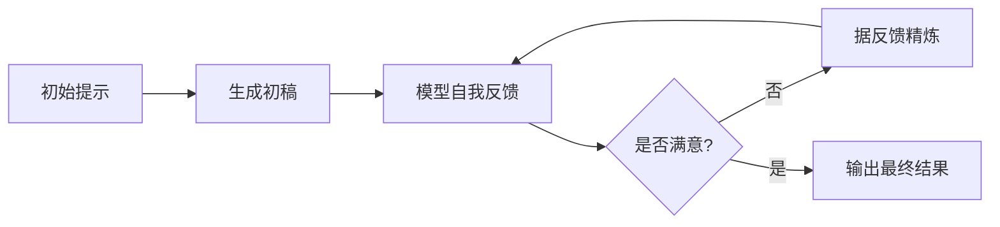

> 本文是对 Madaan et al., 2023（NeurIPS 2023）《Self-Refine: Iterative Refinement with Self-Feedback》的阅读笔记与解读。原文见 arXiv:2303.17651（https://arxiv.org/abs/2303.17651）。文中事实以原文为准，定性概括处为笔者的整理，不代表对具体数字的精确复述。

## TL;DR

- Self-Refine 的核心是一个循环：同一个模型先生成初稿，再对自己的输出给出具体反馈，然后据此修订，反复迭代直至满意。
- 全程只用一个模型完成「生成—反馈—精炼」三件事，不需要额外训练，也不需要外部监督信号或人工标注。
- 在代码、对话、写作等多种生成任务上，经过迭代自我精炼后的输出质量普遍优于一次性生成。
- 它与 Reflexion、Self-Consistency 等同属「让模型自我改进」的思路，是一种在测试时（test-time）提升质量的实用方法。

## 一、背景与动机

大语言模型在一次性生成时，往往能给出「差不多对」的答案，却很难一步到位达到最优。人类写作并非如此：我们写完初稿后会回读、挑毛病、再修改，经过几轮打磨才交付。把这种「先写、再评、后改」的习惯迁移到模型上，是 Self-Refine 想做的事。

此前提升生成质量的常见路径，要么依赖更大的模型、要么依赖额外训练（如基于人类反馈的强化学习），要么依赖外部工具或验证器来判断对错。这些方法各有代价：需要标注数据、需要重新训练、或需要可靠的外部信号。Self-Refine 提出的问题是：能否完全不引入新的训练和外部监督，仅靠模型自身在推理阶段的多轮自我对话，就把答案改得更好？

## 二、核心思想：生成—反馈—精炼的闭环

Self-Refine 把改进过程拆成三步，并让它们循环起来：

- 生成（Generate）：用一个初始提示让模型产出初稿。
- 反馈（Feedback）：把初稿喂回给同一个模型，要求它针对这份输出给出具体的、可操作的批评意见，而不是笼统地打分。反馈越具体，后续修订越有抓手。
- 精炼（Refine）：把「初稿 + 反馈」一起交给模型，让它据此产出改进版本。

随后，改进版本又可以进入下一轮反馈与精炼，如此往复，直到达到设定的停止条件（例如反馈认为已无明显问题，或达到迭代次数上限）。整个过程的关键在于：三步都由同一个模型、用不同的提示来完成，无需任何参数更新。

值得强调的是「反馈」环节的设计。如果只让模型说「好/不好」，修订往往无从下手；Self-Refine 倾向于让反馈指出哪里有问题、为什么、可以怎么改，这种具体性是迭代能够真正带来增益的前提。

## 三、为什么不需要额外训练

Self-Refine 的吸引力之一，是它把改进的能力完全建立在模型已有的知识与推理能力之上。模型在预训练与对齐阶段已经见过大量「批评—修改」的语料，因此具备评判和修订文本的潜力；Self-Refine 只是用提示把这种潜力在推理时显式地调动出来。

这意味着：

- 不引入新参数，不做反向传播，部署侧改动小。
- 不依赖人工标注或外部奖励模型，省去数据与训练成本。
- 适用范围广，凡是「生成—评判—修改」都说得通的任务，原则上都能套用同一套流程。

代价是推理时的开销增加：每一轮迭代都要额外调用模型，token 消耗与延迟随迭代次数上升。

## 四、与相关方法的关系

「让模型自我改进」并非单一技术，而是一族思路。下面做一个定性对比：

| 方法 | 是否需要额外训练 | 是否依赖外部信号 | 改进的主要机制 |
| --- | --- | --- | --- |
| Self-Refine | 否 | 否 | 同一模型反复「自我反馈 + 精炼」单条输出 |
| Reflexion | 否 | 通常借助环境反馈 | 将反思转为语言记忆，指导后续尝试 |
| Self-Consistency | 否 | 否 | 采样多条推理路径并对答案投票 |
| RLHF | 是 | 是（人类偏好） | 训练阶段用偏好信号更新模型参数 |

可以看到，Self-Refine 与 Self-Consistency 都属于测试时方法，但前者是「纵向」打磨同一条输出，后者是「横向」聚合多条输出；Reflexion 同样强调反思，但更偏向在与环境的多次交互中积累经验。它们并不互斥，实践中可以组合使用。

## 五、适用场景与使用要点

Self-Refine 在那些「答案有改进空间、且改进方向可被语言描述」的任务上更易见效，例如代码的可读性与正确性改写、对话回复的得体程度、文本的清晰度与情感倾向调整等。使用时通常需要关注几点：

- 反馈提示要鼓励具体、可执行的意见，避免空泛评价。
- 设定合理的停止条件，防止无意义的反复或质量回退。
- 在成本敏感的场景中权衡迭代轮数与收益。

## 意义与局限

Self-Refine 的意义在于，它用极低的工程代价，把「迭代打磨」这一人类常识引入到模型推理流程中，并在多类生成任务上验证了其有效性。它提示我们：模型的很多能力并未在一次性生成中被充分释放，合适的推理时策略可以把这部分价值挖出来。

局限同样明确。其一，方法的上限受模型自身能力约束——如果模型识别不出某类错误，自我反馈就难以纠正，甚至可能在反复修订中引入新问题。其二，迭代带来的推理成本不可忽视。其三，「自我评判」存在系统性盲区，模型对自己输出的判断未必可靠，在需要严格正确性的任务上仍应辅以外部验证。因此，Self-Refine 更适合定位为一种通用、易用的质量增强手段，而非对外部监督或验证的替代。

> 延伸阅读：Madaan et al., 《Self-Refine: Iterative Refinement with Self-Feedback》，arXiv:2303.17651（https://arxiv.org/abs/2303.17651）。
