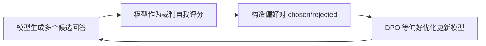

> 本文是对经典论文的阅读笔记。出处：Yuan et al. (Meta), 2024, *Self-Rewarding Language Models*, arXiv:2401.10020（https://arxiv.org/abs/2401.10020）。文中只对论文公开提出的核心思路做定性梳理，不涉及未经核实的具体数值。

## TL;DR

- 核心思想：让同一个模型既当"选手"又当"裁判"，自己为自己的回答打分，从而生产偏好数据。
- 训练范式：用模型自身产出的偏好数据，配合 DPO 这类偏好优化方法迭代地更新模型。
- 目标动机：摆脱对固定人工标注奖励或独立外部奖励模型的依赖，让奖励信号随模型一起进化。
- 定位：它是"用模型自身反馈做对齐"这条研究路线上的代表性探索。

## 一、背景与动机

主流的对齐范式（如 RLHF）通常依赖一个独立训练的奖励模型，或大量人工标注的偏好数据。这类方案有两个被反复讨论的结构性约束：其一，奖励模型一旦训练完成往往被冻结，能力上限被固定，难以随着策略模型的提升而同步进步；其二，人工偏好标注成本高、扩展性受限，且会成为整个迭代链条的瓶颈。

由此引出一个自然的问题：能否让模型自己提供奖励信号，并让这个信号随模型一起成长？*Self-Rewarding Language Models* 给出的回答是把"奖励"这件事内化进同一个模型，借助近年来逐渐成熟的 LLM-as-Judge 能力，让模型对自己的输出进行评价。

## 二、核心思想：选手与裁判合一

论文的关键设计在于让单个模型同时承担两种角色：

- **作为选手（指令遵循）**：针对给定提示生成候选回答。
- **作为裁判（LLM-as-Judge）**：对自己生成的多个候选回答进行评价，给出评分。

这种"自评"利用的是同一套参数。模型对若干候选回答打分后，高分回答与低分回答自然构成一对偏好样本（chosen / rejected）。于是，原本需要外部奖励模型或人工标注才能得到的偏好数据，现在由模型自身批量生产。

由于裁判能力与选手能力共享同一个模型，当模型在迭代中变强时，它的评判能力理论上也会随之增强——这正是该方法区别于"冻结奖励模型"方案的核心论点。

## 三、迭代训练流程

整体流程是一个自我提升的循环：模型生成回答、自我评分构造偏好对、用偏好优化方法更新参数，然后用更新后的模型进入下一轮。偏好优化采用 DPO 这类直接基于偏好对的方法，省去了显式训练独立奖励模型的环节。

每一轮迭代都用上一轮得到的更强模型来生成新的回答并重新打分，从而期望选手能力与裁判能力共同上升，形成正向循环。

## 四、与传统对齐范式的对比

| 维度 | 传统 RLHF / 固定奖励模型 | 自我奖励语言模型 |
| --- | --- | --- |
| 奖励来源 | 独立训练的奖励模型或人工标注 | 模型自身作为裁判（LLM-as-Judge） |
| 奖励是否进化 | 通常冻结，能力上限固定 | 随模型迭代一同进化 |
| 偏好数据获取 | 依赖人工标注，扩展性受限 | 由模型自动生成 |
| 优化方法 | 常用 PPO 等强化学习 | 偏好优化（如 DPO）迭代进行 |
| 主要依赖 | 外部奖励信号 | 模型自身反馈 |

这张对比表突出了该方法最具辨识度的特征：奖励信号不再是外置且静止的，而是内生且可演化的。

## 五、研究脉络中的位置

该工作属于"用模型自身反馈做对齐"这条研究线索的代表性探索。它与 LLM-as-Judge 的评测思路、以及 DPO 这类轻量偏好优化方法相互衔接：前者提供了"模型能否充当合格裁判"的能力基础，后者提供了"无需独立奖励模型即可用偏好对训练"的优化工具。三者结合，使得"模型自己生产训练信号并自我提升"在工程上变得可行。

## 意义与局限

意义层面，自我奖励范式提出了一种摆脱外部奖励瓶颈的路径：当奖励能够与策略一同进化，对齐过程在原则上不再被固定的奖励模型上限所束缚，也降低了对持续人工标注的依赖。这对探索更可扩展的对齐方法具有启发价值。

局限层面，自我评判本身可能引入偏差：模型既是被评价者又是评价者，存在评分偏好与自我强化的风险，自评质量直接决定了偏好数据的质量。此外，迭代式自我提升能否长期稳定、是否会在若干轮后趋于饱和或放大某些倾向，都是需要审慎对待的问题。这类方法的可靠性，仍取决于裁判环节的质量与训练过程的约束设计。

> 延伸阅读：Yuan et al., *Self-Rewarding Language Models*, arXiv:2401.10020（https://arxiv.org/abs/2401.10020）。
