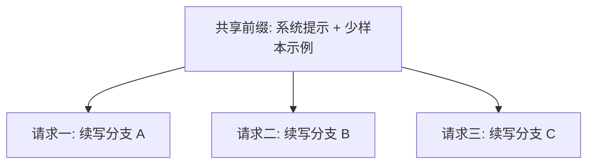

> 本文是对论文 Zheng et al., 2023, 《SGLang: Efficient Execution of Structured Language Model Programs》（arXiv:2312.07104，<https://arxiv.org/abs/2312.07104>）的阅读笔记与解读，旨在梳理其核心思想，不替代原文。

## TL;DR

- 是什么：SGLang 是一套面向「结构化 LLM 程序」的执行方案，包含一种前端编程语言和一个后端运行时。
- 核心思想：后端运行时的关键创新是 RadixAttention——用基数树组织生成过程中的 KV Cache，使相同前缀的缓存能够在不同请求与调用之间自动复用。
- 关键结论：在大量复用相同前缀的工作流中，减少重复计算可带来明显的吞吐提升。
- 意义：SGLang 与 vLLM 的 PagedAttention 是互补的两类推理优化思路，目前已成为主流推理引擎之一。

## 一、背景与动机

随着大语言模型的应用从「一问一答」走向更复杂的工作流，提示（prompt）本身的结构也越来越复杂：少样本提示需要附带固定的示例前缀，多轮对话需要携带历史上下文，思维树（tree-of-thought）、自一致性（self-consistency）等推理范式则会从同一个起点分裂出多条生成路径。

这类复杂工作流带来两个层面的问题。其一是「难写」：用裸字符串拼接去表达分支、并行、约束输出等逻辑，既繁琐又容易出错。其二是「难快」：这些工作流中存在大量重复的前缀——同样的系统提示、同样的少样本示例、同样的对话历史，会在不同请求或同一请求的不同分支里被反复送入模型，对应的 KV Cache 也被反复重新计算。SGLang 正是从「编程表达」和「执行效率」这两端同时切入。

## 二、前端：为结构化程序而设计的语言

SGLang 的前端是一种用于编写结构化 LLM 程序的语言。相较于手工拼接提示字符串，它把常见的复杂模式表达为语言层面的原语，主要覆盖以下能力：

| 能力 | 说明 |
| --- | --- |
| 多轮对话 | 以结构化方式维护与扩展对话上下文 |
| 分支 | 从同一上下文出发生成多个候选或多条路径 |
| 并行 | 同时发起多个生成调用以提升整体效率 |
| 约束解码 | 对模型输出施加格式或取值约束 |

把这些模式提升为语言原语之后，开发者描述的是「程序的结构」，而具体的调度与缓存复用则交给后端运行时处理。这种「前端表达结构、后端利用结构」的分工，是 SGLang 能够做深度优化的前提。

## 三、后端核心：RadixAttention

RadixAttention 是后端运行时的核心创新，要解决的就是前缀重复计算的问题。

在自回归生成中，模型为已经处理过的 token 维护 KV Cache。对于共享相同前缀的多次生成，这部分前缀对应的 KV Cache 在数学上是一致的，理论上不必重复计算。RadixAttention 的做法是用基数树（radix tree）来组织这些 KV Cache：树上的路径对应 token 序列的前缀，公共前缀在树中天然共享同一段缓存。

当一个新请求到来时，运行时沿基数树匹配它与已有缓存的最长公共前缀，直接复用这段已计算好的 KV Cache，只为新增的、不同的部分做计算。整个匹配、复用与缓存管理过程是自动进行的，开发者无需手工指定哪些前缀可以共享。前缀复用程度越高的工作流，从中获得的收益越大。

## 四、适用场景

RadixAttention 的收益与「前缀复用率」直接相关。下表归纳了几类典型场景为何天然契合：

| 场景 | 复用的前缀 |
| --- | --- |
| 少样本提示 | 固定的示例集合作为公共前缀 |
| 多轮对话 | 不断累积、被反复携带的对话历史 |
| 思维树 / 自一致性 | 从同一起点分裂出的多条生成路径共享起点 |

这些场景的共同点是：同一段内容会在多个请求或多条分支中被重复送入模型。通过跨请求、跨调用地复用前缀 KV Cache，重复计算被显著削减，从而带来吞吐上的明显提升。

## 五、与 PagedAttention 的关系

在 LLM 推理优化的版图中，vLLM 提出的 PagedAttention 着眼于 KV Cache 的内存管理：借鉴操作系统的分页思想，按页分配与调度显存，缓解碎片化、提升显存利用率。RadixAttention 则着眼于跨请求的「计算复用」：通过基数树识别并共享公共前缀的缓存，避免重复计算。两者关注的维度不同，属于互补的两类思路，而非相互替代。

## 意义与局限

SGLang 的价值在于把「结构化 LLM 程序」作为一个整体来看待：前端让复杂的提示工作流更易表达，后端则利用程序中暴露出的结构进行优化，RadixAttention 把前缀复用从需要手工设计的技巧变成了运行时自动完成的能力。这一思路与按页管理显存的 PagedAttention 互为补充，SGLang 也已成为主流推理引擎之一。

就适用边界而言，RadixAttention 的收益高度依赖工作流中前缀的复用程度：当请求之间几乎不共享前缀时，可复用的缓存有限，优化空间相应收窄；同时，维护基数树与管理共享缓存本身也会引入额外的工程复杂度。换言之，它更适合那些天然存在大量公共前缀的结构化场景，而非所有推理负载。

> 延伸阅读：SGLang: Efficient Execution of Structured Language Model Programs，arXiv:2312.07104（<https://arxiv.org/abs/2312.07104>）
