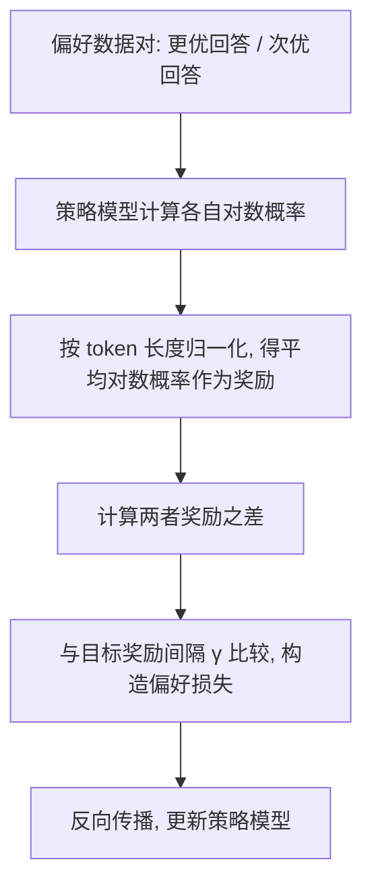

> 本文是对 SimPO 论文的阅读笔记与解读。原文：Meng, Xia, Chen, 2024, *"SimPO: Simple Preference Optimization with a Reference-Free Reward"*，arXiv:2405.14734（https://arxiv.org/abs/2405.14734）。文中观点以论文为准，解读部分仅作概括性梳理。

## TL;DR

- **是什么**：SimPO 是一种用于大语言模型偏好对齐的离线优化方法，可视为 DPO（Direct Preference Optimization）的简化与改进版本。
- **核心思想**：用策略模型对回答的**平均对数概率**作为隐式奖励（长度归一化），并**去掉参考模型**，奖励是 reference-free 的。
- **关键设计**：在偏好损失中引入一个**目标奖励间隔（target reward margin）**，要求更优回答的奖励比次优回答高出一个 margin。
- **意义**：训练时无需加载参考模型，省显存、省一次前向，且奖励形式与生成阶段的似然目标更一致；论文报告在多个指令遵循基准上优于 DPO。

## 一、背景与动机：从 RLHF 到 DPO 再到 SimPO

让大语言模型与人类偏好对齐，是后训练（post-training）阶段的关键环节。早期主流做法是 RLHF：先训练一个奖励模型，再用 PPO 等强化学习算法优化策略。该流程效果显著，但工程复杂、训练不稳定、对超参数敏感。

DPO 的出现改变了这一格局。它通过一个数学变换，把"奖励建模 + 强化学习"两步合并为对策略模型的**单一分类式损失**，直接在偏好数据对（更优回答 vs. 次优回答）上做监督式优化，省去了显式奖励模型和在线采样。不过 DPO 仍保留了一个**参考模型**（通常是 SFT 后的初始模型），其隐式奖励的形式依赖策略模型与参考模型对数概率之比。这带来两点代价：训练时需同时持有策略模型与参考模型、每步要对参考模型多做一次前向；同时，DPO 的优化目标与模型在**生成阶段**实际使用的似然度量之间存在一定不一致。

SimPO 的动机正是从这两点出发：能否设计一个**更简单、与生成目标更一致**的奖励，从而去掉参考模型？

## 二、核心改动：奖励形式的两点调整

SimPO 相对 DPO 的改动可以拆成两点。

**第一，用长度归一化的平均对数概率作为隐式奖励。** DPO 使用的是序列对数概率（再与参考模型对比）。SimPO 则直接采用策略模型对一段回答的**平均**对数概率——即把序列的对数似然除以其 token 长度。这个改动的直接好处是引入了**长度归一化（length normalization）**：因为偏好数据中"更长的回答常被标注为更优"会带来长度偏置，未归一化的对数概率天然偏向长序列；按长度取平均后，这种偏置被天然缓解，奖励更能反映"单位 token 的质量"。同时，平均对数概率正是文本生成中常用的打分形式，使训练目标与解码目标更一致。

**第二，去掉参考模型，奖励是 reference-free 的。** SimPO 的奖励只依赖策略模型自身对回答的平均对数概率，不再需要参考模型作分母。这意味着训练过程中无需加载第二个模型，省去相应显存占用与每步一次前向计算。

## 三、目标奖励间隔（target reward margin）

仅有上述奖励还不足以稳定区分更优与次优回答。SimPO 在偏好损失中额外引入一个**目标奖励间隔 γ**：损失不只是要求"更优回答奖励高于次优回答"，而是要求两者奖励之差**至少达到一个正的间隔**。直观上，这鼓励模型在更优与次优回答之间拉开足够清晰的差距，而非只是勉强分对，从而获得更稳健的偏好边界。该间隔与温度类系数一起，是 SimPO 需要调节的主要超参数。

## 四、SimPO 与 DPO 的对照

下表从几个维度对照两种方法，便于理解"偏好优化"这一族方法的设计空间。

| 维度 | DPO | SimPO |
| --- | --- | --- |
| 隐式奖励 | 策略与参考模型对数概率之比 | 策略模型的平均对数概率 |
| 参考模型 | 需要 | 不需要（reference-free） |
| 长度归一化 | 否（序列对数概率） | 是（按 token 长度取平均） |
| 额外约束 | 无显式间隔项 | 目标奖励间隔 γ |
| 训练资源 | 需同时持有两模型 | 仅持有策略模型 |
| 与生成目标一致性 | 相对较弱 | 相对较强 |

下面用一张流程图概括 SimPO 单步优化的数据流向。

## 五、方法的整体特点

把上述要点合起来看，SimPO 的设计逻辑是相当自洽的：奖励的形式（平均对数概率）既带来长度归一化以缓解长度偏置，又与解码时的打分方式对齐；去掉参考模型简化了训练管线；目标奖励间隔则为偏好区分提供更明确的优化信号。三者共同构成一个比 DPO 更精简的离线偏好优化目标，而无需引入在线采样或显式奖励模型。

## 六、意义与局限

从意义上看，SimPO 提供了一个"参考模型不是必需品"的范例，说明在偏好优化中，**奖励的参数化方式**本身是一个值得设计的维度。其长度归一化对缓解长度偏置具有直接作用，reference-free 的形式则降低了训练的资源与工程成本。论文报告其在多个指令遵循基准上相对 DPO 取得更优表现，使其成为与 DPO 对照阅读、理解偏好优化设计空间的有价值参考。

在局限方面，需要客观看待：作为离线偏好优化方法，SimPO 与 DPO 同样依赖偏好数据的质量与覆盖范围；目标奖励间隔等超参数需要调节，不同任务与数据下的最优取值可能不同；去掉参考模型在简化训练的同时，也移除了参考模型对策略偏移的隐式约束，其实际影响需结合具体数据与设置评估。这些都属于偏好优化方法普遍需要权衡的因素，具体结论应以原论文的实验设定与读者自身的复现为准。

> 延伸阅读：DPO 原论文 *"Direct Preference Optimization: Your Language Model is Secretly a Reward Model"*，与 SimPO 对照阅读可更完整地理解偏好优化的设计空间。
