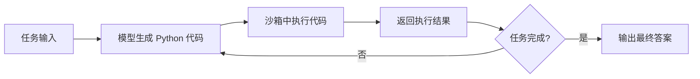

> 本文是对 Hugging Face 开源智能体库 smolagents 的阅读笔记与解读。项目与文档出处见 GitHub 仓库 [huggingface/smolagents](https://github.com/huggingface/smolagents) 以及官方介绍博客 [huggingface.co/blog/smolagents](https://huggingface.co/blog/smolagents)（Hugging Face，2024–2025）。文中事实以官方资料为准，定性描述为主。

## TL;DR

- **是什么**：smolagents 是 Hugging Face 推出的开源 Python 智能体库，主打「极简抽象」，目标是用极少的代码就能构建一个可运行的智能体。
- **核心思想**：提出「agents that think in code」，让智能体把要执行的动作直接写成 Python 代码片段（CodeAgent），而非传统的 JSON 结构化工具调用。
- **关键结论**：库内同时提供 CodeAgent（代码动作）与 ToolCallingAgent（JSON 工具调用）两类智能体，并因为要执行代码而引入沙箱机制保障安全。
- **意义**：它把智能体框架的复杂度压到很低，降低了从原型到落地的门槛，也为「代码即动作」这一范式提供了可直接上手的实现。

## 一、背景与动机

智能体（Agent）的基本工作循环并不复杂：模型根据当前状态决定调用哪个工具、传入什么参数，工具返回结果后模型再继续推理，直到完成任务。然而，许多智能体框架在这套循环之上叠加了大量抽象层——角色、记忆、规划器、回调、状态机等等，导致使用者需要先理解框架本身，才能写出一个能跑的智能体。

smolagents 的出发点正相反：它把抽象削减到尽可能少，强调「smol」（small）的设计哲学，让构建智能体的核心逻辑保持轻量与透明。其目标是让开发者用很少几行代码就能搭起一个可运行的智能体，而不必陷入框架的概念体系中。这种取向使它更接近一个「薄」的工具库，而非一个需要全面接管应用结构的「重」框架。

## 二、核心思想：用代码思考

smolagents 最具辨识度的主张是「agents that think in code」。在传统做法中，模型决定动作时通常输出一段结构化的 JSON，描述「调用哪个工具、参数是什么」，再由框架解析并执行。smolagents 的 CodeAgent 则让模型直接生成一段 Python 代码作为它的「动作」，由运行环境执行这段代码并把结果反馈回模型。

把动作表达为代码，带来的优势在于表达力。一段代码可以在单步中完成变量赋值、循环、条件分支、把一个工具的输出直接喂给另一个工具等组合操作，而这些用扁平的 JSON 调用往往需要拆成多轮交互才能完成。官方资料认为，代码化的动作相比 JSON 工具调用更灵活、也更强大，这与「代码本身就是组合与控制流的自然载体」这一直觉一致。

## 三、两类智能体与对比

为兼顾不同场景，smolagents 提供两种智能体形态：

| 维度 | CodeAgent | ToolCallingAgent |
| --- | --- | --- |
| 动作形式 | 生成并执行 Python 代码片段 | 输出结构化 JSON 工具调用 |
| 表达力 | 可在单步内组合多操作、含控制流 | 以离散的单次工具调用为主 |
| 范式归属 | 「代码即动作」 | 传统结构化工具调用 |
| 执行要求 | 需要可执行代码的运行环境 | 解析并分发调用即可 |
| 适用倾向 | 任务步骤组合复杂、需灵活编排 | 工具边界清晰、调用模式规整 |

两者并非互斥：ToolCallingAgent 沿用业界广泛使用的 JSON 工具调用方式，便于与既有的工具调用生态对接；CodeAgent 则代表该库主推的代码化范式。开发者可根据任务特性与模型能力在两者间选择。

## 四、执行安全与沙箱

让模型生成的代码直接运行，意味着必须正视安全问题：未经约束地执行任意代码可能带来风险。为此，smolagents 支持在沙箱环境中运行智能体生成的代码，官方提到可借助如 E2B、Docker 等方案，把代码执行隔离在受控环境内，从而在享受「代码即动作」表达力的同时控制其副作用范围。

下面用一张流程图概括 CodeAgent 的基本运行回路：

这一回路与传统工具调用智能体的循环结构一致，差别主要在于「动作」的承载形式从 JSON 变成了可执行代码，以及由此引入的沙箱执行环节。

## 五、定位与生态

作为 Hugging Face 生态的一部分，smolagents 延续了该社区一贯的开放与可组合取向：它是开源的 Python 库，倾向于与多种模型与工具协作，而非绑定单一供应商。其「薄抽象」的定位也决定了它更适合作为构建智能体的基础组件，让使用者在其上按需拼装能力，而不是接受一整套预设的应用架构。

## 意义与局限

smolagents 的价值在于把智能体框架的认知与工程成本压低，让「从想法到可运行原型」这一步变得很短，同时以 CodeAgent 把「代码即动作」这一范式做成了可直接上手的实现，为相关讨论提供了具体参照。

局限同样来自其设计取舍。代码化动作把更多表达力交给模型，对模型生成正确、可控代码的能力提出更高要求；直接执行代码必须依赖沙箱等隔离手段来管理安全，这会引入额外的部署与运维成本；而「极简抽象」在带来轻量的同时，也意味着复杂应用所需的部分能力可能需要使用者自行补齐。如何在表达力、安全性与工程复杂度之间取得平衡，是采用这一思路时需要持续权衡的问题。

> 延伸阅读：Hugging Face 官方介绍博客 [huggingface.co/blog/smolagents](https://huggingface.co/blog/smolagents) 与源码仓库 [huggingface/smolagents](https://github.com/huggingface/smolagents)。
