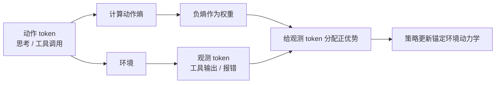

> 本文是对《SOAR: Supervision from Observation for Agentic Reinforcement Learning》（ACL 2026 长文，ACL Anthology: 2026.acl-long.1624）的阅读笔记。以下内容为个人整理与解读，具体结论与数字请以原论文为准。

## TL;DR

- 智能体强化学习（agentic RL）让模型通过与环境交互来解决长程任务，并把工具使用内化进推理过程。
- 既有做法的监督信号主要来自结果奖励或外部奖励模型，而环境返回的「观测」（observation）几乎被排除在学习之外。
- 后果是智能体可能学会了「哪个动作能成功」，却没学会「环境为什么这样回应」，从而形成次优策略。
- SOAR 给观测 token 分配正优势，其大小与前序动作的负熵成正比——只从「有把握的动作」的后果中学习。三个域、13 个基准上通用推理最多提升 7.0%，深度研究任务最多提升 16.9%，同时减少了错误与冗余的工具调用。

## 一、背景：智能体 RL 把什么当作监督信号

从 ReAct 把「推理」与「行动」拧在一起开始，智能体范式的主线一直是让模型在多步交互中调用工具、观察结果、再决定下一步。近一两年，随着 RLVR 在推理任务上被验证有效，这套方法自然被搬到了智能体上：给一个长程任务，让模型自主交互，最后按任务是否完成给奖励，用 GRPO 一类算法更新策略。

这条路走得通，但论文指出其中一个被忽视的结构性问题。一次智能体轨迹由两类 token 交替组成：模型自己生成的**动作**（思考、工具调用），以及环境返回的**观测**（工具输出、报错、检索结果）。由于观测不是模型生成的，主流实现通常把观测 token 从损失中屏蔽掉——只对动作 token 计算梯度。

这个处理在实现上很自然，却带来一个后果：模型学到的是「在这个状态下发出这个调用能拿到奖励」，而不是「发出这个调用后环境会怎么变」。论文的说法很到底：智能体可能识别出了成功的动作，却不理解环境如何回应。缺了这层理解，它就难以预判工具调用的后果，于是在新情况下容易反复试错、发出无效调用，或者干脆走进死胡同。

## 二、核心思想：给观测 token 分配优势

SOAR（Supervision from Observation for Agentic Reinforcement Learning）的做法可以一句话概括：**给观测 token 分配正优势，权重与其前序动作的负熵成正比。**

拆开来看有两层设计。

**第一层，把观测纳入学习目标。** 与常规做法屏蔽观测相反，SOAR 让观测 token 参与更新，并赋予正优势。直觉上，这相当于让模型去「预测环境会怎么回应」——策略更新因此被锚定在环境动力学上，而不只是锚定在最终成败上。这与世界模型类工作的动机相通：要在环境中稳健行动，就得对环境的反应有内部模型。

**第二层，用动作熵做加权。** 如果对所有观测一律赋予正优势，会引入明显的噪声：当模型对某个动作本身都很不确定时，它随手发出的调用所引发的观测未必值得学习。SOAR 的处理是按前序动作的负熵加权——动作熵越低（模型越有把握），随后的观测被赋予的优势就越大。换言之，**只从有把握的动作的后果中学习**，对试探性动作的后果则降低权重。

这个设计的巧妙之处在于它用一个已有的量（动作分布的熵）解决了信号筛选问题，不需要额外的奖励模型或人工标注。

## 三、与既有监督方式的对比

为便于定位 SOAR，下表就监督信号的来源做一个定性梳理。

| 方式 | 监督信号来源 | 观测 token 的处理 | 主要局限 |
| --- | --- | --- | --- |
| 结果奖励（outcome reward） | 任务最终是否成功 | 屏蔽 | 信号稀疏，长程任务归因困难 |
| 外部奖励模型 | 学习到的偏好或过程评分 | 屏蔽 | 依赖奖励模型质量，易被套利 |
| 过程奖励（step-level） | 对中间步骤逐步打分 | 屏蔽 | 标注或构造成本高 |
| SOAR | 环境观测本身，按动作熵加权 | 参与更新，赋正优势 | 依赖动作熵的可靠性 |

可以看到 SOAR 并不是要替代结果奖励，而是补上一路此前被丢弃的信号。它与前三种方式在原则上是可叠加的。

## 四、实验结果

论文在三个域、13 个基准上做了评估。报告的主要结论有两部分：

- **性能提升**：通用推理任务上最多提升 7.0%，深度研究（deep research）任务上最多提升 16.9%。后者的增幅显著更大，这符合直觉——深度研究任务涉及大量检索与信息整合，轨迹更长、观测更密集，因此从观测中学习的收益也更大。
- **行为改善**：错误与低效的工具调用减少，观测的不确定性下降。这一点比分数更能说明方法是否按设计意图工作：如果模型真的对环境反应有了更好的预判，它就应该少发无效调用。

## 意义与局限

意义层面，SOAR 指出并修补了智能体 RL 里一个相当基础的遗漏。「屏蔽观测 token」原本只是一个工程上顺手的选择——观测不是模型生成的，不计入损失似乎理所当然——但这个选择实际上丢掉了轨迹中信息量最大的一部分。把它捡回来，并且用动作熵这样一个免费可得的量来筛选，方法上是轻的，代价也低。对于长程、工具密集的任务（深度研究、仓库级编码），这类改动的价值可能超过继续堆砌奖励设计。

局限层面有几点需要留意。首先，方法的可靠性依赖于动作熵能否真实反映「把握程度」。经过大量 RL 训练的模型往往整体熵偏低（这正是 RLVR 熵坍缩讨论的内容），此时熵作为置信度代理是否仍然有区分度，值得进一步考察。其次，给观测 token 分配正优势本质上是在让模型拟合环境输出，而工具输出中包含大量与任务无关的格式化内容与噪声；论文的加权机制筛的是「哪个动作的后果值得学」，未必能筛掉「观测里哪部分内容值得学」。第三，13 个基准的覆盖面不错，但增益的具体分布、以及在哪类任务上不起作用，需要看原文的细分结果。最后，环境本身的确定性程度会影响这一思路的适用性：在高随机性环境中，预测观测的价值可能大幅下降。

> 延伸阅读：《SOAR: Supervision from Observation for Agentic Reinforcement Learning》，ACL 2026（https://aclanthology.org/2026.acl-long.1624/）。相关背景可参考本站 ReAct 与 GRPO 两篇笔记。
