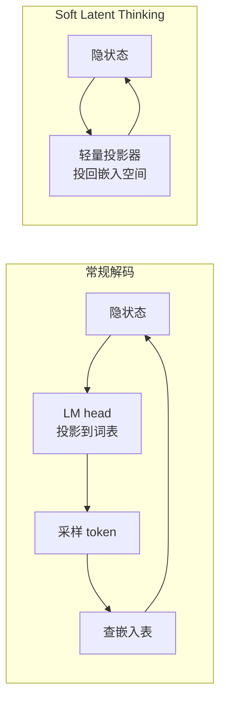

> 本文是对 Aksenov et al., 2026《A Model with No Head and Many Thoughts》的阅读笔记，原文见 arXiv:2608.31069（https://arxiv.org/abs/2608.31069），该工作被 EMNLP 2026 Findings 接收。以下内容为个人整理与解读，具体结论请以原论文为准。

## TL;DR

- 大模型每生成一步都要把隐状态投影过一个巨大的词表头（LM head），这既昂贵，也强制把所有推理过程压成离散 token。
- Soft Latent Thinking 在推理阶段用一个轻量投影器替换 LM head，使自回归展开发生在嵌入空间中，推理步骤保持连续而非被 token 化。
- 在 DeepSeek-Qwen-1.5B 与 LLaMA-3.2-3B 上，该方法在所有 k 取值下都一致提升 pass@k，同时降低思维链过程中每步的计算量。
- 在各类「soft thinking」方案中取得了最高的 pass@32，说明有效的推理可以不经由离散 token 生成来完成。

## 一、背景：离散 token 是推理的必要形式吗

思维链之后，「把过程写出来」几乎成了推理任务的标准配置。但写出来这件事有一个常被忽略的代价：**每一个中间步骤都必须被压缩成词表里的某一个 token。**

这个约束有两层成本。

其一是计算上的。生成每一步都要把隐状态（几千维）投影到词表维度（如今动辄十几万），这个矩阵乘法在长思维链上会被重复成千上万次。对于以推理为主的负载，词表头的开销占比并不小。

其二是表达上的，也更根本。隐状态是一个连续的高维向量，其中可能同时保留了多个候选、多种不确定性；而采样一个 token 意味着把这份丰富的分布坍缩成一个离散选择。中间推理的每一步都要经历这样一次坍缩，信息就在这里被反复丢弃。论文标题里的「no head, many thoughts」正是在说这件事：去掉头，就能同时保留很多个想法。

围绕这个观察，近年出现了一批被统称为「soft thinking」的工作，共同思路是让中间推理停留在连续空间。本文是这条路线上的一个新方案。

## 二、方法：用轻量投影器替换 LM head

Soft Latent Thinking 的做法在结构上很简洁：**在推理阶段，把 LM head 换成一个轻量的投影器（projector）。**

区别在于投影的目标空间。原本 LM head 把隐状态投到词表空间，得到一个 logits 分布，然后采样出 token，再把 token 转回嵌入送进下一步。新的投影器直接把隐状态投回**嵌入空间**——跳过了「投到词表 → 采样 → 查嵌入表」这整条路径。于是自回归展开在嵌入空间中直接进行，每一个推理步骤都是一个连续向量，而不是一个离散符号。

这个替换同时解决了前面提到的两层成本：轻量投影器远小于词表头，因此每步计算下降；推理步骤不再被 token 化，因此避免了分布坍缩。

需要强调的是「在推理阶段」这个限定——方法替换的是思维链展开过程中的头部，最终答案仍需以自然语言输出。也就是说，模型在连续空间里想，在离散空间里说。

## 三、与相关思路的关系

| 方案 | 中间步骤的形式 | 每步词表投影 | 主要动机 |
| --- | --- | --- | --- |
| 标准思维链 | 离散 token | 需要 | 让过程可写、可读、可监督 |
| 自洽性 / 多次采样 | 离散 token（多条） | 需要，且乘以采样数 | 用多样性换正确率 |
| 其他 soft thinking 方案 | 连续表示 | 部分需要 | 避免离散化损失 |
| Soft Latent Thinking | 连续表示（嵌入空间） | 推理阶段不需要 | 同时降计算、保留分布 |

与自洽性类方法的对比尤其能说明问题。自洽性的思路是：既然单条链会丢失信息，那就采样多条再投票——用横向的多样性弥补纵向的坍缩。Soft Latent Thinking 走的是另一条路：既然坍缩发生在每一步的离散化上，那就干脆不离散化，让多种可能性在同一条链里以连续形式共存。论文报告在所有 k 下 pass@k 都获得提升，恰好说明这两者并不冲突——保留了更多分布信息的链，其采样多样性也更有价值。

## 四、实验结果

论文在两个中小规模模型上做了验证：DeepSeek-Qwen-1.5B 与 LLaMA-3.2-3B。报告的结论有两条：

- **pass@k 在所有 k 上一致提升**，同时思维链过程中每步的计算量下降。「一致提升」这个措辞值得留意——如果只在大 k 上提升，可能仅意味着多样性变好；在小 k 上也提升，说明单条链本身的质量也有改善。
- **在各类 soft thinking 方案中取得最高的 pass@32**，即在同类方法的横向对比中处于领先。

## 意义与局限

意义层面，这项工作的价值在于它把一个被视为理所当然的设计放到了台面上：**LM head 是为「输出语言」而存在的，但推理并不一定需要输出语言。** 一旦承认中间步骤只是模型的内部工作草稿，那么强制它经过词表就成了一种无谓的约束——既费算力，又损失信息。方法本身的实现也相当轻：替换一个头部，不改动主干。对推理密集型负载而言，「更准且更省」这样的组合并不常见，多数效率工作都要在质量上做让步。

局限层面则要说得实在一些。首先是规模：验证停在 1.5B 与 3B，而离散化的信息损失与模型规模的关系并不显然——更大的模型隐状态维度更高、词表投影的相对开销也不同，结论是否外推需要独立验证。其次是可解释性的代价，这一点相当实质：思维链之所以被广泛采用，很大一部分原因是它可读、可审计、可用过程奖励去监督。推理若发生在嵌入空间，这些便利就一并消失了——我们无法直接读出模型在想什么，也难以对中间步骤施加过程级监督，而后者正是 Let's Verify Step by Step 一路工作的基础。第三，连续展开缺少 token 化带来的天然「量化」约束，长链上是否会出现表示漂移或退化，需要看原文对链长的分析。最后，pass@k 这一指标本身衡量的是「多次尝试中有正确答案」，它与实际部署中单次输出的可靠性之间仍有距离。

> 延伸阅读：Aksenov et al., 2026，《A Model with No Head and Many Thoughts》，arXiv:2608.31069（https://arxiv.org/abs/2608.31069）。相关背景可参考本站思维链 CoT 与自洽性 Self-Consistency 两篇笔记。
