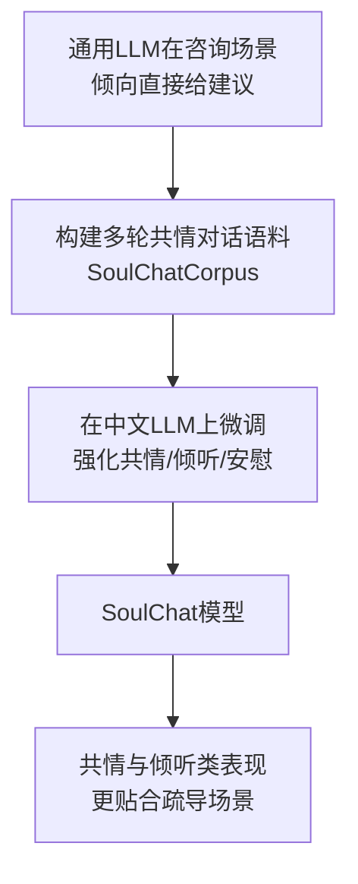

> 本文是对 Chen et al.（华南理工大学 SCUT），2023，《SoulChat: Improving LLMs' Empathy, Listening, and Comfort Abilities through Fine-tuning with Multi-turn Empathy Conversations》（Findings of EMNLP 2023，arXiv:2311.00273，<https://arxiv.org/abs/2311.00273>）的阅读笔记与解读。文中事实以原论文为准，本文仅做概括性整理。

## TL;DR

- **是什么**：一项面向中文心理咨询场景的工作，通过在大规模多轮共情对话数据上微调，得到更「会倾听」的对话模型 SoulChat。
- **核心思想**：用专门构建的多轮共情对话语料 SoulChatCorpus 微调中文 LLM，强化共情、倾听、理解与安慰，而非一上来就堆砌通用建议。
- **关键结论**：相比直接使用通用模型，微调后的 SoulChat 在共情与倾听类表现上更贴合心理疏导需求。
- **意义**：它是「情感支持／心理健康对话」这条研究线上的中文代表性工作之一，但此类系统不能替代专业心理援助。

## 一、背景与动机：通用模型为什么「不会聊」

近年来通用大语言模型在问答、写作、代码等任务上表现亮眼，但当人们把它直接搬到心理咨询、情绪疏导这样的场景时，体验往往并不理想。一个被反复观察到的现象是：当用户倾诉烦恼时，通用模型倾向于「急着解决问题」——立刻列出一大串看起来正确、却泛泛而谈的建议。

然而真实的心理咨询并不主要靠「给方案」运转。咨询场景里，求助者首先需要的是被听见、被理解、被接纳，即共情（empathy）、倾听（listening）、理解与安慰（comfort）。一上来就抛出待办清单，反而可能让倾诉者感到不被理解，体验上更像「被打断」。

SoulChat 这项工作正是针对这一落差展开：与其在推理或知识上继续加码，不如把模型在「如何回应情绪」上的行为对齐到咨询场景所需要的方式。

## 二、核心做法：多轮共情对话语料 + 微调

论文的核心思路可以概括为「构建合适的数据，再用它把模型行为掰过来」。

- **构建专用语料**：作者构建了大规模的多轮共情对话数据集 SoulChatCorpus，论文中提到其规模达到二百万量级的样本。「多轮」很关键——共情与倾听往往体现在对话的连续展开中，而非单轮一问一答里。
- **针对性微调**：在中文 LLM 上，用这套共情对话语料进行微调，使模型学会在情绪语境中先倾听、先共情，再视情况温和地回应，而不是默认进入「建议输出」模式。
- **目标导向**：微调的优化方向明确指向共情、倾听、理解与安慰这几类能力，而非通用任务指标。

下面用一个简化的流程图，呈现从「问题」到「方法」再到「评估」的整体脉络：

## 三、与相关研究线的关系

情感支持与心理健康对话并不是全新命题。在 SoulChat 之前，已有若干被学界广泛引用的基础工作，为「让模型更有共情」提供了任务定义与数据基础。SoulChat 可以看作这条线在中文、并结合大模型微调范式下的延续。

| 工作方向 | 关注点 | 与 SoulChat 的关系 |
| --- | --- | --- |
| EmpatheticDialogues | 面向开放域的共情对话 | 奠定「共情对话」的任务与数据范式 |
| ESConv（情感支持对话） | 结构化的情感支持策略 | 提供情感支持对话的研究脉络 |
| SoulChat | 中文多轮共情对话微调 | 将共情/倾听/安慰能力落到中文 LLM |

## 四、为什么强调「多轮」与「倾听」

把「倾听」当成显式目标，是这项工作值得关注的地方。倾听不是沉默，也不是简单复述，而是在多轮交互中体现出对求助者情绪与处境的持续跟随：先承接情绪、确认感受，再在合适的时机谨慎推进。单轮数据难以充分刻画这种节奏，因此「多轮共情对话」的语料形态与目标能力是相互匹配的。

从工程视角看，这也提示了一个可推广的方法论：当通用模型在某类场景中的「默认行为」与场景需求不符时，与其依赖提示词反复纠偏，不如用与目标行为一致的高质量对话数据进行微调，把期望的回应方式沉淀进模型本身。

## 意义与局限

SoulChat 的意义在于，它把「共情、倾听、安慰」这些过去较难量化、容易被通用指标忽视的能力，作为明确的微调目标，并通过大规模多轮共情对话语料加以强化，为中文情感支持对话提供了一个可参考的范式。它说明：在情绪场景里，「会回应」往往比「会建议」更重要，而这种能力是可以通过数据与微调被有意识地塑造的。

同时必须清楚其边界。第一，这类系统是对话模型，不具备临床诊断与治疗资质，**不能替代专业心理援助**；面对处于危机或有自伤风险的求助者，应引导其寻求专业机构与热线的帮助。第二，共情、倾听这类能力的评估本身存在主观性，不同评测设定下的结论需要谨慎对待，不宜过度外推。第三，涉及心理健康的数据与应用对隐私、安全与伦理有更高要求，任何落地都应将安全边界放在首位。

总体而言，SoulChat 把研究视线从「让模型更聪明」转向「让模型更懂得如何陪伴」，这一取向对情感计算与心理健康对话的后续工作具有参考价值，但其应用始终应在明确的伦理与安全前提下进行。

> 延伸阅读：SoulChat 原论文 arXiv:2311.00273（<https://arxiv.org/abs/2311.00273>）；以及情感支持对话方向的相关基础工作 EmpatheticDialogues 与 ESConv。
