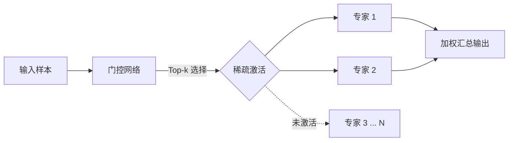

> 这是一篇经典论文阅读笔记，回顾 Shazeer 等人 2017 年的工作《Outrageously Large Neural Networks: The Sparsely-Gated Mixture-of-Experts Layer》（arXiv:1701.06538，原文链接：https://arxiv.org/abs/1701.06538）。这篇论文提出的稀疏门控专家层，被普遍视为现代 MoE 大模型的思想源头。

## TL;DR

- 提出**稀疏门控 Mixture-of-Experts 层**：层内包含成千上万个专家子网络，门控网络为每个输入样本只挑选并激活其中少数几个专家。
- 由此实现「**条件计算（conditional computation）**」：模型总参数量可以做到极大，但任意一次前向传播实际参与运算的部分很小。
- 论文同时讨论了由稀疏激活带来的工程与训练难点，尤其是**专家间的负载均衡**。
- 它为后续的 Switch Transformer、Mixtral、DeepSeekMoE 等一系列稀疏专家模型奠定了基本范式。

## 一、背景与动机

深度学习长期遵循一个朴素直觉：模型容量越大，表达能力越强。但「把网络做大」通常意味着每个样本都要走过全部参数，计算成本随参数量近似线性增长，很快就撞上算力与训练时间的墙。

条件计算提供了另一条思路：让网络的不同部分按输入有选择地被激活，从而把「拥有多少参数」和「单次前向用掉多少算力」这两件事解耦开。这一想法此前已被多次提出，但要在大规模、可训练的神经网络中真正落地，仍面临门控如何学习、稀疏激活如何高效执行等一系列障碍。这篇论文的贡献，正是给出了一种可大规模训练、可端到端学习的具体实现。

## 二、稀疏门控 MoE 层的核心思想

该层由两部分构成：一组数量庞大的**专家网络**，以及一个**门控网络（gating network）**。每个专家本身是一个相对独立的子网络；门控网络则负责为每个输入样本计算一组权重，决定哪些专家被启用、各自贡献多大。

关键在于「稀疏」二字：门控并不会让所有专家都参与，而是对每个样本只选出权重最高的少数专家，其余专家的输出权重为零，因此完全不必参与计算。层的最终输出是被选中专家输出的加权组合。

可以把整个流程拆成几步来理解：

- **门控打分**：门控网络读入样本表示，为每个专家给出一个分数。
- **稀疏选择**：只保留分数最高的少数专家，其余被置零，从而保证激活的稀疏性。
- **专家计算**：仅被选中的专家执行前向运算。
- **加权汇总**：按门控权重对被选专家的输出加权求和，得到该层输出。

由于只有少数专家被激活，总参数量可以做到极大，而单个样本的实际计算量却被控制在很低的水平——这正是「巨大但省算力」的来源。

## 三、训练中的难点：以负载均衡为代表

把稀疏门控真正训练好并不简单。论文专门讨论了几类工程与优化层面的问题，其中最具代表性的是**负载均衡**。

如果不加约束，门控网络容易陷入一种自我强化的退化：少数表现稍好的专家被反复选中、得到更多训练、变得更强，于是被选得更多；大量专家则长期得不到样本，近乎闲置。这既浪费了模型容量，也让稀疏选择的优势无从发挥。论文的应对思路是引入额外的引导机制，鼓励门控把样本较为均衡地分配到各个专家上。

此外，稀疏激活还带来了与稠密网络不同的实现考量，下表概括了几个典型维度的对比：

| 维度 | 稠密大模型 | 稀疏门控 MoE |
| --- | --- | --- |
| 单样本参与的参数 | 几乎全部参数 | 仅被选中的少数专家 |
| 总参数量与单次算力的关系 | 近似同步增长 | 解耦，可分别扩展 |
| 主要训练难点 | 优化与显存 | 负载均衡、门控学习 |
| 容量利用 | 天然均衡 | 需机制保障专家被充分使用 |

## 四、影响与定位

这篇论文的意义并不局限于某一项任务上的指标，而在于它系统性地论证了：通过稀疏门控，神经网络可以在保持单次计算可控的前提下，把参数规模推向极大。这一范式被后续工作不断继承与简化——从把路由收敛到单专家的 Switch Transformer，到将稀疏专家引入主流大模型的 Mixtral、DeepSeekMoE 等，背后的基本骨架都可以追溯到这里所确立的「门控 + 专家 + 稀疏激活」结构。

## 意义与局限

稀疏门控 MoE 的核心价值，在于把「模型能装下多少知识」和「每次推理要花多少算力」这两件事拆开，使得在算力预算受限时仍可显著扩展模型容量。这一思路为大模型的规模化提供了一条不同于单纯堆叠稠密参数的路径。

与此同时，它也带来了稠密网络所没有的复杂性：门控的训练稳定性、专家之间的负载均衡，以及稀疏路由在工程实现上的额外开销，都是需要认真处理的问题。论文本身已经点出了这些方向，而它们在后续的诸多研究中持续被改进。正因如此，这篇工作既是一项具体方法，也是一个长期研究议程的起点。

> 延伸阅读：Shazeer et al., 2017, arXiv:1701.06538（https://arxiv.org/abs/1701.06538）
