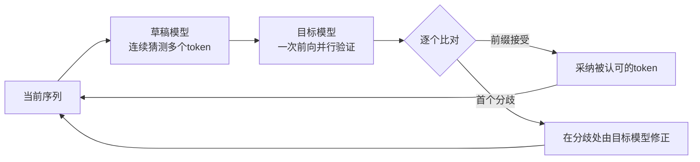

> 本文是对经典论文的回顾与解读。论文：Leviathan et al., 2022 (ICML 2023), "Fast Inference from Transformers via Speculative Decoding", arXiv:2211.17192（https://arxiv.org/abs/2211.17192）。文中事实以原论文及公认背景为准，解读如有偏差请以原文为准。

## TL;DR

- 自回归解码一次只能产出一个 token，大模型逐 token 生成的延迟成为推理瓶颈。
- 投机解码用一个小而快的「草稿模型」一次性提议多个后续 token，再让大的「目标模型」并行验证。
- 该方法在数学上保证输出分布与目标模型单独解码完全一致（无损），不改变结果、无需重训。
- 论文在 T5-XXL 上取得约 2-3 倍加速，投机解码已成为 LLM 推理加速的主流技术之一。

## 一、背景：自回归解码为何慢

主流的 Transformer 大模型采用自回归方式生成文本：每一步以已有序列为条件预测下一个 token，再把它拼回输入、进入下一步。生成一段长度为 N 的文本，原则上需要执行 N 次完整的前向传播，而且这些前向之间存在严格的先后依赖，无法简单并行。

问题的关键在于，单次前向的耗时主要由模型权重的访存与计算决定，而在生成阶段每一步通常只处理一个新 token。也就是说，硬件的并行计算能力被严重浪费——大量算力空转，瓶颈落在「访存带宽」和「逐步的串行依赖」上。模型越大，单步越贵，串行累积出的总延迟也越可观。

一个自然的疑问随之而来：既然一次前向的成本如此之高，能否让每一次昂贵的前向多产出几个有效 token，从而摊薄成本？投机解码正是对这一问题的回答。

## 二、核心思想：先猜，再并行验证

投机解码（Speculative Decoding）的基本构造是「草稿模型 + 目标模型」的协作。

- 草稿模型（draft model）：一个小而快的模型。它先用自回归方式连续生成若干个候选 token，作为对后续内容的「猜测」。因为它小，所以这几步虽仍是串行的，但每步都很便宜。
- 目标模型（target model）：真正想要其输出分布的大模型。它把草稿模型给出的多个候选 token 拼成一段序列，一次性并行地前向验证。

关键洞察是：验证若干个候选 token，可以在目标模型的一次前向中并行完成，其代价与生成单个 token 的一次前向相近。于是，原本需要多次串行前向才能得到的多个 token，现在有机会在目标模型的一次前向里被「批量确认」。

## 三、接受规则与无损保证

接受过程可以概括为：从前往后逐个考察候选 token，被目标模型认可的就接受；一旦遇到第一个不被接受的位置，就在该处停止，丢弃其后的候选，并由目标模型在该位置给出一个修正 token，然后进入下一轮。每一轮至少前进一个 token，因此即便草稿全错，也不会比原始逐 token 解码更慢。

这里最精巧、也最重要的一点是：投机解码不是「近似」。论文给出的接受/修正规则经过专门设计，使得最终生成序列的概率分布与目标模型单独解码时完全一致。换句话说，它是数学上无损的——既适用于贪心解码，也适用于带采样温度的随机采样。这与许多以牺牲质量换速度的加速手段有本质区别：

| 维度 | 朴素自回归 | 投机解码 |
| --- | --- | --- |
| 每次目标模型前向产出的 token | 1 个 | 多个（取决于草稿被接受的数量） |
| 输出分布 | 基准 | 与基准完全一致（无损） |
| 是否需要重新训练 | 否 | 否 |
| 额外组件 | 无 | 需要一个草稿模型 |

正因为无损且无需重训，投机解码可以作为一种「即插即用」的推理优化：只要有一个与目标模型行为接近的小模型作为草稿，就能在不改变结果的前提下提速。

## 四、效果与适用条件

论文在 T5-XXL 上验证了该方法，取得约 2-3 倍的加速。加速的来源很直观：草稿模型越能准确预测目标模型接下来的输出，单轮被接受的 token 就越多，目标模型摊到每个 token 上的前向次数就越少。

由此也能推断出方法的适用条件与权衡：

- 草稿与目标的「契合度」是关键。草稿模型越能模仿目标模型，接受率越高，收益越大；反之接受率低时，草稿生成与验证带来的额外开销会侵蚀收益。
- 存在计算冗余。被拒绝位置之后的候选 token 是被丢弃的，对应的草稿计算属于「投机失败」的成本，因此该方法本质上是用一部分额外算力换取延迟的降低。
- 适合访存受限、批量较小的延迟敏感场景，此时目标模型的并行验证几乎「免费」地利用了空闲算力。

## 意义与局限

投机解码提供了一个朴素而深刻的视角：自回归生成的瓶颈是串行依赖，而验证可以并行。它把「生成」拆成「廉价的猜测」加「并行的确认」，在严格保持输出分布不变的前提下降低了端到端延迟。这一思想此后被大量后续工作沿用与拓展，例如让草稿来自模型自身的额外预测头、用树状结构同时验证多条候选分支等，投机解码也因此成为当下 LLM 推理加速的主流技术之一。

局限同样清晰：方法依赖一个行为接近目标模型的草稿来源，草稿质量不佳或场景本身已是算力受限（如超大批量）时，收益可能有限甚至为负；同时引入草稿模型也带来了额外的工程与显存复杂度。如何更低成本地获得高接受率的草稿，是这条技术路线持续演进的核心问题。

> 延伸阅读：Leviathan et al., "Fast Inference from Transformers via Speculative Decoding", arXiv:2211.17192（https://arxiv.org/abs/2211.17192）。
