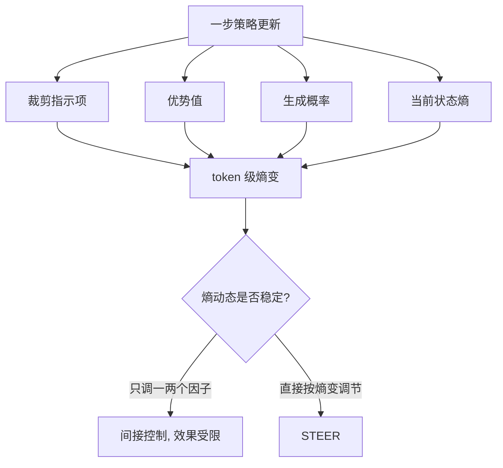

> 本文是对 Hao et al., 2026《Rethinking Entropy Interventions in RLVR: An Entropy Change Perspective》的阅读笔记，原文见 arXiv:2510.10150（https://arxiv.org/abs/2510.10150），该工作获 ACL 2026 Outstanding Paper（ACL Anthology: 2026.acl-long.1436）。以下内容为个人整理与解读，具体结论请以原论文为准。

## TL;DR

- RLVR（可验证奖励强化学习）是当下推理模型的主力训练范式，但训练中常出现「熵坍缩」——策略熵快速下降，探索停滞，泛化受损。
- 论文推导出 token 级熵变在每一步更新时的一个紧近似，指出它由四个因子共同支配，并用这套框架统一解释了既有的各类熵干预方法。
- 由此揭示既有方法的共性局限：它们只启发式地调节其中一两个因子，属于间接控制，效果因而受限。
- 论文提出 STEER，按理论估计的熵变对 token 自适应重加权，在六个数学推理与三个代码基准上稳定了熵动态并持续超过此前最优方法。

## 一、背景：RLVR 与熵坍缩

自 DeepSeek-R1 一类工作把「用强化学习激发推理」推到台面之后，RLVR 成为提升推理能力的主要手段：任务的正确性可以被程序化验证（数学答案是否相等、代码是否通过测试），于是可以绕开训练奖励模型，直接用可验证信号做策略优化。GRPO、RLOO 等算法正是在这一框架下被广泛使用的。

但这条路上有一个反复出现的麻烦：策略熵的坍缩。训练进行到一定阶段，模型输出分布迅速变尖，对每个位置几乎只保留一个候选。表面上看训练奖励还在涨，实际上模型已经停止探索——它把已经会做的题做得更确定，却不再尝试新的解法路径。后果是泛化变差，在训练分布之外的题目上表现不升反降。

社区对此已提出不少缓解手段：调整裁剪范围、加熵正则项、对不同 token 施加不同的更新力度等。这些方法多少都有效，但论文指出一个尴尬的现状：它们为什么有效、什么时候会失效，其内在机制并不清楚。这正是本文要回答的问题。

## 二、核心分析：熵变由哪四个因子支配

论文的第一项贡献不是新方法，而是一个分析工具。作者针对每一步策略更新，推导出 token 级熵变的一个紧解析近似，并指出这个量主要由四类因素决定：

- **裁剪指示项**：该 token 是否落在 PPO/GRPO 式裁剪区间之内，即这次更新是否真的作用到了它身上。
- **优势值**：该 token 所在轨迹被赋予的优势（advantage）大小与符号，决定推动方向。
- **生成概率**：当前策略给该 token 的概率，概率越接近确定，同样的更新对熵的影响越不同。
- **当前状态熵**：该位置本身的熵水平，刻画了它还剩多少可压缩的空间。

这个分解的价值在于它提供了一把统一的尺子。此前各类熵干预方法看起来五花八门，但放进这个框架就清楚了：加熵正则本质上在改优势项，调整裁剪范围在改裁剪指示项，按概率分层加权在改生成概率项。

由此推出论文的第二个观察，也是它最有批判性的部分：**既有方法都是间接控制**。它们启发式地拨动一两个因子，却把其余因子留在原地。由于熵变是四者共同作用的结果，只按住其中一部分，就无法保证最终的熵动态落在期望范围内——在某些配置下甚至可能失效。

## 三、STEER：按熵变自适应重加权

既然问题在于「间接」，解法自然是「直接」。STEER（Stabilizing Token-level Entropy-changE via Reweighting）的思路很直白：既然已经能对每个 token 的熵变做理论估计，就直接依据这个估计值来调节它在训练损失中的权重。

具体做法上，STEER 对每个 token 计算其估计熵变，并据此给出一个重加权系数：熵变过大的 token 被下调权重，熵变温和的 token 保持正常影响。这样一来，那些会造成剧烈熵下降的更新被抑制，而有助于维持探索的更新得以保留，整体上把每一步的熵变约束在一个适中的带宽内。

与既有方法相比，STEER 的差别在于控制的对象和粒度：

| 维度 | 常见熵干预方法 | STEER |
| --- | --- | --- |
| 控制对象 | 优势信号、裁剪范围、生成概率等中间量 | 直接针对估计出的熵变 |
| 控制方式 | 间接，只覆盖一两个因子 | 直接，以四因子分解为依据 |
| 作用粒度 | 多为批级或分组级 | token 级细粒度重加权 |
| 理论依据 | 多为启发式 | 基于熵变的解析近似 |
| 目标 | 避免熵坍缩 | 把每步熵变约束在适中范围 |

需要说明的是，这里的重加权作用在损失的贡献权重上，而非改写优势或奖励本身，因此它与具体的 RL 算法相对解耦。

## 四、实验覆盖与泛化性

论文在六个数学推理基准与三个代码基准上做了评估，结论是 STEER 有效缓解了熵坍缩，并在下游表现上持续超过此前最优的基线方法。

比单点分数更值得注意的是覆盖面。作者报告 STEER 在三个维度上都保持一致：模型规模从 1.5B 到 7B、14B；模型家族横跨 Qwen、Llama、Mistral；RL 算法覆盖 GRPO、RLOO、OPO。对一个「训练稳定性」类的方法来说，这种跨设置的一致性比在单个配置上的高分更有说服力——它说明改进来自对熵动态的把控，而不是某组超参与某个骨干的偶然契合。

## 意义与局限

意义层面，这篇论文的贡献首先是分析性的。它把「熵坍缩」从一个现象描述，推进到一个可分解、可计算的量：熵变由哪几个因子支配、既有方法各自在拨动哪一个，都有了统一的表述。这类工作的价值往往超出它提出的具体方法——即便不用 STEER，这套四因子分解也能作为诊断 RLVR 训练是否健康的工具。其次才是方法层面：把控制从中间量前移到熵变本身，是一个方向上更直接的选择。

局限层面也应当客观看待。首先，熵变的解析式是一个近似，其精度在何种条件下会退化、退化后重加权是否仍然可靠，需要更细致的讨论。其次，实验集中在数学与代码这类可验证性强的领域，这恰是 RLVR 的舒适区；在奖励更稀疏或更主观的任务上是否同样成立，尚待验证。最后，维持较高的熵本身并非目的，探索与利用的平衡点在不同任务上未必一致，「适中带宽」如何选取仍带有调参成分。这些细节应以原论文的完整描述为准。

> 延伸阅读：Hao et al., 2026，《Rethinking Entropy Interventions in RLVR: An Entropy Change Perspective》，arXiv:2510.10150（https://arxiv.org/abs/2510.10150）；开源实现见 https://github.com/zz-haooo/STEER 。
