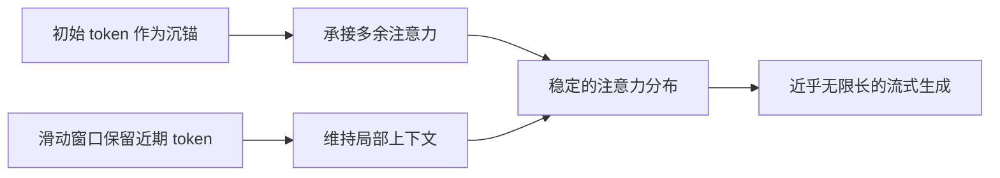

> 本文是一篇经典回顾的阅读笔记，对象为 Xiao 等人于 2023 年提出的工作《Efficient Streaming Language Models with Attention Sinks》（arXiv:2309.17453，[https://arxiv.org/abs/2309.17453](https://arxiv.org/abs/2309.17453)）。文章围绕一个看似简单却长期被忽视的现象展开：为什么滑动窗口式的流式推理会突然崩坏，以及如何用极小的代价修复它。

## TL;DR

- 流式推理若直接丢弃早期 token 的 KV 缓存，模型困惑度会突然飙升、生成质量崩坏。
- 论文发现「注意力沉锚（attention sink）」：模型倾向把大量注意力分配给序列最开头的少数几个 token。
- 只要保留这几个初始 token 的 KV，再配合滑动窗口，就能稳定地进行近乎无限长的流式生成。
- 该方法无需微调即可应用于已有模型，是长序列推理中一种实用的工程技巧。

## 一、背景与动机：流式场景下的 KV 缓存困境

自回归语言模型在解码时会缓存历史 token 的 Key/Value（即 KV 缓存），以避免重复计算。但在多轮对话、长文档持续生成等流式场景中，输入会不断增长。KV 缓存随序列长度线性增长，显存很快成为瓶颈；同时多数模型在训练时见过的上下文长度有限，超出该长度后外推能力会明显下降。

一个直觉上自然的做法是采用「滑动窗口」：只保留最近的若干 token 的 KV，把更早的丢弃。这样显存占用恒定，似乎既能控制开销又能无限生成。然而实践中这种朴素方案并不奏效——一旦最早期的 token 被移出窗口，模型的表现会急剧恶化。论文正是从这一反直觉的失败现象切入。

## 二、核心现象：丢弃早期 token 为何引发崩坏

论文观察到，当滑动窗口开始丢弃序列最开头那几个 token 的 KV 时，模型的困惑度会出现突然的飙升，生成内容随之崩坏。关键在于：导致崩坏的并不是「窗口太小」本身，而是「最初的那几个 token 被删掉」这一动作。

这说明开头的 token 承担了某种超出其语义内容的特殊作用。它们携带的信息往往并不重要——哪怕是起始符或无实义的词——但它们在注意力分布中的地位却异常关键。

## 三、关键发现：注意力沉锚（Attention Sink）

通过分析注意力分布，论文指出：模型会把相当大比例的注意力权重持续分配给序列最开头的少数几个 token，作者将这种现象称为「注意力沉锚」。

其内在原因与 Softmax 的归一化性质相关。注意力权重经过 Softmax 后必须求和为一，即便当前 token 并不真正需要关注任何历史信息，这部分注意力也必须「倾倒」到某处。由于初始 token 对后续所有位置都可见，它们天然成为这一多余注意力的稳定承接点，逐渐演化为「沉锚」。一旦这些锚点被移除，注意力分布被迫重新分配，模型内部状态随之失稳，输出崩坏。

## 四、方法：保留沉锚 + 滑动窗口

基于上述发现，论文提出的做法非常简洁：在滑动窗口之外，额外、持续地保留最开头那几个 token 的 KV，作为固定的注意力沉锚；窗口内则照常保留最近的 token。两者结合，注意力分布既有稳定的锚点，又能覆盖近期上下文，从而支持长度远超训练窗口的持续生成。

这一方案的突出价值在于其可落地性：它无需对模型重新训练或微调，可直接作用于现成的预训练模型；显存占用保持恒定，不随生成长度增长。下表对比了几种处理方式的核心特征。

| 方案 | KV 缓存规模 | 长流式稳定性 | 是否需微调 |
| --- | --- | --- | --- |
| 完整缓存全部历史 | 随长度线性增长 | 受训练窗口限制 | 否 |
| 朴素滑动窗口（丢弃开头） | 恒定 | 差，易崩坏 | 否 |
| 保留沉锚 + 滑动窗口 | 恒定 | 稳定 | 否 |

此外，论文也讨论了在预训练阶段引入专门的可学习沉锚 token 的可能性，使模型从一开始就具备明确的注意力承接位，为后续流式部署提供更一致的行为基础。

## 五、应用视角：作为长序列推理的实用技巧

从工程角度看，StreamingLLM 提供的是一种「即插即用」的推理期技巧，而非一种新的模型架构。它特别契合需要长时间持续运行、上下文不断滚动的部署场景，例如长对话助手与流式文本处理。由于改动集中在 KV 缓存的管理策略上，它与既有的解码流程兼容性较好，迁移成本低。

需要明确的是，保留沉锚解决的是「持续稳定生成」的问题，而非「记住任意久远的全部信息」。窗口之外、沉锚以外的历史内容仍会被丢弃，模型对早期具体细节的精确记忆并不会因此扩展。

## 意义与局限

StreamingLLM 的意义在于，它以极低的代价揭示并利用了 Transformer 注意力机制中一个普遍而隐蔽的结构性现象，把「为何朴素滑动窗口会失败」这一困惑转化为「保留少数初始 token 即可」的可操作方案，为长序列、流式推理提供了清晰的工程路径，也加深了社区对注意力分布行为的理解。

其局限同样应被正视：该方法维持的是生成的稳定性与恒定的资源占用，而不等同于真正的长程记忆扩展，窗口与沉锚之外的内容仍会丢失；它依赖模型本身存在沉锚现象这一前提；对于需要精确检索远端历史细节的任务，仍需结合检索、长上下文建模等其他手段。总体而言，它是长序列推理工具箱中一项简洁而实用的技巧，而非对所有长上下文需求的通用解答。

> 延伸阅读：Xiao et al., "Efficient Streaming Language Models with Attention Sinks", arXiv:2309.17453（https://arxiv.org/abs/2309.17453）
