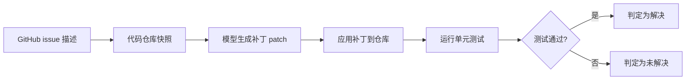

> 经典回顾 / 阅读笔记：本文整理自 Jimenez et al., 2023（ICLR 2024），《SWE-bench: Can Language Models Resolve Real-World GitHub Issues?》，arXiv:2310.06770（https://arxiv.org/abs/2310.06770）。文中事实以该论文为准，主观推断已尽量回避。

## TL;DR

- SWE-bench 从 12 个流行的 Python 开源仓库中收集真实的 GitHub issue 与其对应 PR，构造了约 2294 个软件工程任务。
- 任务形式：给定一个 issue 描述与整个代码仓库，模型需生成一个能通过仓库单元测试的补丁（patch）。
- 发布之初，前沿模型的解决率仅为个位数百分比，直观地暴露了真实软件工程任务的难度。
- 它逐渐成为衡量"AI 写代码/做软件工程"能力的重要基准，并衍生出 SWE-bench Verified 等后续版本。

## 一、为什么需要一个"真实"的代码基准

早期的代码生成评测大多围绕函数级、自包含的小题目展开：给定一段自然语言描述与函数签名，模型补全函数体，再用少量测试用例判定对错。这类基准便于自动评分，但与工程师的日常工作存在明显落差——真实开发很少是"凭空写一个孤立函数"，更多是在一个已有的、规模庞大的代码库里定位问题、理解上下文、做出最小且正确的修改。

SWE-bench 的出发点正是缩小这一落差。它不再让模型做"练习题"，而是把模型直接抛进真实软件项目的工作流：读懂一个用户报告的 issue，在成千上万行的代码中找到相关位置，写出能让项目自身测试套件通过的改动。这种设定天然包含了定位、跨文件理解、回归约束等真实工程要素。

## 二、数据从何而来

基准的数据来源是 GitHub 上 12 个流行的 Python 仓库。研究者关注那些"已被解决的 issue"——即一个 issue 最终通过某个合并的 Pull Request 得到修复。每个被采纳的 PR 通常同时包含两部分内容：对源代码的修改，以及相应的测试改动。

利用这种天然结构，可以把一条记录拆解为评测所需的要素：

| 要素 | 含义 | 在评测中的作用 |
| --- | --- | --- |
| issue 文本 | 用户/开发者报告的问题描述 | 作为模型的输入任务说明 |
| 代码仓库快照 | PR 合并前的代码状态 | 模型需在其上做修改 |
| 黄金补丁 | PR 中真实的源码改动 | 参考答案（不直接给模型） |
| 测试用例 | PR 附带或仓库已有的测试 | 自动判定补丁是否正确 |

经过筛选，最终构成约 2294 个任务实例。判定标准是客观的：模型产出的补丁应用到仓库后，相关测试由"失败"转为"通过"，并且不破坏原本通过的测试。

## 三、任务流程与评测方式

整个任务可以抽象为一条从输入到判定的链路。

与函数级基准相比，这套流程对模型提出了几项更高的要求。其一是检索与定位：仓库往往很大，issue 文本不会直接告诉模型该改哪一行，需要在大量文件中找到相关代码。其二是上下文长度与组织：相关信息可能分散在多个文件，如何把恰当的上下文喂给模型本身就是难点。其三是修改的精确性：补丁既要解决问题，又不能破坏既有行为，单元测试会对此作出严格的回归约束。

## 四、发布时的结果与意义

论文发布时，即便是当时的前沿大模型，在 SWE-bench 上的解决率也只有个位数百分比。这一结果与许多函数级基准上动辄较高的通过率形成鲜明对比，直观说明：能写对一个孤立函数，并不等于能在真实工程环境中完成一次端到端的缺陷修复。

正因为这种"贴近真实、难度真实"的特性，SWE-bench 迅速被社区接受为衡量模型软件工程能力的重要参照，也推动了围绕代码智能体（agent）的研究——许多方法开始强调检索、多步执行、工具调用与迭代验证，而不再是一次性生成。围绕该基准，后续还出现了若干改进版本，其中 SWE-bench Verified 通过人工核验筛除标注或测试本身存在问题的实例，意在让评测信号更可靠。

## 意义与局限

SWE-bench 的核心贡献，是把代码能力评测从"做题"推进到"做工程"，用真实 issue、真实仓库与真实测试构成一套客观、可自动判定的难任务集合。它让"模型会不会写代码"这个模糊问题，落到了"能否让真实项目的测试由红转绿"这一可度量的标准上。

与此同时，它的边界也需被正视。其一，语言与领域集中于 Python 开源项目，难以代表全部软件工程场景。其二，以"测试通过"作为唯一判定，存在补丁恰好骗过测试、或测试覆盖不足的可能，这也是 Verified 等版本试图改善的方向。其三，随着模型与方法被针对性优化，单一榜单分数与真实生产力之间仍需谨慎对照。总体而言，它提供的是一面贴近现实的镜子，而非软件工程能力的完整刻画。

> 延伸阅读：SWE-bench: Can Language Models Resolve Real-World GitHub Issues?（arXiv:2310.06770，https://arxiv.org/abs/2310.06770）
