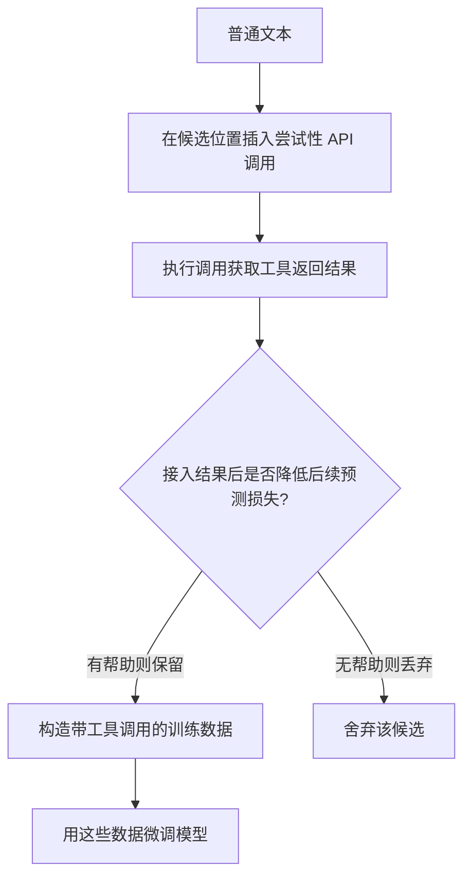

> 本文是对论文《Toolformer: Language Models Can Teach Themselves to Use Tools》（Schick et al., Meta, 2023, arXiv:2302.04761，链接：https://arxiv.org/abs/2302.04761 ）的阅读笔记与解读，旨在梳理其核心思想与方法脉络，便于回顾这条「LLM + 工具」研究路线的早期代表作。

## TL;DR

- 是什么：Toolformer 提出了一种让语言模型「自己教会自己」使用外部工具（计算器、问答、搜索、翻译、日历等）的方法。
- 核心思想：以自监督的方式，让模型先在文本中尝试性地插入 API 调用，再用「这次调用是否降低了后续 token 的预测损失」作为筛选标准，只保留真正有帮助的调用。
- 关键结论：模型几乎不需要大量人工标注的工具使用示例，就能学会在合适的位置、用合适的参数去调用合适的工具。
- 意义：它与 ReAct 一同奠定了工具增强语言模型的基础，是这条技术路线上的早期代表性工作。

## 一、背景与动机

语言模型在文本生成、推理、知识问答等方面表现出色，但它们也有明显的短板：算术计算容易出错、事实性知识可能过时或记错、对实时信息（如当前日期、最新事实）无能为力。这些恰恰是一些简单外部工具的强项——计算器不会算错加法，搜索引擎能拿到最新内容，问答系统能给出更可靠的事实答案。

一个自然的想法是：让模型在生成文本时，能够在需要的地方「停下来」去调用外部工具，把工具返回的结果接回到生成过程中。难点在于：模型如何知道在哪里调用、调用哪个工具、传入什么参数？

最直接的做法是用大量人工标注的「工具使用示例」去训练模型，但这种标注成本高、覆盖面有限，而且很难穷尽各种工具与场景的组合。Toolformer 的动机正是要绕开这种重度人工标注，让模型以自监督的方式自行学会工具的使用。

## 二、核心方法：用「是否降低预测损失」来筛选调用

Toolformer 的方法可以拆成几个关键环节，整体思路是「先生成候选调用，再用损失做筛选，最后用筛选出的数据微调」。

- 采样候选调用：给定一段普通文本，让模型在文本的各个位置尝试性地插入可能的 API 调用（包括调用哪个工具、传入什么参数）。这一步利用模型自身的能力生成大量候选。
- 执行调用：实际去执行这些候选的 API 调用，拿到工具返回的结果。
- 用损失做筛选：核心判据是——把工具返回的结果接入上下文后，是否降低了对后续 token 的预测损失。如果一次调用确实让模型更容易预测接下来的内容，说明这次调用「有帮助」，予以保留；否则丢弃。
- 自我微调：把通过筛选的、带有 API 调用标注的文本汇集成训练数据，用它继续微调模型本身。

这样一来，模型学到的不是「死记某个工具怎么用」，而是在自然语言流中判断「此处是否值得调用工具、该调哪个、参数填什么」的能力。整个数据构造过程几乎不需要人来逐条标注工具使用，标注信号来自模型自身的预测损失。

下面用一张流程图概括这条主线：

## 三、为什么这套自监督是关键

把不同环节对比着看，更容易理解 Toolformer 的取舍：

| 维度 | 传统人工标注式工具学习 | Toolformer 的自监督式 |
| --- | --- | --- |
| 训练信号来源 | 人工标注的工具使用示例 | 模型自身对后续 token 的预测损失 |
| 标注成本 | 高，需大量人工 | 低，几乎无需逐条标注工具调用 |
| 筛选标准 | 依赖标注质量与覆盖面 | 「是否真的降低预测损失」这一客观判据 |
| 学到的能力 | 模仿示例中的工具用法 | 自行判断何时、调用哪个工具、用什么参数 |

这里最值得强调的，是用「预测损失是否下降」来定义「这次调用是否有用」。它把一个原本需要人来判断的主观问题，转化成了一个可以自动度量的目标：只要工具结果让后续文本更好预测，就认为它有价值。正是这一判据，让大规模、低人工成本地构造工具使用数据成为可能。

## 四、工具种类与适用场景

Toolformer 所验证的工具覆盖了几类常见且互补的能力，它们恰好对应语言模型的若干短板：

| 工具类型 | 主要弥补的能力 |
| --- | --- |
| 计算器 | 算术与数值计算的准确性 |
| 问答系统 | 更可靠的事实性知识获取 |
| 搜索引擎 | 获取文本之外、可能更新的信息 |
| 翻译 | 跨语言信息的处理 |
| 日历 | 与时间/日期相关的查询 |

这些工具的共同点是：调用接口清晰、返回结果可被自然地接回生成过程，且各自能在模型薄弱的环节提供确定性的补充。

## 意义与局限

Toolformer 的意义在于，它给出了一条「让模型自监督地学会用工具」的可行路径：不依赖大量人工标注，而是用模型自身的预测损失作为筛选信号，自动构造出高质量的工具调用数据。这一思路把「LLM + 工具」从依赖人工示范，推进到可以自我筛选、自我提升的阶段，是工具增强语言模型这条线上的早期代表作。它与同期强调「推理与行动交织」的 ReAct 一起，共同奠定了后续 Agent 与工具调用研究的基础。

局限方面，需要保持客观：以预测损失下降作为唯一判据，本质上度量的是「对文本预测是否有帮助」，未必完全等同于「对完成真实任务是否有帮助」；方法依赖工具接口的清晰可执行，对接口复杂、调用链较长或需要多步交互的场景，单纯依靠这种数据构造方式可能不够。后续工作在多工具编排、与推理过程的结合等方向上做了诸多延展，而 Toolformer 提供的，是这条道路上一块重要的奠基石。

> 延伸阅读：Schick et al., 《Toolformer: Language Models Can Teach Themselves to Use Tools》，arXiv:2302.04761（https://arxiv.org/abs/2302.04761 ）。
