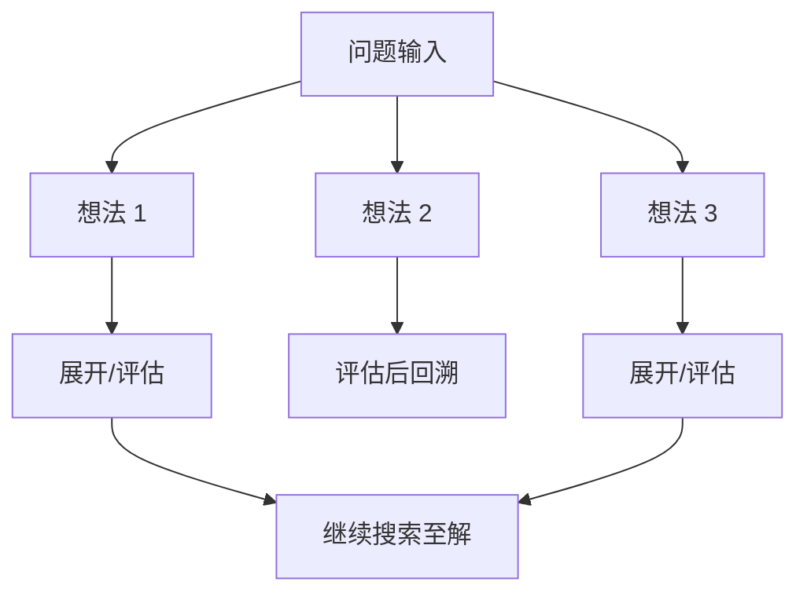

> 本文是对经典论文的解读与回顾：Yao et al., 2023（NeurIPS 2023），《Tree of Thoughts: Deliberate Problem Solving with Large Language Models》，arXiv:2305.10601（<https://arxiv.org/abs/2305.10601>）。旨在梳理 ToT 的动机、核心思想与意义，便于理解其在 LLM 推理中的位置。

## TL;DR

- **是什么**：Tree of Thoughts（ToT，思维树）是一种让大语言模型进行「深思熟虑」式问题求解的推理框架。
- **核心思想**：把推理过程组织成一棵树，每个节点是一个中间想法（thought），模型可生成多个候选分支、对它们自我评估，并用搜索算法在树上探索与回溯。
- **关键结论**：在需要规划与搜索的任务（如 24 点游戏、填字等）上，ToT 相比思维链（CoT）有显著提升。
- **意义**：ToT 把推理从「单链」拓展为「带搜索的推理」，是用结构化探索增强 LLM 推理的代表性工作。

## 一、背景与动机：单链推理的天花板

思维链（Chain-of-Thought, CoT）让模型在给出答案前先写出中间推理步骤，显著提升了模型在算术、常识与符号推理上的表现。但 CoT 的推理本质上是「一条道走到黑」的线性过程：模型一旦在某个中间步骤选错方向，后续推理往往沿着错误路径继续展开，缺乏退回、改选、比较的机制。

对于那些天然需要探索、试错与回溯的问题，这种线性范式就显得力不从心。这类问题通常具有这样的特征：解空间较大、需要在多个候选方案之间权衡、并且早期决策会强烈约束后续可行性。人在解这类问题时，往往不是一口气写下唯一推理链，而是先设想几种可能，评估哪条更有希望，再决定深入还是放弃。ToT 正是从这种「深思熟虑」的认知直觉出发，试图为 LLM 补上「探索与回溯」这一能力。

## 二、核心思想：把「想法」组织成一棵树

ToT 的关键转变，是把推理的基本单元从「token 序列」抬升为「想法（thought）」。一个想法是一段连贯的中间推理片段，作为求解过程中的一个状态节点。整个求解过程随之被组织为一棵思维树：根节点是问题输入，每个节点向下分裂出若干候选想法，构成可供探索的分支。

在这棵树上，ToT 把求解拆解为几个相互配合的环节：

- **想法生成**：在当前节点上，让模型产生多个候选的下一步想法，而不是只生成唯一的延续，从而显式地铺开多条可能路径。
- **状态评估**：让模型对这些候选想法进行自我评估，判断每条分支是否有希望通向最终解，为搜索提供启发信息。
- **搜索与回溯**：在生成与评估的基础上，用经典搜索算法（如广度优先、深度优先）在树上系统地探索；当某条路径被判定为没有前途时，可以回溯到更早的节点，改选其他分支。

这样，LLM 不再被锁死在一条推理链上，而是在一个由自身生成、自身评估的状态空间中进行有目的的搜索。

## 三、ToT 与 CoT 的对比

ToT 可以看作是对 CoT 的结构化推广：当树退化为一条没有分支的链时，ToT 就接近于 CoT。下表从几个维度概括两者的差别。

| 维度 | 思维链 CoT | 思维树 ToT |
| --- | --- | --- |
| 推理结构 | 线性单链 | 多分支的树 |
| 中间单元 | 连续的推理步骤 | 作为节点的「想法」 |
| 候选方案 | 通常单一延续 | 同时生成多个候选分支 |
| 评估机制 | 一般不显式评估中间步骤 | 对候选想法自我评估 |
| 是否可回溯 | 难以回溯 | 可借助搜索算法回溯 |
| 适用问题 | 一步步即可推进的任务 | 需探索、试错与规划的任务 |

需要说明的是，这种能力的增强并非没有代价：生成多分支并逐一评估意味着更多的模型调用与计算开销，本质上是用更多「思考成本」换取在困难问题上的成功率。

## 四、适用场景与效果

ToT 的优势集中体现在那些需要规划与搜索的任务上。论文中以 24 点游戏、填字等为代表的任务进行了验证：这类问题的共同点在于，正确解往往依赖于对多种组合或填法的尝试与筛选，单条线性推理很容易在中途陷入死路。在这些任务上，ToT 相比 CoT 表现出显著的提升，说明显式的探索与回溯机制确实补上了线性推理所缺失的能力。

换句话说，ToT 更像是给模型配上了一套「先设想、再评估、可回头」的工作流，使其在面对组合性、规划性的问题时，能够以接近搜索的方式逐步逼近解，而不是把宝押在一次性写出的推理链上。

## 意义与局限

ToT 的意义在于，它把 LLM 的「推理」从单链拓展为「带搜索的推理」，将生成、评估与搜索三者统一在一个以想法为节点的框架之中，是用结构化探索增强大模型推理能力的代表性工作。它启发了后续一系列围绕「让模型更有条理地探索解空间」的研究与实践，使「推理结构」本身成为一个可被设计与优化的对象。

局限同样值得正视。ToT 引入的多分支生成与逐节点评估会带来更高的计算与调用开销，对于本就能用简单推理解决的问题，这种代价并不划算。此外，搜索的有效性高度依赖模型自我评估的可靠性：若模型对分支前景的判断出现系统性偏差，搜索就可能被引向错误方向。因此，ToT 更适合那些「探索价值」明显高于「探索成本」的复杂规划类任务，而非作为所有推理场景的通用替代。

> 延伸阅读：Yao et al., 2023, 《Tree of Thoughts: Deliberate Problem Solving with Large Language Models》，arXiv:2305.10601（<https://arxiv.org/abs/2305.10601>）。
