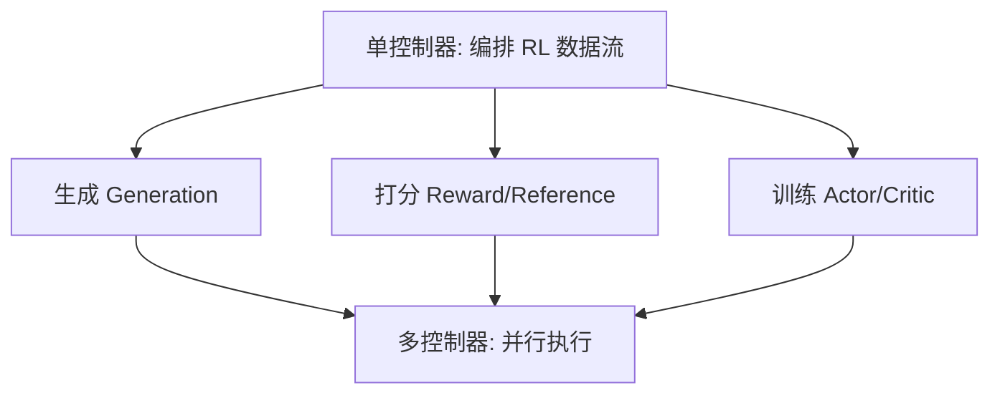

> 本文是对论文 Sheng et al. (ByteDance), 2024, *HybridFlow: A Flexible and Efficient RLHF Framework*（arXiv:2409.19256，<https://arxiv.org/abs/2409.19256>）及其官方开源实现 verl（GitHub: verl-project/verl）的阅读笔记与解读，内容以原文与开源仓库为准。

## TL;DR

- **是什么**：HybridFlow 是一篇面向 RLHF（基于人类反馈的强化学习）训练的系统论文，verl（Volcano Engine RL for LLMs，字节/火山引擎）是其官方开源实现。
- **核心思想**：把「单控制器（single-controller）」与「多控制器（multi-controller）」两种编程范式混合起来——用单控制器灵活表达 RL 的数据流，用多控制器高效执行底层并行计算。
- **关键结论**：通过这种分层设计，框架在「易于表达和修改算法」与「执行高效」之间取得了平衡，避免了二选一的取舍。
- **意义**：verl 已发展为生产级的 RL 训练库，被 DAPO 等多项推理强化学习工作用作底座。

## 一、背景与动机：RLHF 为什么难做

RLHF 已经成为对齐大语言模型的关键环节，但它在工程上的复杂度远高于普通的有监督训练。一次典型的 RLHF 迭代要协调多个模型协同工作：负责生成回复的策略模型（actor）、给回复打分的奖励模型（reward model）、用于约束更新幅度的参考模型（reference），以及在某些算法中还要估计价值的 critic。这些模型的角色不同，对计算资源和并行方式的需求也不同。

更棘手的是其中的**数据流（dataflow）**：生成阶段是自回归推理，更适合面向吞吐的推理引擎；打分与训练阶段则是前向/反向传播，更适合训练框架；不同阶段之间还要在不同的并行策略与设备布局之间搬运数据与权重。把生成、打分、训练这几个环节串成一个高效又可改的流水线，是 RLHF 框架的核心难题。

在 HybridFlow 之前，已有的实现往往落入两类取舍：一类用灵活的方式描述算法，研究者改起来方便，但执行效率不高；另一类把流程写死、深度优化，跑得快，却难以修改和扩展新算法。HybridFlow 想要打破这种「灵活」与「高效」的二元对立。

## 二、核心思想：混合单控制器与多控制器

HybridFlow 的关键洞察在于区分两类不同的关注点，并用两种控制范式分别承接：

- **单控制器（single-controller）**：由一个中心化的控制逻辑来编排整个 RL 数据流——什么时候生成、什么时候打分、什么时候更新、数据如何在角色之间流转。集中式的表达让算法逻辑清晰、便于修改，研究者可以像写普通脚本一样描述一个新的 RL 算法。
- **多控制器（multi-controller）**：在每个具体的计算节点内部，由多个并行的工作进程各自执行自己的那份计算（如分布式训练中的数据并行、张量并行等）。这种范式贴近底层并行执行，效率高。

HybridFlow 的做法是把二者**分层组合**：用单控制器在上层灵活地表达和编排数据流，用多控制器在下层高效地执行繁重的计算。上层负责「做什么、按什么顺序做」，下层负责「怎么把每一步算得快」。这样一来，修改算法主要改的是上层的编排逻辑，而不必重写底层的高性能执行代码。

## 三、两种范式的分工对比

| 维度 | 单控制器（single-controller） | 多控制器（multi-controller） |
| --- | --- | --- |
| 职责 | 编排 RL 数据流与各角色调用顺序 | 在节点内并行执行具体计算 |
| 关注点 | 算法逻辑的表达与可修改性 | 计算与通信的执行效率 |
| 在 HybridFlow 中的层次 | 上层（控制流） | 下层（计算流） |
| 优势 | 灵活、易于理解和扩展 | 高吞吐、贴近底层并行 |

这种分工让框架能够把「面向研究者的可读性」和「面向系统的性能」放在不同的层上分别优化，而不是混在一起互相牵制。

## 四、verl：从论文到生产级训练库

verl 是 HybridFlow 思想的官方开源实现，名称取自 Volcano Engine RL for LLMs。它把上述的混合控制思路落到了可用的代码框架中：算法侧以相对简洁的方式描述 RLHF 的迭代流程，执行侧则对接成熟的训练与推理后端，去承担分布式计算的重活。这种「上层编排、下层执行」的结构，使得在框架上实现或调整一个 RL 算法的成本相对可控。

也正因为同时兼顾了可改性与效率，verl 在开源后逐步发展为生产级的 RL 训练库，并被多项面向推理能力的强化学习工作用作底座，其中包括 DAPO 等工作。换句话说，HybridFlow 提出的设计不仅停留在论文层面，也在实际的训练实践中得到了延续与验证。

## 意义与局限

HybridFlow 的价值在于，它为 RLHF 这类「多模型、多阶段、多并行」的复杂训练给出了一个清晰的系统抽象：用单控制器表达灵活的数据流，用多控制器执行高效的并行计算，从工程结构上缓解了「灵活」与「高效」难以兼得的长期矛盾。对研究者而言，这意味着尝试新算法的门槛更低；对工程团队而言，这意味着可以在不牺牲性能的前提下复用同一套框架。

需要说明的是，作为一套面向分布式训练的系统，框架的实际表现仍取决于具体的模型规模、并行策略、硬件环境与所对接的执行后端；不同算法与场景下的收益也会有所差异。RLHF 本身仍在快速演进，新的算法形态、奖励设计与训练范式会持续对框架的抽象能力提出新的要求。HybridFlow 与 verl 提供的，是一个在当前阶段被广泛采用、并具备扩展空间的基础设施起点。

> 延伸阅读：HybridFlow 论文 arXiv:2409.19256（<https://arxiv.org/abs/2409.19256>）；verl 开源仓库 verl-project/verl。
