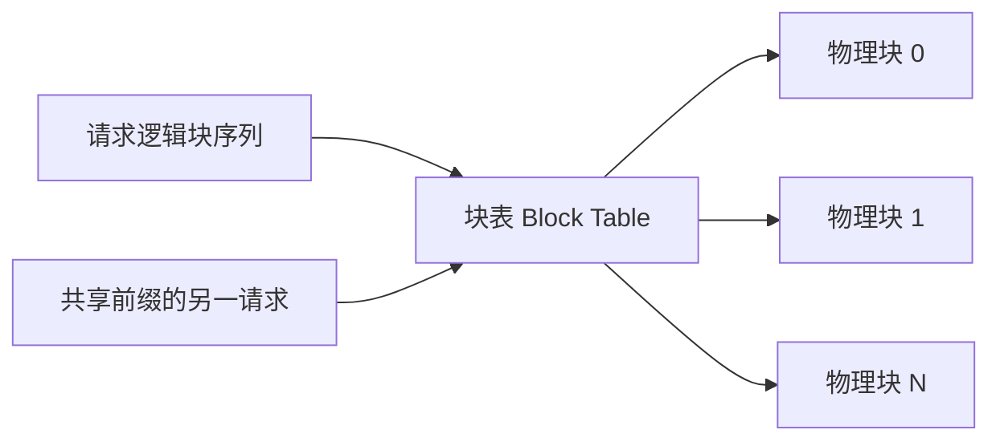

> 本文是对 PagedAttention 论文及 vLLM 项目的阅读笔记与解读。原文：Kwon et al., "Efficient Memory Management for Large Language Model Serving with PagedAttention", SOSP 2023, arXiv:2309.06180（<https://arxiv.org/abs/2309.06180>）；项目地址：vLLM（<https://github.com/vllm-project/vllm>）。

## TL;DR

- **是什么**：vLLM 是一个面向大语言模型（LLM）服务的高吞吐推理引擎，其核心技术 PagedAttention 解决了 KV Cache 的显存管理问题。
- **核心思想**：借鉴操作系统的虚拟内存与分页机制，把注意力的 KV Cache 切分为固定大小的"块（page）"，通过块表（block table）进行映射管理。
- **关键结论**：分页式管理几乎消除了 KV Cache 的内部/外部碎片与预留浪费，并支持请求之间的内存共享；配合连续批处理（continuous batching），可显著提升服务吞吐。
- **意义**：vLLM 已成为开源 LLM 推理部署的主流引擎之一，并提供 OpenAI 兼容的 API 接口，降低了高性能服务的落地门槛。

## 一、背景与动机：显存才是吞吐的瓶颈

在自回归生成中，模型每生成一个 token，都需要用到此前所有 token 的 Key 与 Value 向量。为了避免重复计算，推理系统会把这些向量缓存下来，这就是 **KV Cache**。KV Cache 的体量随序列长度和并发请求数线性增长，往往成为 GPU 显存中最主要的占用项之一。

问题在于传统实现对 KV Cache 的管理方式较为粗放。常见做法是为每个请求按"可能的最大长度"预先分配一段**连续**的显存。这带来了几类浪费：

- **内部碎片**：按最大长度预留，但实际生成长度通常远小于上限，预留出来的空间在请求结束前一直闲置。
- **外部碎片**：不同请求需要的连续块大小不一，反复分配/释放后，显存被切割成难以再利用的零散空隙。
- **无法共享**：即使多个请求（或同一请求的多路采样）拥有相同的前缀，它们的 KV Cache 仍各自独立存放，无法复用。

这些浪费直接压缩了能同时驻留的请求数量，而并发请求数正是决定服务吞吐的关键因素之一。换句话说，显存利用率低，吞吐就上不去。

## 二、核心思想：把虚拟内存搬到注意力里

PagedAttention 的灵感来自操作系统经典的**虚拟内存与分页**。操作系统不要求进程占用连续的物理内存，而是把内存切成固定大小的页，通过页表把逻辑地址映射到物理页帧。PagedAttention 把同样的思路用在了 KV Cache 上：

- **分块（page/block）**：将每个序列的 KV Cache 切分为固定数量 token 的小块，每块在物理显存中独立存放，无需彼此连续。
- **块表（block table）**：为每个请求维护一张映射表，记录其逻辑块到物理块的对应关系。注意力计算时按块查表读取对应的 Key/Value。
- **按需分配**：序列变长时再追加新块，而不是一次性预留到最大长度，从而把内部碎片降到接近一个块的粒度；由于块大小固定，外部碎片也基本消失。

这种设计还自然地解锁了**内存共享**：当多个序列共享相同前缀（例如并行采样生成多个候选、或多个请求复用同一段系统提示）时，它们可以让块表指向同一批物理块，仅在内容产生分歧时再"按需复制"（copy-on-write），进一步节省显存。

## 三、PagedAttention 与传统分配方式对比

| 维度 | 连续预分配（传统） | PagedAttention（分页） |
| --- | --- | --- |
| 显存布局 | 每请求一段连续区间 | 固定大小物理块，按需分布 |
| 分配时机 | 按最大长度一次性预留 | 随生成增长按块追加 |
| 内部碎片 | 较大（预留远超实际） | 接近一个块的粒度 |
| 外部碎片 | 明显 | 基本消除 |
| 前缀/采样共享 | 难以实现 | 支持，配合写时复制 |

## 四、连续批处理：让 GPU 不空转

PagedAttention 解决了"装得下更多请求"的问题，而 **连续批处理（continuous batching）** 解决的是"让这些请求高效地一起跑"的问题。

传统静态批处理需要等一个批次里所有请求都生成完才能释放并组下一批，导致先完成的请求白白占着位置、GPU 出现空转。连续批处理则在**迭代级别**动态调度：某个请求一旦结束就立刻让出资源，新请求随时插入正在运行的批次。这要求底层显存管理足够灵活——而 PagedAttention 的按块分配恰好提供了这种灵活性。两者配合，使 GPU 计算资源得到更充分的利用。

论文与社区实践中，这套方案相对此前的服务系统常能带来**数倍量级**（常见 2–4 倍）的吞吐提升，具体倍数取决于模型、序列长度分布和负载等因素。

## 五、vLLM：从论文到可用的工程

PagedAttention 是技术内核，vLLM 则是把它工程化、产品化的开源推理引擎。从使用者角度，vLLM 的几个特征值得关注：

- **高吞吐服务**：以 PagedAttention 与连续批处理为基础，面向高并发的在线/离线推理场景。
- **OpenAI 兼容 API**：提供与 OpenAI 接口风格一致的服务端点，已有应用可以较低成本迁移。
- **广泛的模型支持**：覆盖众多主流开源大模型架构，并持续随社区演进。

这些工程化特性是它能成为主流部署选择的重要原因——技术先进之外，还要"开箱即用"。

## 六、意义与局限

PagedAttention 的价值在于，它把一个被长期当作"实现细节"的显存管理问题，重新表述为一个有成熟理论与工程范式可循的**资源调度问题**，并借用操作系统的分页思想给出了系统化解法。它降低了 KV Cache 的浪费、提升了显存利用率，从而把更多并发请求装进同一块 GPU。

需要客观看待的是：

- 分页引入了块表查找与间接寻址，注意力核需要相应改造，存在一定的实现复杂度与管理开销。
- 吞吐提升的幅度与负载特征强相关，不同模型、序列长度分布、批大小下的收益并不一致，不能简单套用某个固定倍数。
- 它优化的是**显存管理与调度**这一环节，并不替代量化、算子优化、投机解码等其它推理加速方向；在实际系统中这些技术通常是互补叠加的。

总体而言，PagedAttention 与 vLLM 把"显存利用率"这一长期被低估的维度推到了 LLM 服务优化的前台，并提供了一条可复用的工程路径。

> 延伸阅读：PagedAttention 论文 arXiv:2309.06180，以及 vLLM 项目仓库 github.com/vllm-project/vllm。
