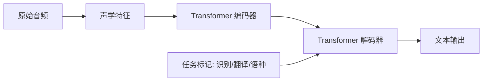

> 本文是对 Whisper 论文的经典回顾与阅读笔记。原文：Radford et al. (OpenAI), 2022, *Robust Speech Recognition via Large-Scale Weak Supervision*, arXiv:2212.04356（https://arxiv.org/abs/2212.04356）。下文仅在论文与公开事实范围内展开，定性为主。

## TL;DR

- Whisper 使用约 68 万小时多语言、弱监督的网络音频数据进行训练，把「数据规模与多样性」当作鲁棒性的主要来源。
- 模型是一个编码器-解码器 Transformer，用统一架构同时完成多语言语音识别与语音翻译等多种任务。
- 它强调零样本（zero-shot）鲁棒性：无需在特定数据集上微调，也能在多种口音、噪声、领域上保持稳健表现。
- 模型开源，被广泛用于字幕生成、语音转写等实际场景。

## 一、背景与动机：为什么追求「鲁棒」

长期以来，学术界的语音识别（ASR）进展往往依赖在单一基准数据集上的训练与微调。这类系统在与训练分布相近的测试集上表现优异，但一旦迁移到不同口音、不同录音条件、不同领域的真实音频上，性能就可能明显下降。换言之，传统范式优化的是「特定数据集上的准确率」，而不是「面对未知分布时的稳健性」。

Whisper 的出发点正是要弥合这道鸿沟。它把目标从「在某个基准上刷高分」转向「在没有针对性微调的情况下，依然能在广泛真实场景中可用」。为此，论文选择了一条与「精标注、小而精」相反的路径：用极大规模、弱监督的网络音频数据来训练，让模型在训练阶段就见过足够多样的语音世界。

## 二、核心思想：大规模弱监督

Whisper 方法可以拆解为几个相互支撑的要点：

- **数据规模与多样性优先。** 训练数据约为 68 万小时，覆盖多语言、多领域的网络音频。这里的「弱监督」指标注并非逐字精校的高质量人工转写，而是规模化收集、质量参差但总量巨大的音频-文本配对。论文的假设是：足够大、足够杂的数据，本身就能带来对噪声与分布偏移的抵抗力。
- **统一的序列到序列建模。** Whisper 采用编码器-解码器 Transformer，把语音识别、语音翻译、语种识别等任务统一表述为「给定音频，预测文本序列」的问题。不同任务通过特殊标记（task token）在解码端区分，从而用一套权重处理多种任务。
- **零样本评估导向。** 论文刻意避免在下游评测集上微调，而是直接以零样本方式评估。这样得到的结果更能反映模型面对未见过分布时的真实表现，也更贴近实际部署时「拿来即用」的诉求。

下表对两种范式做一个定性对比：

| 维度 | 传统「单数据集微调」范式 | Whisper 弱监督范式 |
| --- | --- | --- |
| 数据来源 | 精标注、规模有限 | 大规模、弱监督网络音频 |
| 训练目标 | 特定基准准确率 | 跨分布的稳健可用 |
| 任务覆盖 | 通常单一任务 | 识别 / 翻译等多任务统一 |
| 评估方式 | 同分布测试 | 零样本、跨领域 |
| 部署姿态 | 常需针对场景再训练 | 倾向「开箱即用」 |

## 三、架构与流程：一套权重，多种任务

从数据到输出的整体链路可以概括为：原始音频先被转为声学特征（如对数梅尔频谱），由编码器得到隐含表示，再由解码器以自回归方式生成文本；过程中通过任务标记控制是「转写」还是「翻译」，以及目标语种等行为。

这种设计的好处在于「简洁而通用」：不需要为每个任务、每种语言单独维护模型与流水线，而是把控制信息编码进序列本身，让同一个模型按需切换行为。

## 四、为什么会更鲁棒

Whisper 的鲁棒性并非来自某个精巧的正则化技巧，而主要来自训练数据的覆盖面。当模型在训练阶段就接触了大量带口音、带背景噪声、来自不同领域的语音，它在推理阶段遇到类似扰动时就不会「水土不服」。这与「在单一干净数据集上过拟合」的传统做法形成对照——后者在分布外样本上更容易失效。

同时，多任务、多语言的联合训练也起到隐性作用：不同语言与任务之间的共享表示，使模型对语音信号的建模更具普适性，而非仅记住某个数据集的表层统计特征。正因如此，Whisper 在无需针对性微调的前提下，仍能在多种条件下给出可用的转写结果，这也是它被广泛集成进字幕生成、语音转写等工具链的重要原因。

## 意义与局限

意义层面，Whisper 提供了一个有说服力的范式样本：在语音识别中，扩大数据规模与多样性、并以零样本鲁棒性为评估标准，可以换来面向真实世界的可用性，而不只是基准分数。它的开源进一步降低了使用门槛，使语音转写能力更容易被嵌入各类产品与研究流程。

局限层面也应客观看待。弱监督数据的质量参差，可能引入转写错误或偏差；不同语言之间的表现并不均衡，资源较少的语言通常更弱；自回归解码在长音频或特定输入下可能出现重复、幻觉式输出等问题。这些都属于「以规模换鲁棒」路线需要持续应对的代价。总体而言，Whisper 的价值在于指明方向——把鲁棒性当作一等目标，并用大规模弱监督去逼近它。

> 延伸阅读：Radford et al., *Robust Speech Recognition via Large-Scale Weak Supervision*, arXiv:2212.04356（https://arxiv.org/abs/2212.04356）。
